| Run | densify | LPIPS 활성 방식 | `w_lpips` | 목표 `R_lpips` | run5_1 대비 변경점 |
|---|---|---|---:|---:|---|
| **run5_1** (기준) | OFF | noise-gate (`σ≤0.7`) | 0.002 | 0.027(실측) | — |
| **run6_1** | OFF | noise-gate (`σ≤0.7`, 동일) | 0.0075 | ~0.10 | `w_lpips`만 3.75배 |
| **run6_2** | OFF | noise-gate (`σ≤0.7`, 동일) | 0.022 | ~0.30 | `w_lpips`만 11배 |

세 run 모두 densify OFF, 게이트 위치·정규화 규약 동일. `configs/run6_1_lpips_mid_phase1.yaml`,
`configs/run6_2_lpips_high_phase1.yaml` — `[0806]run5_test_results.md` §3.3-e("게이트 고정,
세기만 스윕")의 실행분. 학습 로그는 `logs/run6_{1,2}_lpips_{mid,high}_phase1.log` +
`logs/run6_{1,2}_perceptual.log`, 산출물은 `outputs/0807/run6_{1,2}`(seed `{1,2,3,42}` ×
`epoch{5,10,15}`, `data/test` 8장). 평가는 `scripts/eval/orientation_run6.py`
(`orientation_run5.py`와 동일 방법론, structure tensor, `sigma_i=3`, `erode_px=6`)로 새로
계산함.

## 요약

1. **두 값 모두 방향 지표에서 run5_1(`w=0.002`)보다 나쁨.** epoch15 macro 기준
   GT 오차 18.10 → run6_1 19.56(+1.46) / run6_2 18.59(+0.49), seed 불일치
   14.09 → run6_1 16.69(+2.60) / run6_2 15.17(+1.08). `[0806]` §3.3-e가 기대한 "중간 지점에서
   개선"은 이번 스윕에서 재현되지 않음.
2. **세기와 손상이 단조 관계가 아님.** `w`를 0.0075→0.022로 더 올렸는데 오히려 8장
   전부에서 run6_1보다 run6_2가 낮은(나은) GT 오차를 보임(§3.2). 즉 `run5_1 < run6_2 < run6_1`
   순이며, "LPIPS를 더 세게 걸수록 더 나빠진다"는 단순 가설과 맞지 않음.
3. `R_lpips` 실측 중앙값은 run6_1 0.091, run6_2 0.296으로 각 config의 목표 밴드
   (0.068~0.181, 0.199~0.531) 안에 들어옴 — 세기 스윕 자체는 의도대로 걸렸고, `grad_clipped`
   비율도 6~7%대로 낮아 clip이 세기 차이를 지워버린 것도 아님(§3.1).
4. frizz(run3, `R≈1.016`에서 관찰된 고주파 곱슬 아티팩트)는 두 run 모두에서 육안상 관찰되지
   않음(§3.4) — `R≈0.30`까지도 frizz 재발 지점과는 거리가 있음.
5. 색 지표(`dE_unbraid`, `lpips_unbraid`)는 run5_1 마지막 로그 시점(epoch14) 대비 두 run
   모두 epoch15에서 소폭 더 나쁨(§3.3) — 단, run5_1은 epoch15 시점 로그가 누락되어 있어
   정확히 같은 epoch끼리 비교한 값은 아님.

## 1. 결과 이미지 비교

epoch 15 · seed 42, `data/test` 중 5장에 대한 비교. 좌측부터 입력 스케치, run5_1(기준),
run6_1(`R≈0.10`), run6_2(`R≈0.30`) 순.

| image | 스케치 | run5_1 | run6_1 | run6_2 |
|---|---|---|---|---|
| CM_1033 (유일하게 개선된 이미지) |  | 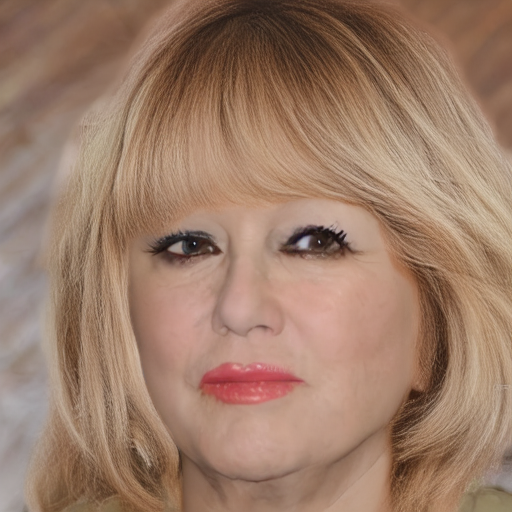 | 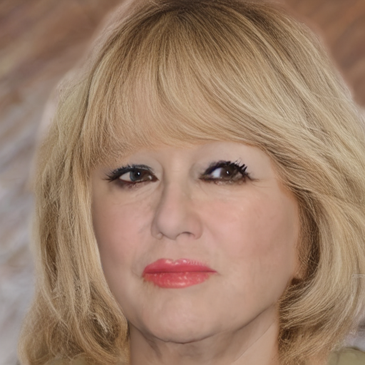 |  |
| CM_1084 (가장 크게 악화된 이미지) |  |  | 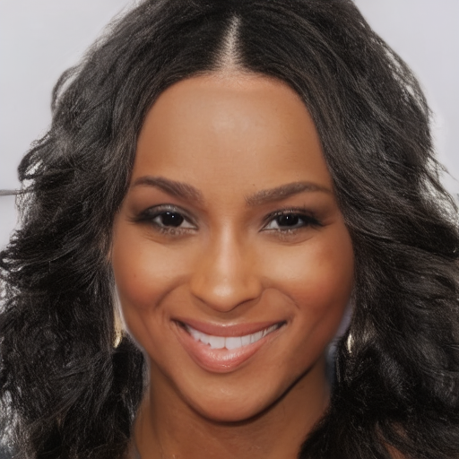 | 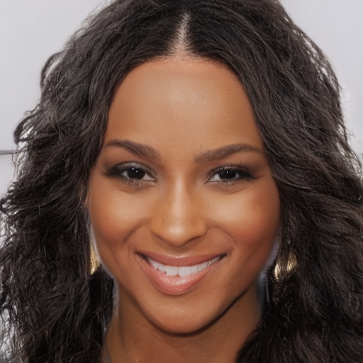 |
| CM_1068 |  |  |  |  |
| CM_1082 |  | 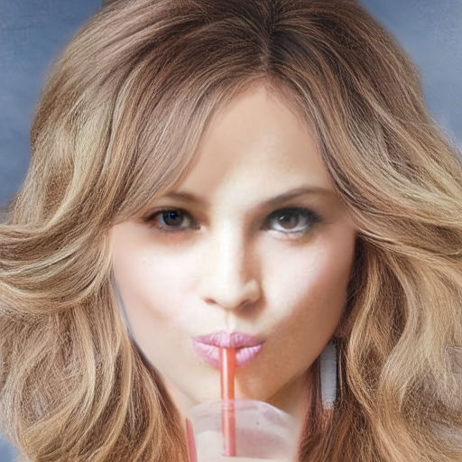 | 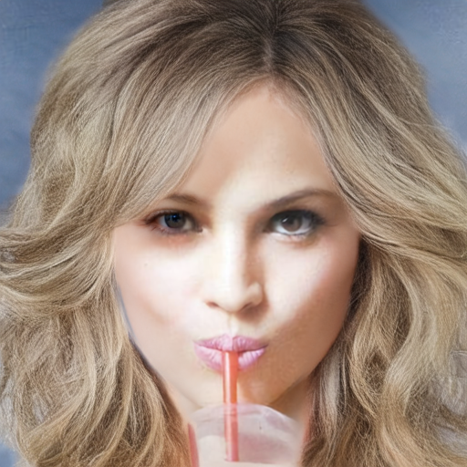 | 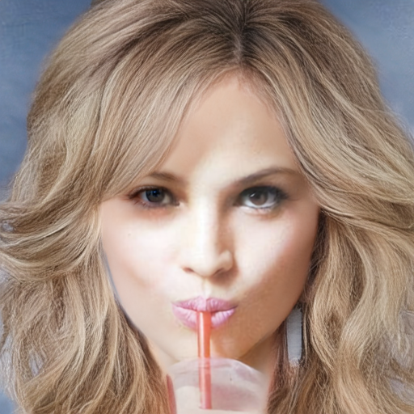 |
| CM_1172 |  | 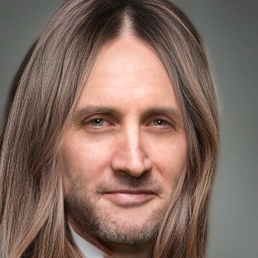 |  |  |

※ 정성적으로는 frizz·고주파 곱슬 아티팩트가 세 run 어디에도 뚜렷이 보이지 않음. 육안상
가장 두드러지는 차이는 머리카락 색 채도/명도(특히 CM_1084)이며, 이는 §3.3의 색 지표
변화와 방향이 같음.

### 1.2 seed별 비교

epoch 15 고정, 같은 이미지를 seed `{1, 2, 3, 42}`로 생성한 결과임. 한 행이 하나의 run이므로
**행 내부에서 seed끼리 얼마나 흔들리는지**가 §2의 seed 불일치에 대응함. 행 라벨의 값은
§2-2의 해당 이미지 seed 불일치[deg]임. §1.1과 같은 이유로 CM_1033(유일한 개선 사례)과
CM_1084(가장 큰 악화 사례)를 골랐음.

#### CM_1033

| run | seed 1 | seed 2 | seed 3 | seed 42 |
|---|---|---|---|---|
| run5_1 (14.17°) | 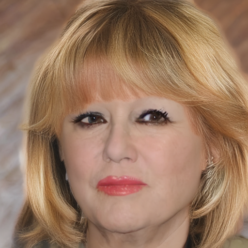 |  | 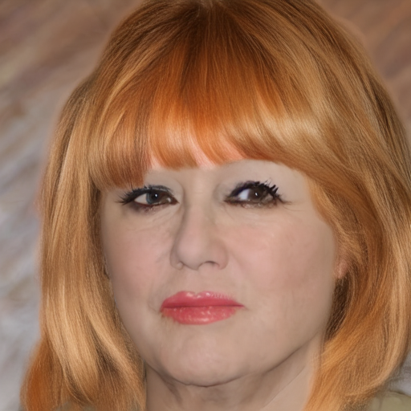 |  |
| run6_1 (15.25°) | 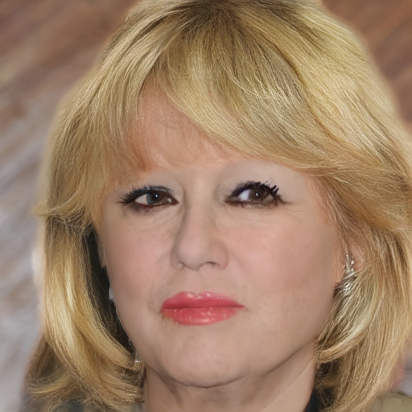 |  | 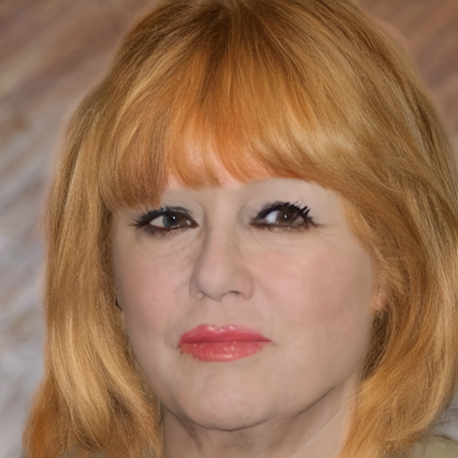 |  |
| run6_2 (13.45°) | 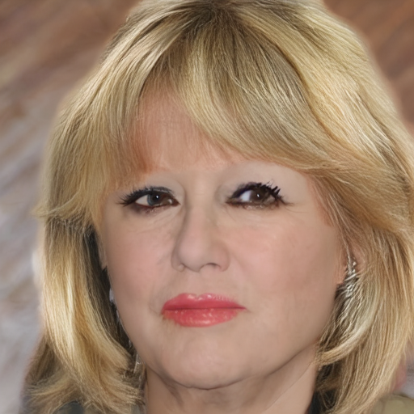 |  | 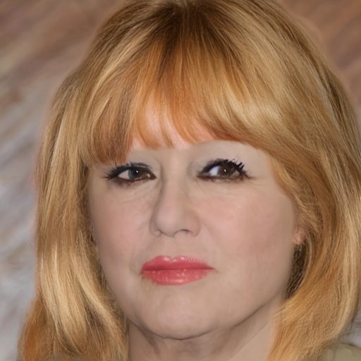 |  |

#### CM_1084

| run | seed 1 | seed 2 | seed 3 | seed 42 |
|---|---|---|---|---|
| run5_1 (17.43°) | 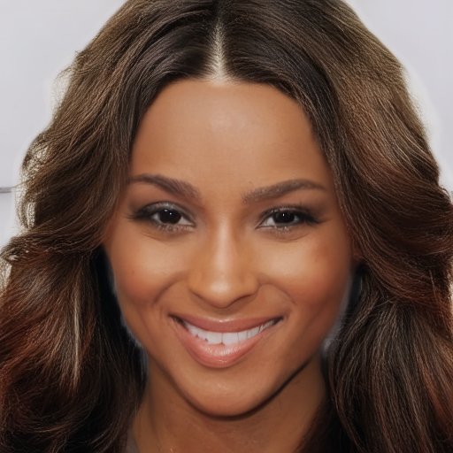 | 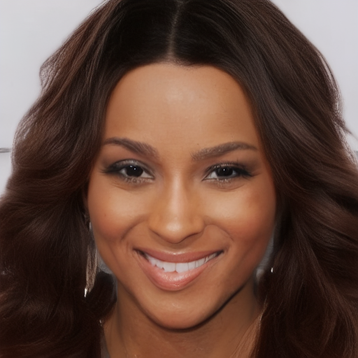 | 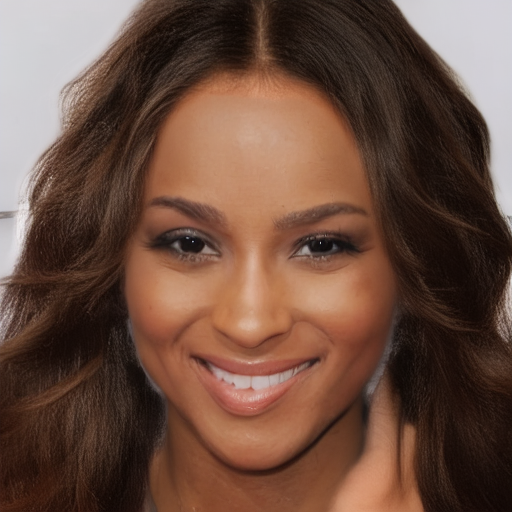 |  |
| run6_1 (22.10°) | 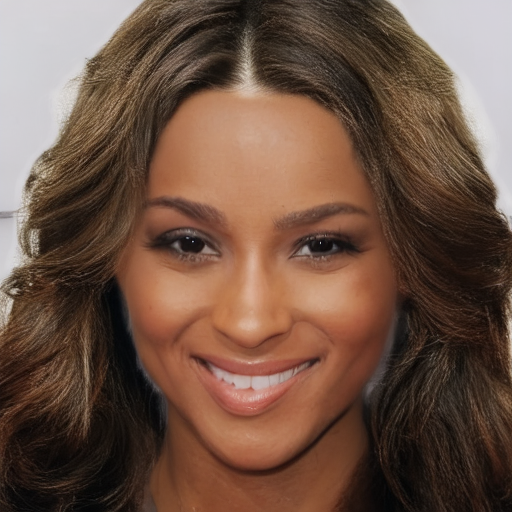 | 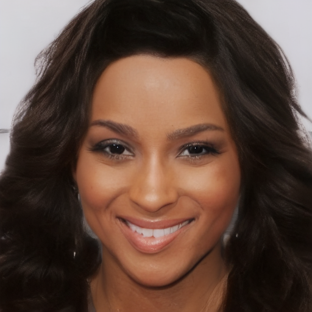 | 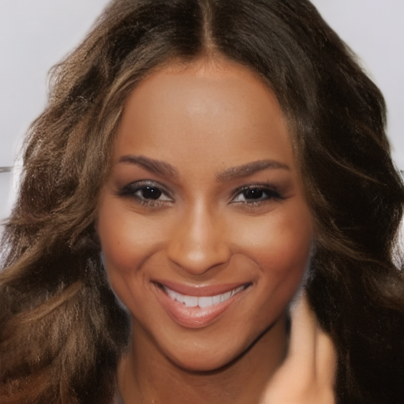 |  |
| run6_2 (19.65°) | 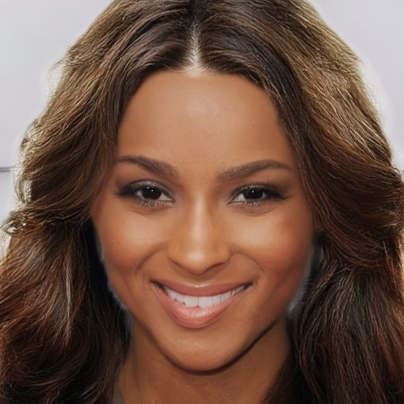 | 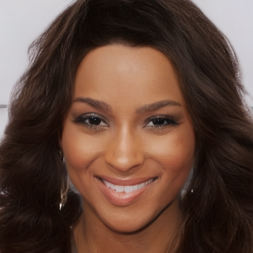 | 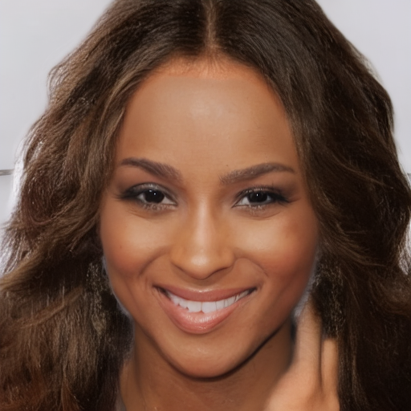 |  |

※ seed 간 차이 중 육안으로 가장 먼저 보이는 것은 모발 색상이지만, seed 불일치는 hair matte
내부의 structure tensor 방향만 coherence 가중으로 측정한 값이므로 색 변화는 지표에 반영되지
않음(`[0806]run5_test_results.md` §1.2와 동일 주의).

## 2. 방향 오차 / 시드 불일치 평가

`[0803]seed_test.md` §5 방법론, `data/test` 8장 × seed `{1,2,3,42}`, `sigma_i=3`,
`erode_px=6`. 전체 표(이미지별 4-seed 값)는 `scripts/eval/orientation_run6.py` 실행 결과
참조 — 아래는 macro 요약과 epoch15 per-image 비교임.

### 2-1. Macro 평균 (8장)

| run | epoch | GT 오차 평균 [deg] | coherence | seed 불일치 [deg] |
|---|---:|---:|---:|---:|
| run5_1 | 5 | 19.47 | 0.789 | 15.73±3.12 |
| run5_1 | 10 | 19.37 | 0.758 | 15.78±2.95 |
| **run5_1** | **15** | **18.10** | **0.770** | **14.09±2.52** |
| run6_1 | 5 | 20.38 | 0.765 | 17.60±4.04 |
| run6_1 | 10 | 19.56 | 0.770 | 16.72±3.33 |
| run6_1 | 15 | 19.56 | 0.728 | 16.69±3.24 |
| run6_2 | 5 | 19.87 | 0.778 | 16.69±3.74 |
| run6_2 | 10 | 19.82 | 0.719 | 16.53±3.21 |
| run6_2 | 15 | 18.59 | 0.758 | 15.17±2.86 |

(run5_1 세 행은 `[0806]run5_test_results.md` §2-1과 동일 — 이번 스크립트로 재계산해도 값이
일치함을 확인함.)

### 2-2. Epoch 15 per-image, run5_1 대비 변화

| image | run5_1 GT/seed | run6_1 GT/seed | run6_2 GT/seed | run6_2 − run5_1 (GT) |
|---|---:|---:|---:|---:|
| CM_1007 | 16.87 / 15.72 | 19.04 / 18.39 | 17.30 / 16.46 | +0.43 |
| CM_1027 | 17.19 / 14.14 | 18.96 / 17.34 | 18.15 / 16.22 | +0.96 |
| CM_1033 | 15.98 / 14.17 | 16.59 / 15.25 | **15.46 / 13.45** | **−0.52** |
| CM_1067 | 16.93 / 13.38 | 18.14 / 15.83 | 17.02 / 14.15 | +0.09 |
| CM_1068 | 16.98 / 14.89 | 18.29 / 17.51 | 17.97 / 16.67 | +0.99 |
| CM_1082 | 16.69 / 14.37 | 17.79 / 16.51 | 16.92 / 14.91 | +0.23 |
| CM_1084 | 17.59 / 17.43 | 20.76 / 22.10 | 19.14 / 19.65 | +1.55 |
| CM_1172 | 26.59 / 8.66 | 26.87 / 10.57 | 26.79 / 9.87 | +0.20 |

8장 중 7장에서 run6_2가 run5_1보다 GT 오차가 크고(악화), CM_1033만 개선됨. 그리고 8장
전부에서 `run6_2 < run6_1`(run6_2가 run6_1보다 항상 낮음/나음) — 이 방향은 우연으로
보기엔 표본 8/8이 일관됨.

## 3. 분석

### 3.1 세기 스윕이 의도대로 걸렸는가 — 착수 체크리스트 검증

두 config 모두 "착수 직후 필수 확인" 항목을 실측으로 확인함(`logs/run6_*_lpips_*_phase1.log`).

| 항목 | run6_1 목표/기준 | run6_1 실측 | run6_2 목표/기준 | run6_2 실측 |
|---|---|---|---|---|
| `lpips_active_fraction` | 0.40±0.03 | 0.4031 | 0.40±0.03 | 0.4014 |
| `densify_t` 로그 키 | 없어야 함 | 0건 (없음) | 없어야 함 | 0건 (없음) |
| `R_lpips` 중앙값 | 0.10, 밴드 0.068~0.181 | **0.091** (평균 0.098, n=29) | 0.30, 밴드 0.199~0.531 | **0.296** (평균 0.297, n=32) |
| `s_raw` | 28~51 | 28.5~51.1 | 28~51 | 28.8~53.2 |
| `clamp_hi/lo` | 0% | 0% | 0% | 0% |
| `grad_clipped` 비율 | 참고 | ~6.8%(근사)* | 참고 | ~6.5%(근사)* |

*tqdm postfix가 스텝당 여러 줄로 중복 기록되어 정확한 스텝 단위 비율은 아니고 근사치임.
두 run 모두 10% 미만으로 낮아, "상시 clip으로 세기가 안 전달됨" 상황은 아님.

**결론: 두 run 모두 config가 의도한 조건(게이트 고정, `w`만 스윕)대로 정상 실행됨.** R이
run5_1 수준(0.027)에 눌러앉지도 않았고, densify가 실수로 켜지지도 않았음. 따라서 §2의
결과 차이는 절차상의 오류가 아니라 `w_lpips` 변화 자체의 효과로 봄.

### 3.2 방향 지표 — 단조성이 깨짐

`[0806]` §3.3-e는 `R≈0.10`을 "안전한 첫 걸음", `R≈0.30`을 LPL의 "1/5 기여"에 근접한 조건으로
설계했고, 방향 지표가 개선되거나 최소한 완만하게 나빠질 것을 기대할 수 있는 설계였음.
실측은 그 반대 순서임 — `run5_1(0.027) < run6_2(0.30) < run6_1(0.10)` (오차 기준, 낮을수록
좋음). 세 값 다 실측 R대로면 `w`가 클수록 단조 악화해야 하는데, `run6_1`이 `run6_2`보다
오히려 나쁨.

가능한 설명(확인되지 않은 가설):
- **비단조 최적화 동역학**: 특정 `w` 구간에서 LPIPS 그래디언트가 flow 학습과 상쇄적으로
  간섭하다가, 더 세게 걸면 오히려 다른 국소해로 수렴할 수 있음. `[0730]results.md` §3-2가
  `R≈1.016`(run3)에서 flow loss 반등을 보고한 것과 같은 계열의 현상일 가능성.
- **학습 시드 미고정에 따른 우연**: `[0806]` §6-4/한계에서 이미 지적된 대로 run마다 학습
  시드가 다름. 8/8 이미지가 같은 방향을 가리키는 건 우연이라기엔 일관성이 크지만, run이
  세 개뿐이라(`n=3`) "`w`-오차 곡선이 U자형"이라고 결론 내리기엔 점이 부족함 — `run6_1`과
  `run6_2` 사이(`R≈0.15~0.25`)나 `run6_2` 너머(`R≈0.5+`)를 찍은 적이 없음.
- 두 설명 모두 이 리포트만으로는 구분할 수 없음.

### 3.3 색/구조 지표

`dE_unbraid`, `lpips_unbraid`, `lpips_braid`, `edge_iou_braid`(perceptual val, `losses.py` 로깅)
epoch 경계 값:

| run | epoch | dE_unbraid | lpips_unbraid | lpips_braid | edge_iou_braid |
|---|---:|---:|---:|---:|---:|
| run5_1 | 14 (마지막 기록)* | 10.6195 | 0.4042 | 0.3089 | 0.0569 |
| run6_1 | 15 | 10.9925 | 0.4323 | 0.3198 | 0.0552 |
| run6_2 | 15 | 10.9406 | 0.4134 | 0.3125 | 0.0565 |

*run5_1의 `logs/run5_1_perceptual.log`는 step=2701(epoch~15)의 `R_lpips`까지만 기록되고
epoch15 체크포인트의 `dE_unbraid` 행이 누락되어 있음 — 원인 미확인(로그 파일이 그 지점에서
끊김). 따라서 이 비교는 정확히 같은 epoch끼리가 아니라 run5_1 epoch14 vs run6_{1,2} epoch15임.

epoch14→15 사이 run5_1의 `dE_unbraid`가 계속 감소하는 추세(12.18→10.62, 단조 감소)였던
점을 감안하면, run5_1의 실제 epoch15 값은 10.62보다 더 낮았을 가능성이 높음 — 즉 이 표의
격차는 과소평가된 하한선이고, `w`를 올릴수록 색 재현이 나빠지는 방향은 §3.2(방향 지표
악화)와 일관됨. `w`가 클수록 LPIPS가 flow/색 학습과 더 강하게 경합한다는 그림에는 부합하지만,
run5_1 epoch15 실측치가 없어 정량적 확정은 아님.

### 3.4 정성 관찰 — frizz 재발 여부

`run6_2`는 설계 단계에서 "frizz 위험이 가장 큰 조건"으로 지목됨(`R≈0.30`이 run3의
frizz 지점 `R≈1.016`까지 3.4배 거리). §1의 5장(seed 42, epoch15) 육안 검토 결과:

- 고주파 곱슬거림(run3에서 관찰된 frizz 특징)은 run6_1·run6_2 어디에서도 뚜렷하지 않음.
- 가장 눈에 띄는 차이는 색상 채도/명도(CM_1084에서 `w`가 클수록 어둡고 채도가 낮아짐)이며,
  이는 §3.3의 `dE_unbraid` 악화와 방향이 같음 — frizz가 아니라 색 재현 저하 쪽으로 손상이
  나타난 것으로 보임.
- 다만 5장만 육안 검토했고 정량 frizz 지표는 없음(`[0806]` §3.3-e 한계 ③과 동일한 gap).

## 4. 한계

1. **학습 시드 미고정** — run5_1/run6_1/run6_2는 각각 다른 학습 시드로 1회씩만 돌았음(`n=1`
   per 조건). §3.2의 비단조 패턴이 8/8 이미지에서 일관되긴 하나, 세 run 자체가 각각 다른
   난수로 학습된 결과라 "`w`의 진짜 효과"와 "학습 시드 운"을 분리할 수 없음.
2. **스윕 두 점 + 기준점 하나, 총 3점** — `R∈(0.03, 0.10)`, `R∈(0.10, 0.30)`, `R>0.30` 세 구간
   모두 비어 있어 U자형인지, 계단형인지, 단일 이상치인지 판별 불가.
3. **run5_1 epoch15 색 지표 로그 누락**(§3.3) — 정확히 같은 epoch끼리 색 지표를 비교하지
   못함.
4. `grad_clipped` 비율은 tqdm 중복 출력 때문에 근사치임 — 정확한 스텝별 비율이 필요하면
   로그 파싱을 스텝 경계 기준으로 다시 해야 함.
5. 평가셋은 8장, seed는 4개로 `[0806]`과 동일 — 표본 크기 자체의 한계는 그대로 이어짐.

## 다음 논의가 필요한 지점

- §3.2의 비단조 결과를 어떻게 다룰지: (a) 중간 구간(`R≈0.15~0.25`)을 추가로 찍어 U자형
  가설을 검증할지, (b) 학습 시드를 고정해 3 run을 재실행하고 시드 효과부터 분리할지,
  (c) 이번 스윕은 "`w=0.002`(run5_1)가 지금까지 찍은 점 중 최선"이라는 결론만 남기고 스윕을
  종료할지 — 판단 기준(추가 GPU 시간 vs 결론의 확실성)이 필요해 보여 선택은 보류함.
