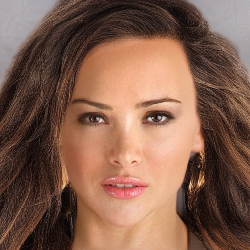
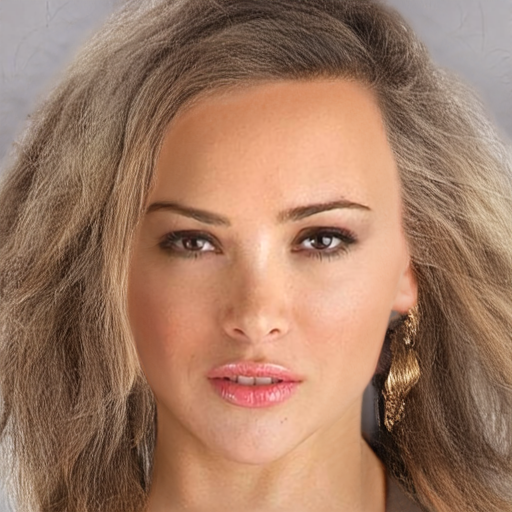
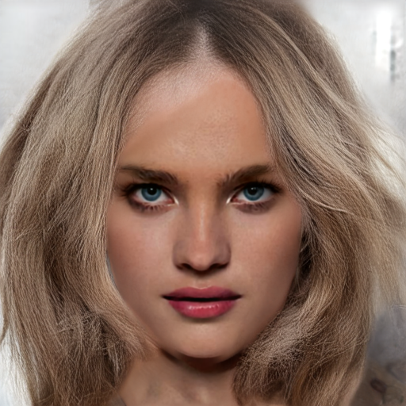
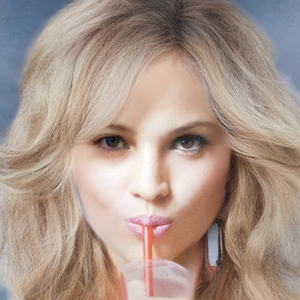
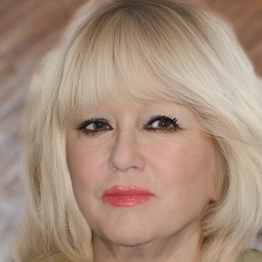
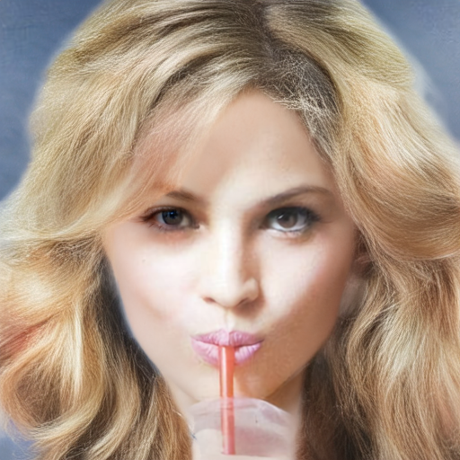
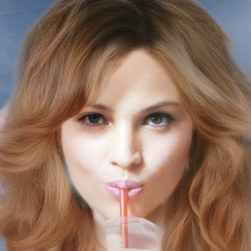
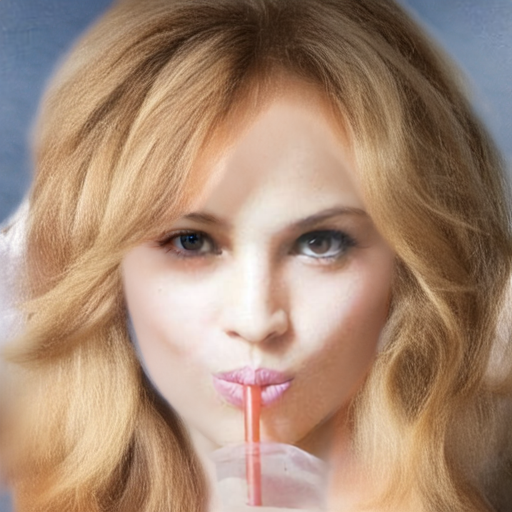
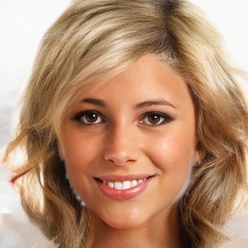

# run5 result

## 최상단 요약 (10줄 이내)

**지난 미팅 (2026-08-06, `[0805]results.md` 보고 후 교수님 피드백)** — 키워드 3줄
- 모델 아키텍처는 그대로 유지
- densify 끄고 noise-gate만 적용한 조건(run5_1)을 진행
- densify 켜고 기존 step-warmup(에포크 기준 30%)을 적용한 조건(run5_2)을 진행

**합의 사항 → 상태**
- [완료] densify OFF + noise-gate 조건(run5_1) 학습 및 방향·색 지표 측정
- [완료] densify ON + 기존 step-warmup 조건(run5_2) 학습 및 방향·색 지표 측정
- [완료] densify·LPIPS 게이트 두 변수를 분리해 개별 효과 확인(§3.1, §3.2)

**이번 결과 / 막힌 것 / 다음**
- 결과: run5_2(densify)는 방향 오차·coherence·seed 불일치 모두 저하, run5_1(noise-gate만)은 오히려 개선 — 노이즈·엉킴 문제는 densify와 강하게 연관되고 noise-gate 탓이 아님
- 막힌 것: LPIPS 최적 세기 미확정 — 지금까지 `R≈0.02`, `R≈1.0` 두 점뿐이고 그 사이 구간은 게이트 도입 후 한 번도 평가되지 않음
- 다음: 게이트 고정한 채 세기만 두 값(`R≈0.10`, `R≈0.30`)으로 스윕(§3.3-e)

## 0. 실험 구성

| Run | Densify | LPIPS 활성 방식 | run4 대비 변경점 | 실험 목적 |
|---|---|---|---|---|
| **run4** | OFF | Step-warmup (기존 방식, epoch 기준 30%) | 기준 조건 | Baseline |
| **run5** | ON | Noise-gate | Densify + LPIPS 활성 기준 동시 변경 | 두 변수의 복합 효과 확인 |
| **run5_1** | OFF | Noise-gate | LPIPS 활성 기준만 변경 | Noise-gate 효과 분리 |
| **run5_2** | ON | Step-warmup (기존 방식, epoch 기준 30%) | Densify만 변경 | Densify 효과 분리 |

※ 네 run 모두 모델 아키텍처와 그 외 학습 조건은 동일하게 유지했으며, run5_1/run5_2는 run4와 동일한 조건에서 한 변수씩 분리해 비교하기 위한 실험임.

## 1. 결과 이미지 비교

### 1.1 run4 vs run5 vs run5_1 vs run5_2

epoch 15 · seed 42 고정, `data/test` 5장(CM_1027 / CM_1067 / CM_1082 / CM_1033 / CM_1068)에 대한 비교임.
좌측부터 입력 스케치, run4(baseline), run5(densify+noise-gate), run5_1(noise-gate만), run5_2(densify만) 순임.

| image | 스케치 | run4 | run5 | run5_1 | run5_2 |
|---|---|---|---|---|---|
| CM_1027 |  |  |  |  |  |
| CM_1067 |  |  |  |  |  |
| CM_1082 |  |  |  |  |  |
| CM_1033 |  |  |  |  |  |
| CM_1068 |  |  |  |  |  |

※ 입력 스케치는 `data/test/recolor_sketch` — 네 run의 추론에 실제로 conditioning으로 들어간 그 이미지임
(`[0805]results.md` §2의 `infer_custom.py --sketch data/test/recolor_sketch`). densify 미적용 원본이며,
densify는 학습 시 입력 증강으로만 적용됨.
※ run5_1은 `epoch15`와 `epoch15_infer` 산출물이 동일해(해시 일치) `epoch15` 디렉터리를 사용함.

### 1.2 seed별 비교

epoch 15 고정, 같은 이미지를 seed `{1, 2, 3, 42}`로 생성한 결과임. 한 행이 하나의 run이므로
**행 내부에서 seed끼리 얼마나 흔들리는지**가 §2의 seed 불일치에 대응함. 행 라벨의 값은
§2-2의 해당 이미지 seed 불일치[deg]임.

#### CM_1082

| run | seed 1 | seed 2 | seed 3 | seed 42 |
|---|---|---|---|---|
| run4 (16.02°) |  |  |  |  |
| run5 (18.78°) |  |  |  |  |
| run5_1 (14.37°) |  |  |  |  |
| run5_2 (18.91°) |  |  |  |  |

#### CM_1068

| run | seed 1 | seed 2 | seed 3 | seed 42 |
|---|---|---|---|---|
| run4 (16.82°) |  |  |  |  |
| run5 (19.46°) |  |  |  |  |
| run5_1 (14.89°) |  |  |  |  |
| run5_2 (19.96°) |  |  |  |  |

두 이미지는 8장 중 `run4 → run5_1` 개선폭과 `run4 → run5_2` 악화폭이 함께 큰 사례로 골랐음
(CM_1082: −1.65 / +2.89, CM_1068: −1.93 / +3.14). 정성 비교는 선택된 사례에 대한 예시이며,
판정 근거는 §2-1의 8장 macro 평균임.

※ seed 간 차이 중 육안으로 가장 먼저 보이는 것은 모발 **색상**이지만, §2의 seed 불일치는 hair
matte 내부의 structure tensor **방향**만 coherence 가중으로 측정한 값이므로 색 변화는 지표에
반영되지 않음. 이 표는 방향 안정성의 참고 자료로만 봄.


## 2. 방향 오차 / 시드 불일치 평가 ([DIGLAB][0803][장서현]seed_test.md §5 방법론)

`[DIGLAB][0803][장서현]seed_test.md` §5의 structure tensor 지표를 그대로 적용함. 평가 대상은
`data/test` 8장 × seed `{1, 2, 3, 42}`이며, `sigma_i=3`, `erode_px=6`을 사용함.

- **GT 오차**: 생성 이미지와 GT 원본의 평균 방향 오차(도)
- **coherence**: 생성 이미지의 방향 선명도
- **seed 불일치**: 같은 run·epoch에서 4개 seed의 6개 쌍을 직접 비교한 평균 방향 차이(도)

### 2-1. Macro 평균 (8장)

| run | epoch | GT 오차 평균 [deg] | coherence | seed 불일치 [deg] |
|---|---:|---:|---:|---:|
| run4 | 5 | 20.61 | 0.769 | 18.53±3.70 |
| run4 | 10 | 19.59 | 0.762 | 16.50±3.00 |
| **run4** | **15** | **19.29** | **0.761** | **15.80±3.07** |
| run5 | 5 | 21.99 | 0.731 | 20.33±5.00 |
| run5 | 10 | 20.09 | 0.745 | 17.75±2.97 |
| run5 | 15 | 20.83 | 0.708 | 18.43±3.59 |
| run5_1 | 5 | 19.47 | 0.789 | 15.73±3.12 |
| run5_1 | 10 | 19.37 | 0.758 | 15.78±2.95 |
| **run5_1** | **15** | **18.10** | **0.770** | **14.09±2.52** |
| run5_2 | 5 | 21.54 | 0.720 | 18.39±3.67 |
| run5_2 | 10 | 20.49 | 0.739 | 16.99±3.19 |
| run5_2 | 15 | 20.57 | 0.724 | 17.98±3.19 |

### 2-2. Epoch 15 per-image 비교

| image | run4 GT/seed | run5 GT/seed | run5_1 GT/seed | run5_2 GT/seed |
|---|---:|---:|---:|---:|
| CM_1007 | 18.92 / 18.70 | 20.08 / 19.69 | **16.87 / 15.72** | 19.66 / 20.07 |
| CM_1027 | 19.04 / 16.48 | 21.22 / 20.53 | **17.19 / 14.14** | 20.69 / 18.83 |
| CM_1033 | 16.35 / 14.85 | 17.74 / 16.69 | **15.98 / 14.17** | 16.70 / 15.91 |
| CM_1067 | 17.51 / 14.48 | 18.98 / 17.30 | **16.93 / 13.38** | 19.20 / 17.54 |
| CM_1068 | 18.32 / 16.82 | 19.94 / 19.46 | **16.98 / 14.89** | 20.11 / 19.96 |
| CM_1082 | 17.66 / 16.02 | 19.25 / 18.78 | **16.69 / 14.37** | 18.90 / 18.91 |
| CM_1084 | 19.92 / 19.55 | 22.75 / 23.69 | **17.59 / 17.43** | 22.41 / 21.38 |
| CM_1172 | 26.61 / 9.54 | 26.73 / 11.28 | **26.59 / 8.66** | 26.93 / 11.23 |


### 2-3. 해석

- epoch15 기준 `run5_1`은 run4보다 GT 오차가 **19.29 → 18.10°**, seed 불일치가
 **15.80 → 14.09°**로 모두 낮고, coherence도 **0.761 → 0.770**으로 높음. 따라서
 densify를 끈 상태에서 noise-gate를 적용한 run5_1은 방향 안정성 측면에서 오히려 안정됨
- `run5_2`는 run4 대비 epoch15에서 GT 오차가 **19.29 → 20.57°**, coherence가
 **0.761 → 0.724**, seed 불일치가 **15.80 → 17.98°**로 악화됨.
- 따라서 이번 8장·4 seed 평가에서는 **run5_2의 저하가 densify 축에서 재현**됨. 반면
 run5_1은 run4보다 오히려 개선되어, run5에서 관찰된 방향 불안정성을 noise-gate 단독
 효과로 설명하기 어려움.
- 단, 표본은 8장이고 seed 불일치는 상대 지표이므로, 이를 모든 입력에 대한 절대적 인과
 증명으로 해석하지 않고 이번 평가 범위의 ablation 결과로 해석함.


## 3. 분석

### 3.1 DensifyAug의 방향성 영향

`run4`↔`run5_2`는 densify만, `run4`↔`run5_1`은 LPIPS 활성 규칙만 다르므로 epoch15 비교로
두 변수를 분리할 수 있음.

```text
run5_2 − run4:  GT 방향 오차 19.29 → 20.57° (+1.28)
         coherence   0.761 → 0.724  (−0.037)
         seed 불일치  15.80 → 17.98° (+2.18)
```

8개 이미지 모두 같은 방향이고, densify를 끈 `run5_1`은 반대로 개선됨. 따라서 run5의 방향
불안정성과 coherence 저하를 noise-gate 단독으로 설명하기 어렵고, **DensifyAug가 주된 저하
요인**으로 판단함.

가능한 메커니즘은 densification이 원본 stroke 사이 빈 공간에 보간 stroke를 넣으면서
annotation에 없던 영역의 방향까지 조건으로 학습시킨다는 것임. 서로 다른 방향의 stroke
사이가 평균화되거나 연결된 구조로 보이면, 생성 시 방향 prior와 seed noise가 개입할 여지가 오히려 커짐.

### 3.2 Noise-gate의 영향 — 개선은 사실이나 "게이트 위치" 효과가 아님

epoch15에서 `run5_1`은 GT 오차 19.29→18.10°, seed 불일치 15.80→14.09°, coherence
0.761→0.770으로 세 지표 모두 개선됨. **noise-gate가 방향성 저하를 유발하지 않았음**이
§2가 직접 지지하는 진술임.

다만 게이트를 바꾸면 적용 위치와 **누적 투여량이 함께** 바뀜 — `run5_1`은 `run4`의 5배
LPIPS 노출을 받았음(§3.3-a). `w_lpips` 값이 같다고 "위치만 바뀌었음"이라 할 수 없음.

2×2를 교호작용까지 분해하면:

```text
게이트 효과:  densify OFF  run5_1 − run4  = −1.19°  (개선)
        densify ON  run5  − run5_2 = +0.26°  (소멸)
densify 효과: warmup    run5_2 − run4  = +1.28°
        noise-gate  run5  − run5_1 = +2.73°  (2배)
```

두 변수는 가법적이지 않고, LPIPS 노출 증가가 densified sketch의 악영향까지 증폭함. 정확한
기술은 **"densify를 끈 조건에서 LPIPS 노출을 늘렸더니 방향 지표 세 개가 모두 개선됨"** 이고,
남는 조합은 **densify OFF + LPIPS 증량**임.

### 3.3 LPIPS 영향에 대한 해석상의 주의

LPIPS는 방향성을 직접 최적화하는 손실이 아니라 복원 이미지의 perceptual feature를 제한할
뿐이므로, 방향 지표의 변화는 간접적 결과임. 또한 `run5`는 2변수 동시 변경이라 그 저하만으로
게이트를 판단할 수 없음 — 이번 2×2에서 게이트 축은 `run4→run5_1`, densify 축은
`run4→run5_2`임.

가장 중요한 주의는 **`w_lpips=0.002`가 step-warmup 기준으로 보정된 값**이라는 점임.
아래 (a)~(e)는 그 값이 게이트 교체 이후 근거를 잃었다는 분석임.

#### (a) 게이트 교체는 세기를 유지한 변경이 아니었음 — 누적 5배

`w_lpips`는 손대지 않았고 config에도 "재보정하지 않는다"고 적혀 있지만 두 분기는 LPIPS가 걸리는
총량이 다름.

| | 활성 시점 | 배치 내 적용 | epoch15까지 누적 |
|---|---|---:|---:|
| warmup (run4 / run5_2) | `int(0.3×40×187)=step 2244` = **epoch 13** | 전체 배치 | **3 epoch** |
| noise-gate (run5 / run5_1) | step 0부터 상시 | σ≤0.7 부분집합 | **15 epoch** |

warmup은 epoch 13부터 15까지 3 epoch, noise-gate는 epoch 1부터 15까지 15 epoch — epoch15
시점에서 `run5_1`은 `run4`의 **5.0배** 노출을 받았음.

평균을 내는 범위도 다름 — 배치 하나에 이미지 16장이 있고, 각 이미지는 서로 다른 노이즈 세기
σ를 독립적으로 배정받음. warmup은 활성화되면 이 16장 전체의 평균으로 LPIPS를 계산하는 반면,
noise-gate는 이 중 σ가 낮은(0.7 이하) 이미지만 골라 계산하는데 그 조건을 통과하는 것이 평균
40%, 즉 16장 중 약 6.4장뿐임. 활성 이미지 한 장이 최종 loss에서 차지하는 비중이 noise-gate는
`1/6.4`, warmup은 `1/16`이 되어 **2.5배** 차이가 남. 이는 앞서 말한 5배(LPIPS가 걸리는 기간이
3 epoch냐 15 epoch냐)와는 별개의 배율이라, 둘을 곱하면 총 노출 차이는 **5×2.5 = 12.5배**에 이름.

> σ는 이미지가 여러 스텝을 거치며 순차적으로 낮아지는 값이 아님 학습은 매 스텝 이미지마다 σ를 독립적으로 새로 뽑고(로그정규분포), 그 σ로 노이즈를 한 번 섞어 한 번에 예측·역전파하는 것으로 끝남 다음 epoch에 같은 이미지가 다시 뽑혀도 이전 σ와 무관한 새 추첨이라, `σ≤0.7`을 통과할 확률은 매번 40%로 일정함.
> 이 2.5배가 구현상의 우연이 아니라는 것도 확인함 — PixelGen 공식 코드를 열어보면 `base_t`를 이미지마다 독립적으로 뽑고 LPIPS도 **활성 샘플 개수**로 나눔 — HairDiT의 noise-gate와 정규화 방식이 동일함. 즉 이 2.5배는 인용 논문의 실제 관례를 그대로 따른 결과임.

#### (b) 그런데 `R_lpips`는 이 차이를 못 잡음

`R_lpips`는 그 스텝에서 LPIPS가 `v_pred`에 주는 그래디언트 크기를 flow loss가 주는 그래디언트
크기로 나눈 값(100스텝마다 로깅, `losses.py:360`) — "지금 이 순간 LPIPS가 얼마나 세게 미는가"를
찍는 지표임.

| run | 게이트 | `R_lpips` 평균 | 중앙값 | 범위 | n |
|---|---|---:|---:|---|---:|
| run4 | warmup | 0.0225 | 0.0222 | 0.0178~0.0287 | 52 |
| run5 | noise-gate | 0.0265 | 0.0249 | 0.0159~0.0425 | 29 |
| run5_1 | noise-gate | 0.0268 | 0.0262 | 0.0181~0.0483 | 28 |
| run5_2 | warmup | 0.0233 | 0.0238 | 0.0217~0.0244 | 7 |

(네 run 모두 `w_lpips=0.002`. run5_2의 n=7은 LPIPS가 epoch 13부터만 켜져 그 전에는 `R`이
계산되지 않기 때문임 — `losses.py:360`.)

숫자만 보면 네 run이 0.022~0.027로 비슷해 보이지만, 이는 반대 방향으로 작용하는 두 효과가
우연히 상쇄된 결과임.

① `x0_pred = x_t − σ·v_pred`(`losses.py:333`)라 LPIPS를 `v_pred`로 역전파할 때 이 식의 미분인
`−σ`가 곱해짐 — σ가 큰(노이즈가 센) 샘플일수록 그래디언트가 커짐. noise-gate는 σ가 작은
샘플만 남기므로(활성 샘플의 평균 σ²=0.303, 전체 평균 σ²=0.542), 이 경로만 보면 noise-gate
쪽 그래디언트가 오히려 **작아져야** 함(비율 `√(0.303/0.542) ≈ 0.75`배).
② 그런데 (a)의 부분집합 평균 효과가 반대로 작용함 — 그래디언트 노름은 방향이 제각각인
표본을 K개 모아 평균 내면 대략 `√K`배로 커지므로(랜덤워크 성질), 16장 중 6.4장만 모아
평균 내는 noise-gate 쪽이 `√(16/6.4) ≈ 1.58`배 더 큼.

두 효과를 곱하면 `0.75 × 1.58 ≈ 1.18`배로, 표의 실측 변화(run4 0.0225 → run5_1 0.0268,
1.19배)와 거의 일치함(`P(σ≤0.7)=0.4002`, 로그 실측 0.4026과도 일치).

**즉 `R_lpips`가 비슷해 보이는 건 두 게이트의 실효 세기가 같아서가 아니라 우연한 상쇄일
뿐임.** 이 지표는 순간의 비율만 재므로 활성 구간이 3 epoch인지 15 epoch인지(§(a)의 5배)는
전혀 반영하지 못함 — "R이 밴드 안이니 세기는 동일함"이라는 착수 체크리스트의 전제는 누적
투여량에 대해 성립하지 않음.

#### (c) 탐색된 적 없는 구간 — `R ∈ (0.02, 1.0)`

| run | `R` | `w_lpips` | 관측 |
|---|---:|---:|---|
| run3 | 1.016 | 0.1 | frizz(머리카락이 뻣뻣하고 고주파로 곱슬거리는 아티팩트). LPIPS 활성 epoch에서 flow loss 반등(`[DIGLAB][0730][장서현]results.md` §3-2) |
| run4 / 0730 | ~0.022 | 0.002 | frizz 소멸, 대신 가닥 뭉개짐·방향 흐트러짐(blur) |

`[DIGLAB][0729][장서현]retrain_plan_v2.md` §2-2가 중간 구간(`R=0.2~0.5`)을 선택지 ②로 적어두고 "재현 성공 후
이분탐색"으로 미뤘으나 **실행되지 않았고, 50배 간격이 그대로 비어 있음.**


#### (d) 외부 논문의 수치는 이식되지 않음

**PixelGen은 파이프라인이 다름.** Algorithm 1(p.15)의 `xθ = netθ(xt,t,c)`에서 보듯 **pixel
diffusion + x-prediction**이라 LPIPS 그래디언트가 출력에 직행함. §(a)에서 연 PixelGen 공식
코드로도 확인됨 — `pred_img, src_feature = net(x_t, t, y, ...)`로 네트워크가 예측 이미지를
직접 내놓고, VAE 디코드 과정 없이 `lpips_loss_fn(pred_img, x)`에 곧장 넣음. 우리는 latent +
v-prediction이라 `(−σ) × VAE decoder Jacobian`을 경유하고 matte 마스킹(`losses.py:107-108`,
머리를 검은 배경에 오려붙여 VGG에 투입)까지 붙음. 분모도 pixel L2 vs
latent L2/`s≈37`(`losses.py:272-274`)로 다름. 실제로 `λ1=0.1`을 그대로 넣었을 때 우리 실측
`R`은 **1.016**이었음(`[DIGLAB][0729][장서현]retrain_plan_v2.md` §0) — 저쪽 보조항이 우리에겐 flow와 동급이
됨. 게다가 그 값은 P-DINO·REPA가 함께 있는 3항 목적함수에서 튜닝됐음(Table 5b~5d).
threshold도 `timeshift=1.0` 전제라, `shift=3.0`인 우리에게 `σ≤0.7`은 스케줄 기준 마지막
**43.75%**(샘플 40%)이지 PixelGen의 70%가 아님.
> `shift=3.0` 인 건 SD3.5-medium의 설계 그대로 따온 것

**LPL은 파이프라인이 맞는 유일한 선례임** — [arXiv:2411.04873](https://arxiv.org/abs/2411.04873),
latent diffusion + VAE decoder 경유 + ε/v/flow 전부에서 검증, `w_LPL≈3.0`으로 저자 표현상 **"전체 loss의 약 1/5 기여"**, 게이트는 SNR threshold
`τ_σ∈[3,6]`. 그러나 우리 σ 분포에 대입하면 `τ_σ=3 → σ≤0.366`(통과율 4.95%),
`τ_σ=6 → 2.29%`로 사실상 LPIPS가 꺼짐.

**이식되는 것은 숫자가 아니라 목표 수준임** — LPL은 perceptual을 전체 loss의 1/5로 놓고
우리는 그래디언트 비 2%임. 측정량이 달라(loss 비 vs grad-norm 비) 직접 비교는 불가하지만 두
논문 모두 우리보다 한 자릿수 이상 강함. 따라서 **"방향이 100% 일치하는 논문을 찾아 그대로
채택"하는 경로는 성립하지 않음.** 실효 세기는 예측 타깃·공간·`scale_sync` 제수·마스킹·
σ 분포·게이트의 mean 규약 전부에 의존하는 파이프라인 고유량이고, 이식 가능한 것은 ① 설계의
형태(perceptual을 저노이즈에 한정)와 ② 측정 프로토콜(`R`을 재서 환산)뿐이며 둘 다 이미 있음.

#### (e) 제안 — 게이트 고정, 세기만 스윕

`R`은 `w`에 선형이므로 run5_1 실측(`w=0.002` → `R=0.0268`)에서 환산함.

| 조건 | 목표 `R` | `w_lpips` | 성격 |
|---|---:|---:|---|
| run5_1 (기준) | 0.027 | 0.002 | 현재 최선 조건 |
| **run6_1** | ~0.10 | **0.0075** | 현행 3.7배, 안전한 첫 걸음 |
| **run6_2** | ~0.30 | **0.022** | `[0729]` ②구간, LPL "1/5 기여"에 근접 |

- 두 run 모두 densify OFF + noise-gate 유지(run5_1에서 `lpips` 한 줄만 변경). 정규화 규약은
 같이 바꾸지 않음 — 실효 세기를 바꾸지 않는 재매개화라 변수만 늘어남.
- 판정은 §2의 8장×4 seed 방향 지표 + `[0805]results.md` §3의 색·구조 지표. `w`가 커지면
 `gradient_clip=1.0` 발동 빈도가 늘 수 있어 함께 기록함.
- 로깅 보강: 지금 남는 건 순간 비뿐이라 (a)의 5배 차이가 드러나지 않음. **누적 LPIPS/flow
 gradient 비**를 추가해야 run 간 비교가 가능함.

**한계** — ① 2×2는 셀당 n=1이고 학습 시드가 미고정이며(`[0805]results.md` §6-4) `run5_1`은
투여량과 위치가 동시에 바뀐 조건이라, 위 논거는 부호를 설명하는 메커니즘이지 인과 증명이
아님. ② (b)의 1.18 추정은 decoder Jacobian이 σ에 무관하다고 본 값으로, PixelGen
Appendix A Fig.6(b)에 따르면 noise-gate 쪽에 유리하게 편향돼 있음. ③ 평가셋 8장이고, 방향
지표만으로는 frizz와 sharpness를 구별하지 못하므로 `R`을 올릴 때 정성 관찰이 필요함.
④ 이 스윕에서 seed 불일치가 줄어들더라도, sparse stroke 사이 방향을 초기 noise와 모델
prior가 정하는 메커니즘(`[DIGLAB][0803][장서현]seed_test.md` §6)을 해결했다는 뜻은 아님 — LPIPS는 방향을
명시적으로 재는 항이 아니라 마스크 전체의 texture 유사도를 재는 항이라, 개선이 있어도
"출력이 GT 쪽으로 덜 흔들리는" 간접 효과로 해석해야 함. 실제로 run4(R≈0.02로 frizz를
해결한 조건)에서도 이 문제는 남았음(`[DIGLAB][0803][장서현]seed_test.md` §6: "LPIPS 조정은 푸석거림을
개선했지만 방향성 문제는 seed에 따라 여전히 나타남"). 