# run6_results

## 최상단 요약 (10줄 이내)

**지난 미팅 (2026-08-07, `[DIGLAB][0806][장서현]run5 result.md` 보고 후 교수님 피드백)** — 키워드 3줄
- dense sketch 결과는 학습 데이터가 늘어난 효과로 학습이 덜 진행된 것으로 보는 게 맞음 — 동일 퀄리티엔 4배 에포크 필요(단, 학습 효율성 페널티)
- noise-gate 효과가 주효했고, flow-matching은 노이즈 `σ`가 순차 발현이 아니라 random sample로 학습되는 구조 → `σ=0.7` 정책의 비중 재조정이 필요하다는 지적에 동의
- "제안 — 게이트 고정, 세기만 스윕"을 두 값에 대해 동시 진행하라고 지시

**합의 사항 → 상태**
- [완료] `σ≤0.7` 게이트 고정, `w_lpips` 두 값(3.75×, 11×) 동시 재학습 및 방향·색 지표 측정
- [완료] 세기 스윕이 의도대로 걸렸는지 착수 체크리스트로 검증(§3.1)

**이번 결과 / 막힌 것 / 다음**
- 결과: GT 방향오차는 `run5_1`(18.10)이 세 조건 중 가장 낮음(최선) — `run6_2`(18.59, +0.49)·`run6_1`(19.56, +1.46) 순으로 나쁨, 8/8 이미지에서 `run6_2 < run6_1`
- 막힌 것: `w`가 클수록 악화될 거란 예상과 반대로 run6_1이 run6_2보다 나쁨 — 원인 미확정(비단조 동역학 vs 학습 시드 우연) 🔴
- 다음: `w_lpips`는 run5_1 세기(`R≈0.027`) 유지 — 이번 스윕에서 세기를 올린 두 조건 모두 방향·색 지표 전부 악화되어 상향 방향은 기각(단, n=1, R_lpips 3점뿐이라 §4 한계 있음)
- 다음: color 항 아직 추가 안함 - 추가 필요 / seed 42 일부 이미지에서(CM_1067) 헤어방향성 문제 미해결 - seed 불일치 문제 미해결

## 0. 실험 구성

| Run | densify | LPIPS 활성 방식 | `w_lpips` | 목표 `R_lpips` | run5_1 대비 변경점 |
|---|---|---|---:|---:|---|
| **run5_1** (기준) | OFF | noise-gate (`σ≤0.7`) | 0.002 | 0.027(실측) | — |
| **run6_1** | OFF | noise-gate (`σ≤0.7`, 동일) | 0.0075 | ~0.10 | `w_lpips`만 3.75배 |
| **run6_2** | OFF | noise-gate (`σ≤0.7`, 동일) | 0.022 | ~0.30 | `w_lpips`만 11배 |

세 run 모두 densify OFF, 게이트 위치·정규화 규약 동일.

## 1. 결과 이미지 비교

epoch 15 · seed 42, `[DIGLAB][0806][장서현]run5 result.md`와 동일한 5장(CM_1027 / CM_1067 / CM_1082 /
CM_1033 / CM_1068)에 대한 비교. 좌측부터 입력 스케치, run5_1(기준), run6_1(`R≈0.10`),
run6_2(`R≈0.30`) 순.

| image | 스케치 | run5_1 | run6_1 | run6_2 |
|---|---|---|---|---|
| CM_1027 |  |  | 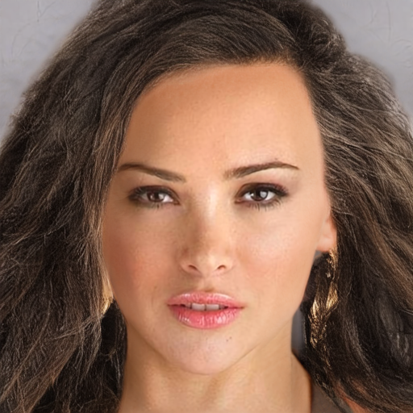 | 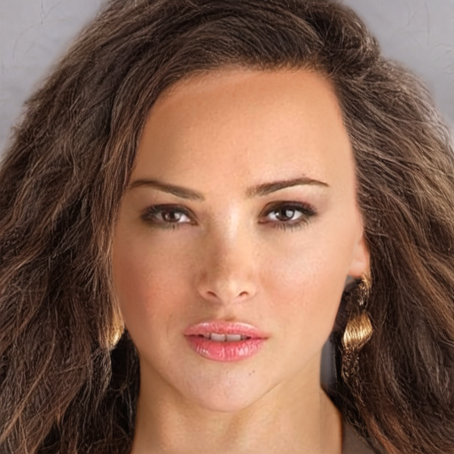 |
| CM_1067 |  |  | 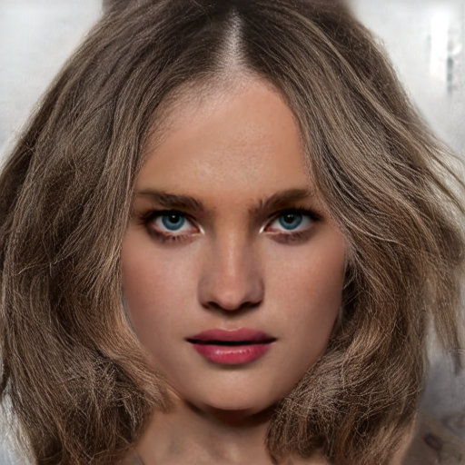 | 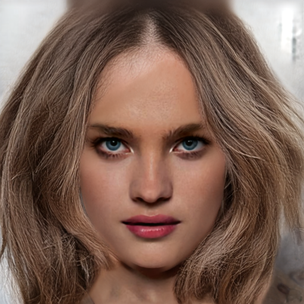 |
| CM_1082 |  |  |  |  |
| CM_1033 (유일하게 개선된 이미지) |  |  |  |  |
| CM_1068 |  |  |  |  |

### 1.2 seed별 비교

epoch 15 고정, 같은 이미지를 seed `{1, 2, 3, 42}`로 생성한 결과임. 한 행이 하나의 run이므로
**행 내부에서 seed끼리 얼마나 흔들리는지**가 §2의 seed 불일치에 대응함. 행 라벨의 값은
§2-2의 해당 이미지 seed 불일치[deg]임. §1.1의 5장 중 `run5_1 → run6_2` 개선폭과
`run5_1 → run6_1` 악화폭이 함께 큰 두 사례(CM_1033, CM_1027)를 골랐음.

#### CM_1033

| run | seed 1 | seed 2 | seed 3 | seed 42 |
|---|---|---|---|---|
| run5_1 (14.17°) |  |  |  |  |
| run6_1 (15.25°) |  |  |  |  |
| run6_2 (13.45°) |  |  |  |  |

#### CM_1027

| run | seed 1 | seed 2 | seed 3 | seed 42 |
|---|---|---|---|---|
| run5_1 (14.14°) | 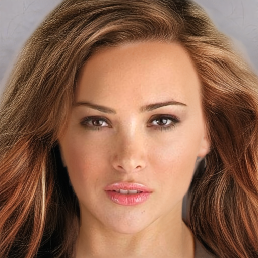 | 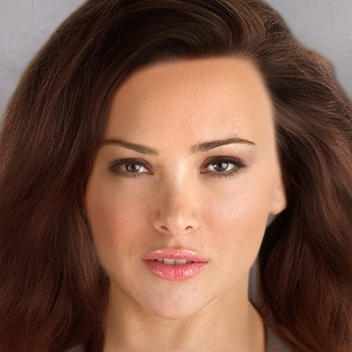 | 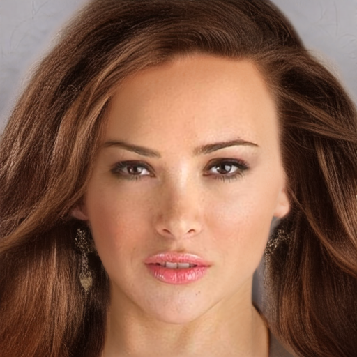 |  |
| run6_1 (17.34°) | 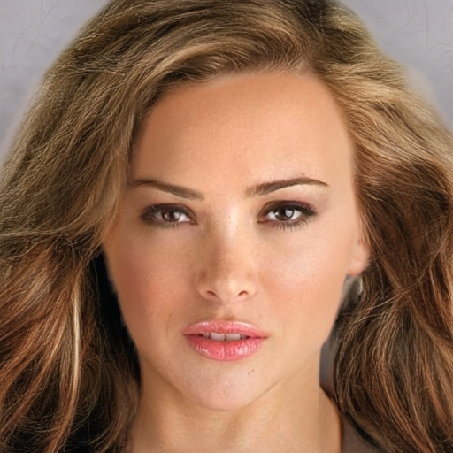 | 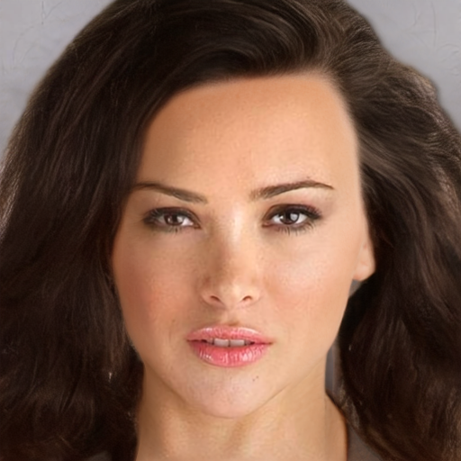 | 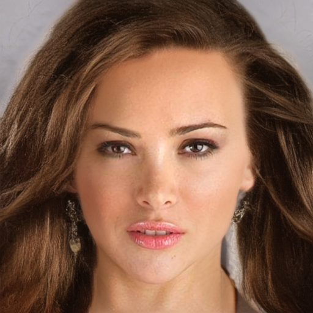 |  |
| run6_2 (16.22°) | 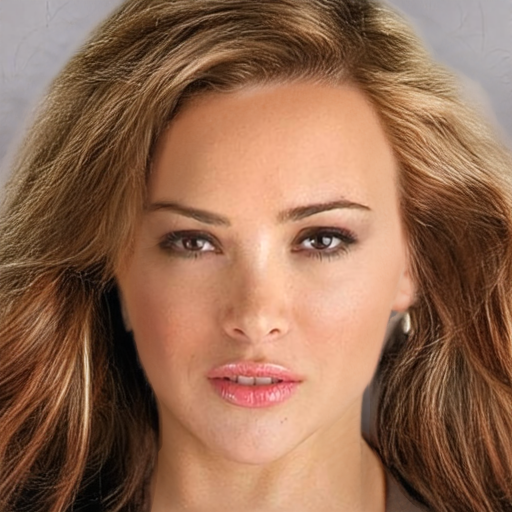 | 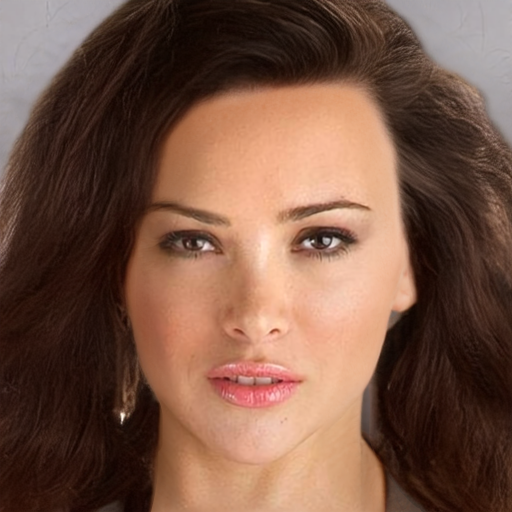 | 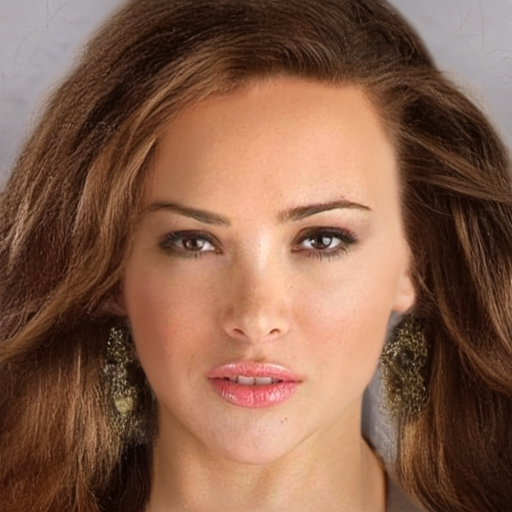 |  |

※ seed 간 차이 중 육안으로 가장 먼저 보이는 것은 모발 색상이지만, seed 불일치는 hair matte
내부의 structure tensor 방향만 coherence 가중으로 측정한 값이므로 색 변화는 지표에 반영되지
않음(`[DIGLAB][0806][장서현]run5 result.md` §1.2와 동일 주의).

## 2. 방향 오차 / 시드 불일치 평가

`[DIGLAB][0803][장서현]seed_test.md` §5 방법론, `data/test` 8장 × seed `{1,2,3,42}`, `sigma_i=3`,
`erode_px=6`. 전체 표(이미지별 4-seed 값)는 `scripts/eval/orientation_run6.py` 실행 결과
참조 — 아래는 macro 요약과 epoch15 per-image 비교임.

### 2-1. Macro 평균 (8장)

| run | epoch | GT 오차 평균 [deg] | coherence | seed 불일치 [deg] |
|---|---:|---:|---:|---:|
| run5_1 | 5 | 19.47 | 0.789 | 15.73±3.12 |
| run5_1 | 10 | 19.37 | 0.758 | 15.78±2.95 |
| **run5_1** | **15** | **18.10** | **0.770** | **14.09±2.52** |
| run6_1 | 5 | 20.38 | 0.765 | 17.60±4.04 |
| run6_1 | 10 | 19.56 | 0.770 | 16.72±3.33 |
| run6_1 | 15 | 19.56 | 0.728 | 16.69±3.24 |
| run6_2 | 5 | 19.87 | 0.778 | 16.69±3.74 |
| run6_2 | 10 | 19.82 | 0.719 | 16.53±3.21 |
| run6_2 | 15 | 18.59 | 0.758 | 15.17±2.86 |

### 2-2. Epoch 15 per-image, run5_1 대비 변화

| image | run5_1 GT/seed | run6_1 GT/seed | run6_2 GT/seed | run6_2 − run5_1 (GT) |
|---|---:|---:|---:|---:|
| CM_1007 | 16.87 / 15.72 | 19.04 / 18.39 | 17.30 / 16.46 | +0.43 |
| CM_1027 | 17.19 / 14.14 | 18.96 / 17.34 | 18.15 / 16.22 | +0.96 |
| CM_1033 | 15.98 / 14.17 | 16.59 / 15.25 | **15.46 / 13.45** | **−0.52** |
| CM_1067 | 16.93 / 13.38 | 18.14 / 15.83 | 17.02 / 14.15 | +0.09 |
| CM_1068 | 16.98 / 14.89 | 18.29 / 17.51 | 17.97 / 16.67 | +0.99 |
| CM_1082 | 16.69 / 14.37 | 17.79 / 16.51 | 16.92 / 14.91 | +0.23 |
| CM_1084 | 17.59 / 17.43 | 20.76 / 22.10 | 19.14 / 19.65 | +1.55 |
| CM_1172 | 26.59 / 8.66 | 26.87 / 10.57 | 26.79 / 9.87 | +0.20 |

8장 중 7장에서 run6_2가 run5_1보다 GT 오차가 크고(악화), CM_1033만 개선됨. 그리고 8장
전부에서 `run6_2 < run6_1`(run6_2가 run6_1보다 항상 낮음/나음) — 이 방향은 우연으로
보기엔 표본 8/8이 일관됨.

## 3. 분석

### 3.1 세기 스윕이 의도대로 걸렸는가 — 착수 체크리스트 검증

두 config 모두 "착수 직후 필수 확인" 항목을 실측으로 확인함

| 항목 | run6_1 목표/기준 | run6_1 실측 | run6_2 목표/기준 | run6_2 실측 |
|---|---|---|---|---|
| `lpips_active_fraction` | 0.40±0.03 | 0.4031 | 0.40±0.03 | 0.4014 |
| `densify_t` 로그 키 | 없어야 함 | 0건 (없음) | 없어야 함 | 0건 (없음) |
| `R_lpips` 중앙값 | 0.10, 밴드 0.068~0.181 | **0.091** (평균 0.098, n=29) | 0.30, 밴드 0.199~0.531 | **0.296** (평균 0.297, n=32) |
| `s_raw` | 28~51 | 28.5~51.1 | 28~51 | 28.8~53.2 |
| `clamp_hi/lo` | 0% | 0% | 0% | 0% |
| `grad_clipped` 비율 | 참고 | ~6.8%(근사)* | 참고 | ~6.5%(근사)* |

**결론: 두 run 모두 config가 의도한 조건(게이트 고정, `w`만 스윕)대로 정상 실행됨.** R이
run5_1 수준(0.027)에 눌러앉지도 않았고, densify가 실수로 켜지지도 않았음. 따라서 §2의
결과 차이는 절차상의 오류가 아니라 `w_lpips` 변화 자체의 효과로 봄.

### 3.2 방향 지표 — 단조성이 깨짐

`[0806]` §3.3-e는 `R≈0.10`을 "안전한 첫 걸음", `R≈0.30`을 LPL의 "1/5 기여"에 근접한 조건으로
설계했고, 방향 지표가 개선되거나 최소한 완만하게 나빠질 것을 기대할 수 있는 설계였음.
실측은 그 반대 순서임 — `run5_1(0.027) < run6_2(0.30) < run6_1(0.10)` (오차 기준, 낮을수록
좋음). 세 값 다 실측 R대로면 `w`가 클수록 단조 악화해야 하는데, `run6_1`이 `run6_2`보다
오히려 나쁨.

가능한 설명(확인되지 않은 가설):
- **비단조 최적화 동역학**: 특정 `w` 구간에서 LPIPS 그래디언트가 flow 학습과 상쇄적으로
 간섭하다가, 더 세게 걸면 오히려 다른 국소해로 수렴할 수 있음. `[DIGLAB][0730][장서현]results.md` §3-2가
 `R≈1.016`(run3)에서 flow loss 반등을 보고한 것과 같은 계열의 현상일 가능성.
- **학습 시드 미고정에 따른 우연**: `[0806]` §6-4/한계에서 이미 지적된 대로 run마다 학습
 시드가 다름. 8/8 이미지가 같은 방향을 가리키는 건 우연이라기엔 일관성이 크지만, run이
 세 개뿐이라(`n=3`) "`w`-오차 곡선이 U자형"이라고 결론 내리기엔 점이 부족함 — `run6_1`과
 `run6_2` 사이(`R≈0.15~0.25`)나 `run6_2` 너머(`R≈0.5+`)를 찍은 적이 없음.
- 두 설명 모두 이 리포트만으로는 구분할 수 없음.

### 3.3 색/구조 지표

`dE_unbraid`, `lpips_unbraid`, `lpips_braid`, `edge_iou_braid`(perceptual val, `losses.py` 로깅)

| run | epoch | dE_unbraid | lpips_unbraid | lpips_braid | edge_iou_braid |
|---|---:|---:|---:|---:|---:|
| run5_1 | 15 | 10.6195 | 0.4042 | 0.3089 | 0.0569 |
| run6_1 | 15 | 10.9925 | 0.4323 | 0.3198 | 0.0552 |
| run6_2 | 15 | 10.9406 | 0.4134 | 0.3125 | 0.0565 |

### 3.4 정성 관찰 — frizz 재발 여부

`run6_2`는 설계 단계에서 "frizz 위험이 가장 큰 조건"으로 지목됨(`R≈0.30`이 run3의
frizz 지점 `R≈1.016`까지 3.4배 거리). §1의 5장(seed 42, epoch15) 육안 검토 결과:

- 고주파 곱슬거림(run3에서 관찰된 frizz 특징)은 run6_1·run6_2 어디에서도 뚜렷하지 않음.
- 가장 눈에 띄는 차이는 머리카락 색조/채도임(예: CM_1027, `w`가 클수록 톤이 옅어지고 채도가
 낮아짐). 이는 §3.3의 `dE_unbraid` 악화와 방향이 같음 — frizz가 아니라 색 재현 저하 쪽으로
 손상이 나타난 것으로 보임.

같은 seed(42)·같은 epoch(15)로 맞춘 run3 대조:

| image | run3 | run6_1 | run6_2 |
|---|---|---|---|
| CM_1027 | 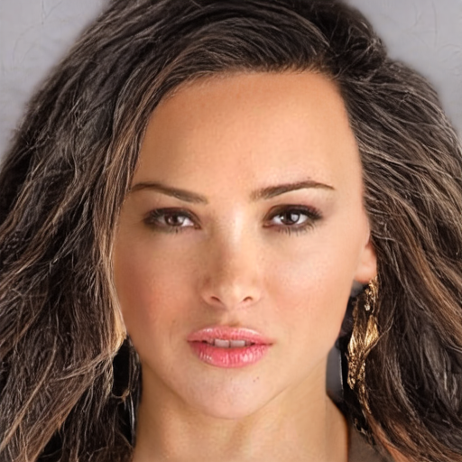 |  |  |
| CM_1067 | 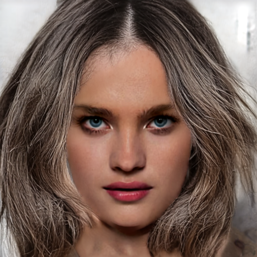 |  |  |
| CM_1082 | 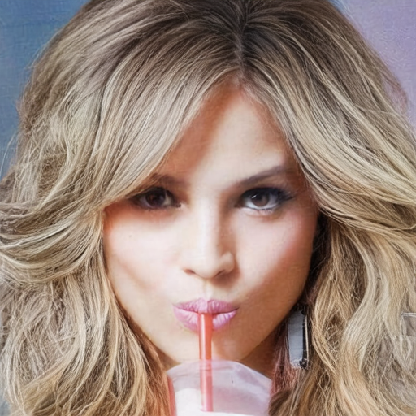 |  |  |
| CM_1033 |  |  |  |
| CM_1068 |  |  |  |

## 4. 한계
- **조건당 학습 반복 없음(`n=1`)** — `w_lpips` 값마다 학습을 1회씩만 돌림. §3.2의 비단조
  패턴(`run5_1 < run6_2 < run6_1`)이 8/8 이미지에서 일관되긴 하나, 반복 없이는 이게 `w`의
  진짜 효과인지 그 1회 학습들의 우연인지 이 리포트만으로는 확정할 수 없음.
- **스윕 두 점 + 기준점 하나, 총 3점** — `R∈(0.03, 0.10)`, `R∈(0.10, 0.30)`, `R>0.30` 세 구간 모두 비어 있어 U자형인지, 계단형인지, 단일 이상치인지 판별 불가.
