# run5_1 T15 CFG eval

## 최상단 요약 (10줄 이내)

**지난 미팅 (2026-08-10, 교수님 지시)** — 키워드 3줄
- run5_1 × T15 densify(추론 시점만) × 50장 × seed 4개 테스트
- 50장 배치 기존 8장 dE·lpips 재계산
- CFG {7.5→5.0→3.5} 스윕 × seed42 × 문제 이미지 2장 테스트

**합의 사항 → 상태**
- [완료] T15 densify 50장×4seed 추론·지표 계산(§1)
- [완료] 기존 8장 dE·lpips 재계산(§2)
- [완료] true CFG 구현·스윕(§3)

**이번 결과 / 막힌 것 / 다음**
- 방법론 수정: 배경 합성 유무에 따라 matte 안쪽 픽셀 평균 9.4/255 차이 확인 → §1·§2
  전체 재생성(§0-1)
- 결과: T15 densify, 50장 중 48장 개선, seed 불일치 13.14°→12.32°(-6.2%)(§1)
- 결과: CFG 3.5에서 GT 오차 최선(15.18°/14.79°), 5.0·7.5 재악화(§3)
- 다음: CFG 3.5 미만 구간 추가 스윕

---

## 0. 지시사항 원문

```
-- run5_1 × T15 densify × 50장 × seed 4개 테스트
-- 50장 배치 안에서 기존 8장만 dE·lpips 재계산
-- CFG {7.5→5.0→3.5} 스윕 × seed42 × 문제의 이미지 두장 테스트
```

체크포인트: `checkpoints/run5_1_noisegate/epoch_15_infer.pth`
(config `configs/run5_1_noisegate_phase1.yaml`), 20-step 샘플링 공통.

### 0-1. 방법론 수정 — 배경 합성 유무의 헤어 생성 영향

§1·§2 최초 생성: 배경 합성 없음(hair-only, 학습 타깃 포맷과 동일). CFG 검증 중 matte
밖 프리즌 prior의 얼굴 생성 발견(§3-2) → 배경 합성 영향 확인 필요.

`dE_unbraid`/`lpips_unbraid`는 matte 마스킹이라 배경 합성 여부와 수식상 무관. 단
`bld_mode="full"`의 매 스텝 블렌딩이 matte 안쪽 생성에도 개입 — 동일 seed·이미지
대조 시 matte 안쪽 픽셀 평균 절대차 **9.4/255**(std 12.7).

배경 합성이 생성 과정 자체에 관여함을 확인. 기존 정성 리포트 전부 배경 합성 조건이므로
§1·§2 전체를 배경 합성 조건(`--bld_mode full --bld_soft_steps 18 --pixel_blend
--pixel_blend_alpha 0.75`)으로 재생성. 지난 세션 run5_1/run6_1/run6_2 50장 비교는
이번 범위 밖 — 재작업 여부 판단 필요 🔴.

---

## 1. run5_1 × T15 densify × 50장 × seed 4개

### 1-1. 방법

`data/densify_masks/` 로컬 부재로 50장용 T15 컬러 스케치 신규 생성.

1. 50장 원본 스케치(`dataset/sketch`) GT색 recolor(`recolor_sketch_from_gt`, densify
   전 수행 — 학습 순서와 동일)
2. `scripts/preprocess/densify_shs.py colored --thresholds 15` T15 색전파(SHS 공식
   `getSketchCompletion`, `threshold` 외 무수정) — 밀도 0.1291±0.0106, 기존 8장용
   T15(0.122~0.129)와 동일 대역
3. run5_1 × seed `{1,2,3,42}` × 50장 추론, 배경 합성 조건(§0-1)
4. 지표: `orientation_metric.py`(structure tensor, `sigma_i=3`, `erode_px=6`) +
   `eval_metrics.py`의 `compute_delta_e_hue`/`hair_masked_lpips` —
   `quant50_run5_1_run6.py`와 동일 정의

### 1-2. 결과 — macro 평균 (50장×4seed)

| set | GT 오차 [deg] | coherence | seed 불일치 [deg] | dE_unbraid | lpips_unbraid |
|---|---:|---:|---:|---:|---:|
| T∞ (densify 없음) | 14.95 | 0.769 | 13.14±4.64 | 4.5783 | 0.2222 |
| **T15** | **14.57** | **0.782** | **12.32±4.50** | 4.6546 | **0.2175** |

GT 오차 -2.5%, seed 불일치 -6.2%, coherence 상승. densify 상대 개선폭은 배경 합성
유무 무관 — §0-1 이전 no-face 조건도 -6.8%로 동일 수준.

### 1-3. per-image

50장 중 **48장 개선**(seed 불일치 감소), 2장 소폭 악화(R2_1424 +0.1%, R2_1720 +0.5%).
개선폭 최대: CM_1020(-17.6%), CM_1223(-13.8%), CM_1057(-13.6%), CM_1134(-12.8%).

`[DIGLAB][0804][장서현]densified_sketch_shs.md`의 8장(2장 상세) 기준 "밀도 증가 → seed
불일치 감소" 결과, run5_1 실제 체크포인트·50장 규모에서 재현.

개선 최대 2장 + 소폭 악화 1장 seed42 비교(스케치 → 결과):

| image | T∞ 스케치 | T∞ 결과 | T15 스케치 | T15 결과 | GT |
|---|---|---|---|---|---|
| CM_1020 (-17.6%) | 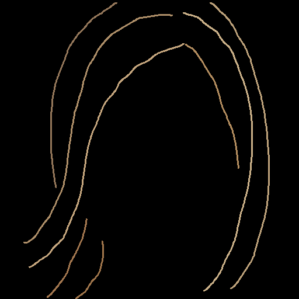 | 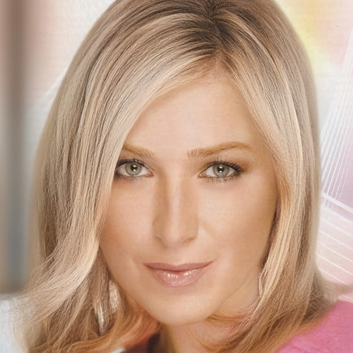 | 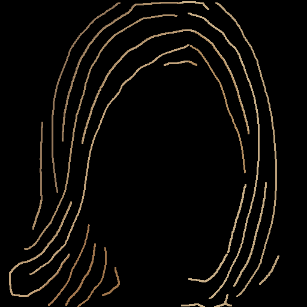 | 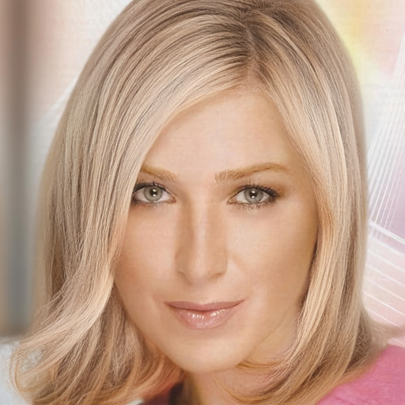 | 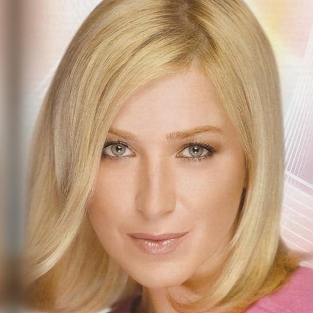 |
| CM_1057 (-13.6%) | 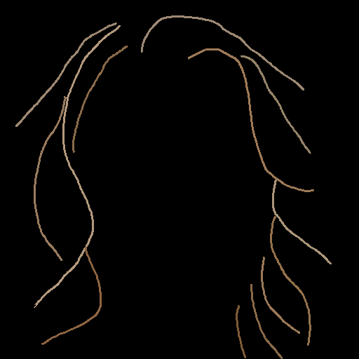 | 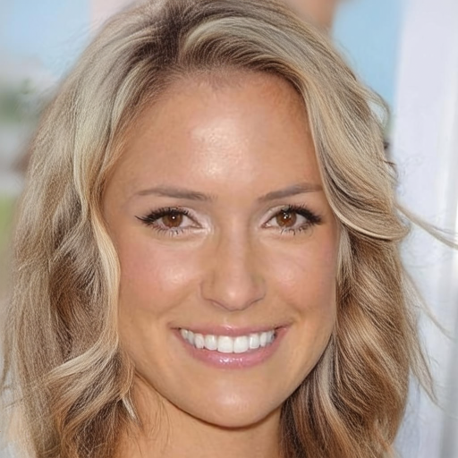 | 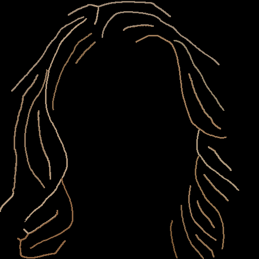 | 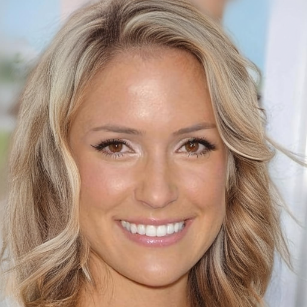 | 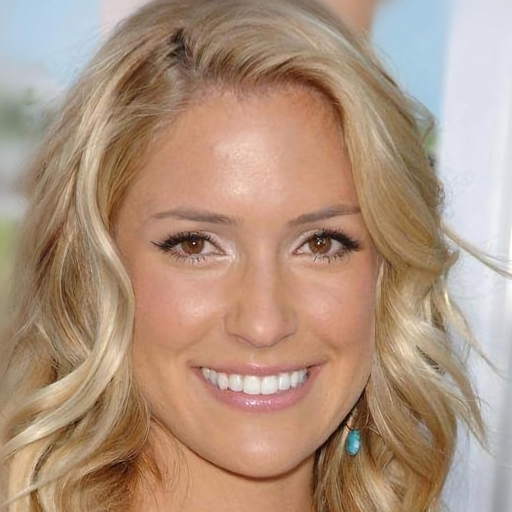 |
| R2_1424 (+0.1%) | 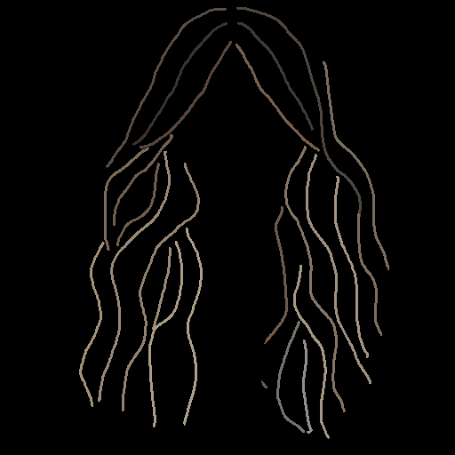 |  |  | 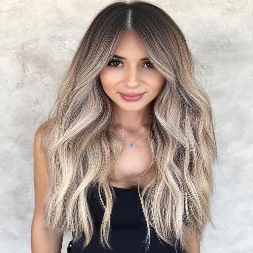 | 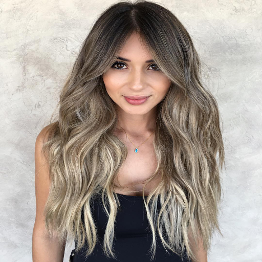 |

### 1-4. 한계

- outlier 개수(4-seed 평균 대비 1σ 초과) 배경 합성 조건 미재계산 — no-face 조건은
  T∞·T15 동일(36/200), densify가 오차 크기만 낮추고 outlier 자체는 유지
- dE_unbraid 방향: no-face 무변화 vs 배경 합성 +1.7%(T15 소폭 악화) — 변화폭 작음,
  표본 n=50 하나뿐이라 판단 보류

---

## 2. 기존 8장 dE·lpips 재계산

### 2-1. 지시 해석

"50장 평가와 동일 방법론을 기존 8장에 독립 적용"으로 해석. 50장 무작위 풀
(`eval50_stems.txt`, `dataset/img` 466장 중 `random.seed(42)` 추출)에 기존 8장 중
CM_1007만 포함, 나머지 7장 부재 — 배치 내 추출 불가로 배치 밖 독립 재계산.

### 2-2. 방법

- run5_1 × seed `{1,2,3,42}` × 기존 8장, `--recolor_from_gt`, 배경 합성 조건(§0-1)
- GT: `dataset/img`/`dataset/matte`(50장 평가와 동일 소스)

### 2-3. 결과

| set | GT 오차 [deg] | coherence | seed 불일치 [deg] | dE_unbraid | lpips_unbraid |
|---|---:|---:|---:|---:|---:|
| 기존 8장(n=8) | 15.42 | 0.762 | 13.82±2.54 | **3.7809** | 0.2517 |
| 50장(n=50) | 14.95 | 0.769 | 13.14±4.64 | 4.5783 | **0.2222** |

방향 지표 유사. 색 지표 상반 — dE_unbraid 8장 우세(3.78<4.58), lpips_unbraid 8장
열세(0.2517>0.2222). 배경 합성 유무 무관 동일 방향 — 8장이 색 재현 기준 "쉬운"
이미지 위주일 가능성, 원인 미확인.

### 2-4. per-image (기존 8장)

| image | dE_unbraid | lpips_unbraid | seed 불일치 [deg] |
|---|---:|---:|---:|
| CM_1007 | 4.5873 | 0.2191 | 15.68±0.97 |
| CM_1027 | 2.4152 | 0.2364 | 13.55±0.25 |
| CM_1033 | 5.4668 | 0.2324 | 13.52±1.22 |
| CM_1067 | 3.3823 | 0.3089 | 12.92±0.88 |
| CM_1068 | 2.6195 | 0.2582 | 14.86±1.00 |
| CM_1082 | 2.7000 | 0.2777 | 14.02±0.86 |
| CM_1084 | 6.0433 | 0.2726 | 17.39±1.06 |
| CM_1172 | 3.0325 | 0.2081 | 8.62±0.59 |

seed42 결과(배경 합성):

| image | GT | 생성 결과(seed42) |
|---|---|---|
| CM_1007 |  | 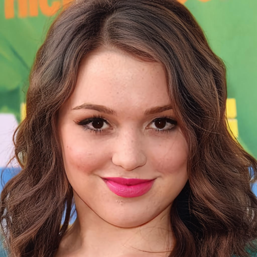 |
| CM_1027 |  | 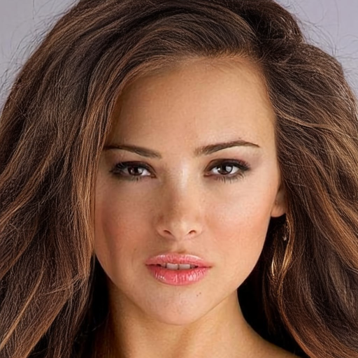 |
| CM_1033 |  | 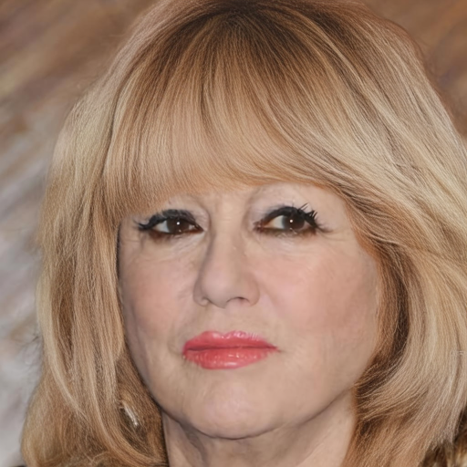 |
| CM_1067 |  | 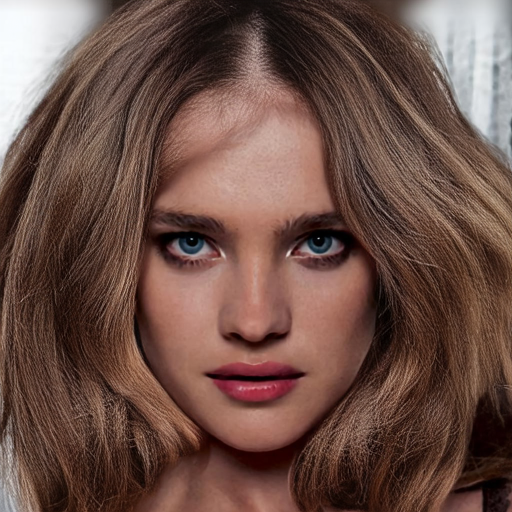 |
| CM_1068 |  | 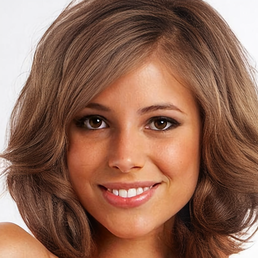 |
| CM_1082 |  | 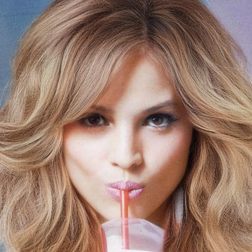 |
| CM_1084 |  | 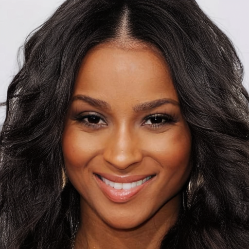 |
| CM_1172 |  | 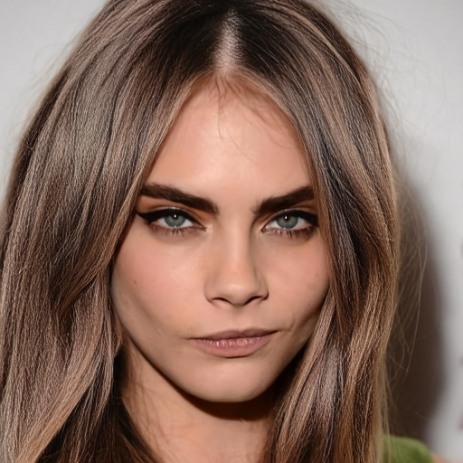 |

---

## 3. CFG {7.5→5.0→3.5} × seed42 × CM_1027/CM_1067

### 3-1. 구현

Unconditional 분기 = "ControlNet residual 없는 프리즌 transformer 단독 forward"
(`block_controlnet_hidden_states=None`). 매 스텝 uncond/cond 2-pass,
`v = v_uncond + w·(v_cond - v_uncond)` blend(`--cfg_scale`, 비용 약 1.4~1.5배).

한계: conditioning dropout 학습 이력 부재 — uncond 분기, 학습된 null 분포 아님.
표준 CFG 스케일 관례(7.5 등) 적용 미보장 — §3-3에서 확인.

### 3-2. 발견 — matte 밖 프리즌 prior의 얼굴 생성

배경 합성 없이 CM_1027 순수 생성 확인 결과, matte=0(비-헤어) 영역에 눈·코·입 출현
(`outputs/0810/cfg_sweep/none/CM_1027.png`). `FlowMatchingLoss`(`outside_weight=0.0`)의
matte 밖 supervision 배제 — 프리즌 SD3.5 prior의 무제약 출력. 기존 리포트 전부 배경
합성 조건이라 미노출 상태. 본 발견이 §0-1 재검증의 계기.

| 입력 스케치 | matte | 배경 합성 없이 본 결과(CFG 없음, seed42) |
|---|---|---|
|  | 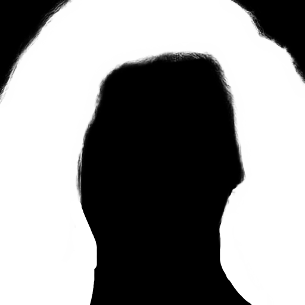 | 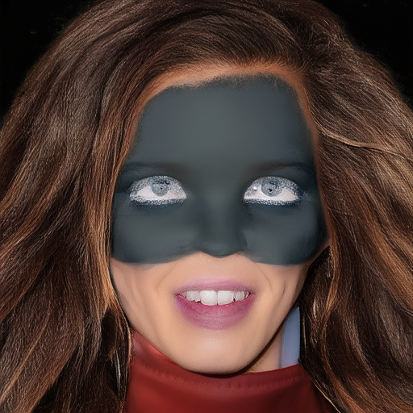 |

이후 §3-3, 배경 합성 조건(§0-1)으로 재생성.

### 3-3. 결과 (배경 합성, seed42)

| CFG | CM_1027 GT오차 | CM_1027 coherence | CM_1067 GT오차 | CM_1067 coherence |
|---|---:|---:|---:|---:|
| 없음(기존) | 16.67 | 0.731 | 16.64 | 0.748 |
| **3.5** | **15.18** | 0.804 | **14.79** | 0.825 |
| 5.0 | 15.92 | 0.793 | 15.40 | 0.830 |
| 7.5 | 16.18 | 0.828 | 16.62 | 0.826 |

coherence, 스케일 증가에 따라 단조 증가. GT 오차는 두 이미지 모두 3.5 최선, 5.0·7.5
재악화 — 비단조. 정성: 스케일 증가 시 결 선명도 상승, 색 주황/구리색 과포화, 7.5에서
경계 아티팩트 발생.

| CFG | CM_1027 (GT오차/coh) | CM_1067 (GT오차/coh) |
|---|---|---|
| 없음(기존) — 16.67/0.731, 16.64/0.748 | 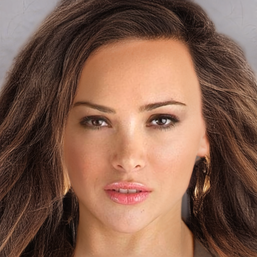 |  |
| **3.5** — 15.18/0.804, 14.79/0.825 | 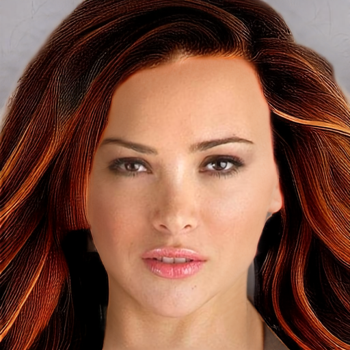 | 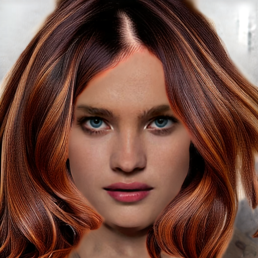 |
| 5.0 — 15.92/0.793, 15.40/0.830 | 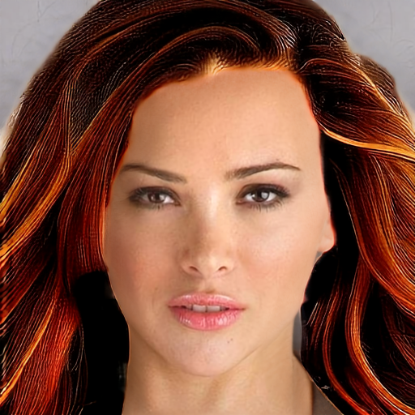 | 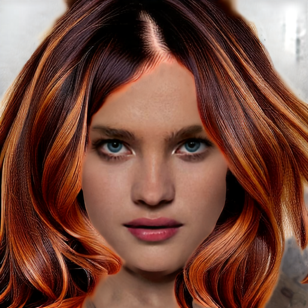 |
| 7.5 — 16.18/0.828, 16.62/0.826 | 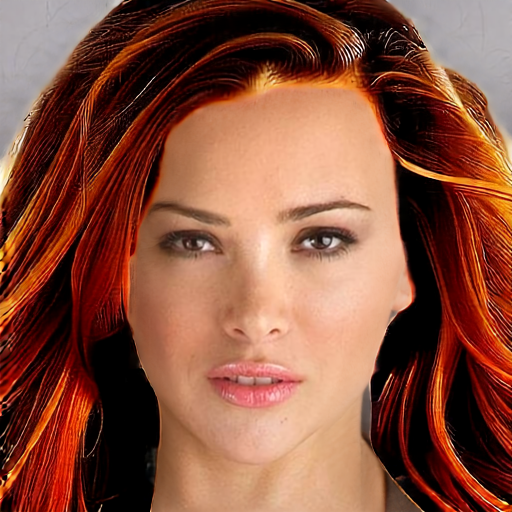 | 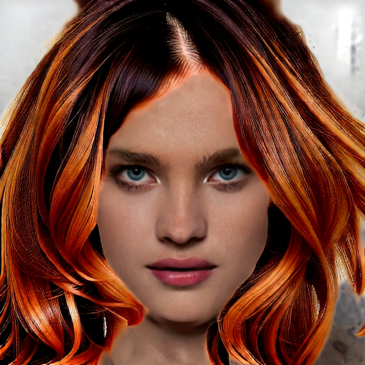 |

### 3-4. 해석

스윕 구간 최적점, 3.5 이하 위치 가능성. uncond 분기 미학습(§3-1) 고려 시 표준 CFG
스케일(7.5) 과도 추정. 다음 스윕: 3.5 미만(2.0, 1.5) 제안.

---

## 4. 코드 변경

- `infer_custom.py`: `cfg_scale` 파라미터·`--cfg_scale` CLI 옵션 추가
- `densify_shs.py colored`로 50장 T15 세트 생성
- 신규 스크립트: `prep_densify_t15_eval50.py`, `quant50_T15_vs_Tinf.py`,
  `eval8_orig_quant.py`
- §0-1 이후 T∞/T15/기존 8장 배경 합성 조건 전량 재생성(`eval50_face/`,
  `eval8_orig_face/`) — no-face 결과는 §0-1 비교용 보존

---

## 5. 한계 / 다음

- 지난 세션 run5_1/run6_1/run6_2 50장 비교, 동일 no-face 방식 — §0-1 발견 적용 여부
  재작업 필요 판단 🔴
- §1-4 outlier 개수, 배경 합성 조건 재계산 필요
- CFG 표본 seed42·이미지 2장·1 seed — 확장 시 판단 안정화
- T15 densify, dose-response 성격 — 낮은 threshold(T12) 확장 시 개선폭 확인 가능
