# run5_1 quant eval

## 요약

- 정성 비교는 몇 장만, 정량 비교는 50장으로 진행
- 정량 비교용 test set은 bald 변환 없이 기존 test dataset(헤어 있는 이미지) 그대로 사용
- 고주파 노이즈가 학습 부족 때문일 수 있으니 30 epoch까지 추가 학습 진행 지시(양상 먼저 확인)
- 이미지를 직접 확인해보았을 때, run5_1에서는 특정 시드의 일부 이미지(seed 42)를 제외하고는 고주파 푸석거림 + 방향노이즈가 나오지 않음, 오히려 일부 시드에(seed2) mcs2보다 더 자연스러운 머릿결이 나옴 

**합의 사항 → 상태**
- [완료] run5_1에서의 정성평가
- [부분] 30 epoch 추가 학습 지시 — 착수 전, run5_1의 epoch5→15 결과에서 머릿결 방향 노이즈 문제가 해결되지 않는 추세를 확인해(§2) 추가 학습으로 해결될지 의문, 또한, run2, 3, 4에서도 epoch 별 경향을 보면, 머릿결 방향 노이즈 문제가 해결되지 않음. 착수 여부 **판단 필요** 🔴
- [완료] 50장 정량 평가 - 50장 선정 후 run5_1/run6_1/run6_2 epoch15·4seed 추론 및 지표 산출 완료(§3)

**이번 결과 / 막힌 것 / 다음**
- 결과: run5_1 8장 육안 검토에서 고주파 곱슬거림은 seed 42의 일부 이미지를 제외하고 거의
 관찰되지 않음(§1) — 그마저도 고주파라기보다 푸석거림 + 방향 노이즈에 가까움(§1)
- 결과: 50장 정량 평가에서 **방향 지표는 run5_1이 최선**(GT 오차 15.29°, seed 불일치
 13.15°)이나, **색/구조 지표는 run6_2가 최선**(dE_unbraid 5.10, lpips_unbraid 0.2304) —
 8장 기준이던 `[DIGLAB][0809][장서현]run6_results.md`의 "세기를 올리면 색·구조 지표도 같이
 악화"라는 결론과 반대 방향(§3.3), 재해석 필요 🔴
- 막힌 것: epoch5→15로 갈수록 GT 방향 오차는 19.47→18.10°로 줄었지만(`[DIGLAB][0806][장서현]run5_test_result.md`
 §2-1) 푸석거림 + 노이즈는 육안상 크게 개선되지 않음(§2)
- 다음: seed에 따라 푸석거림 + 방향노이즈의 정도가 다른데 원인 파악 및 해결 방안 탐색

## 0. run5_1은 어떤 모델인가

run5_1 = `run4`(baseline, `configs/lpips_low_phase1.yaml`)와 아키텍처·학습 조건이 전부 같고
**LPIPS를 켜는 기준 하나만** 바꾼 조건(`[DIGLAB][0806][장서현]run5_test_result.md` §0, §3-1).

| 항목 | run4(baseline) | run5_1 |
|---|---|---|
| LPIPS 활성 기준 | step-warmup(step 30% 경과, 배치 단위) | noise-gate(σ≤0.7, 샘플 단위) |
| LPIPS 걸린 epoch | 15개 중 3 | 15개 중 15 |
| `w_lpips` | 0.002 | 0.002(동일, 재조정 안 함) |
| `R_lpips`(실효 세기, 실측) | 0.0225 | 0.0268 (≈0.027) |
| Densify | OFF | OFF(동일) |

비교 대상 `mcs2`는 세대가 다른 이전 baseline임(단일 변수 ablation이 아니라 구세대 대비 현재
모델의 정성적 위치 확인용 ):

| 항목 | mcs2 | run5_1 |
|---|---|---|
| 조건 채널 | 17ch | 32ch |
| MatteCNN 초기화 | non-zero | zero-init |
| Matte gate | hard gate, all blocks | soft gate |
| Timestep 전달 | raw sigma(×1000 스케일링 없음) | sigma×1000 |
| Scale-sync | 없음 | 있음 |

## 1. run5_1 vs mcs2 결과 이미지 비교 (seed별)

epoch 15(run5_1 최종 epoch) 고정, mcs2는 phase2 40epoch 까지 학습된 점을 감안  
일부 seed에서는 mcs2보다 run5_1이 더 자연스러운 머릿결 결과가 나옴(seed2)  
색에 대한 loss항이 아직 적용되지 않았음으로 색은 무시, 머릿결에 대한 결과만 확인

### 1.1 seed 1

run5_1 CM_1027의 좌측 상단, CM_1067의 좌측 상단, CM_1082의 가르마 부분에서 노이즈 볼 수 있음
| | CM_1007 | CM_1027 | CM_1033 | CM_1067 | CM_1068 | CM_1082 | CM_1172 |
|---|---|---|---|---|---|---|---|
| 스케치 |  |  |  |  |  |  |  |
| mcs2 | 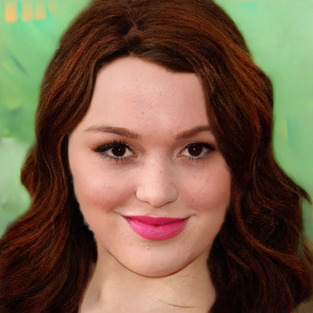 | 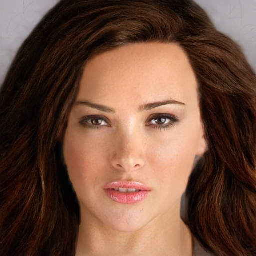 |  |  | 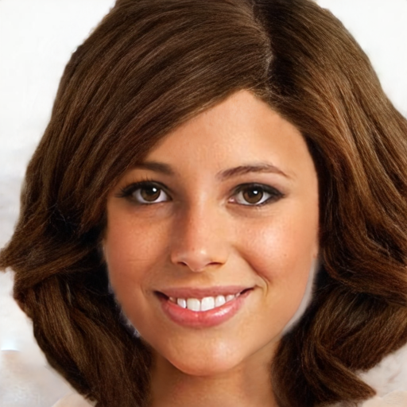 | 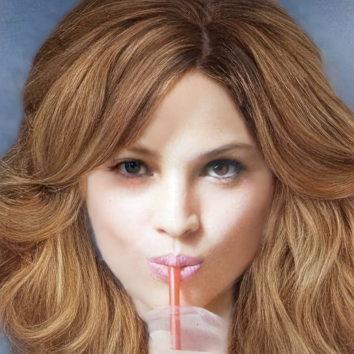 |  |
| run5_1 | 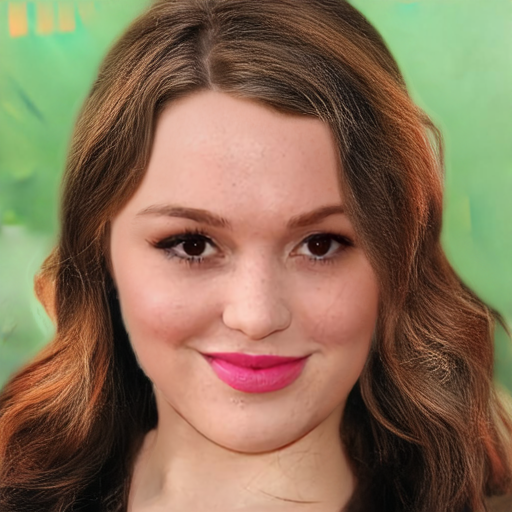 |  |  | 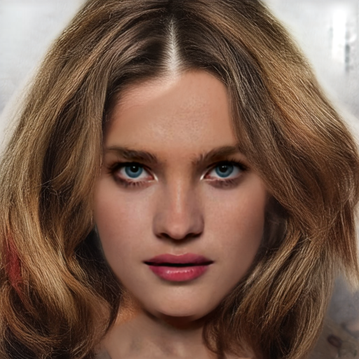 |  |  | 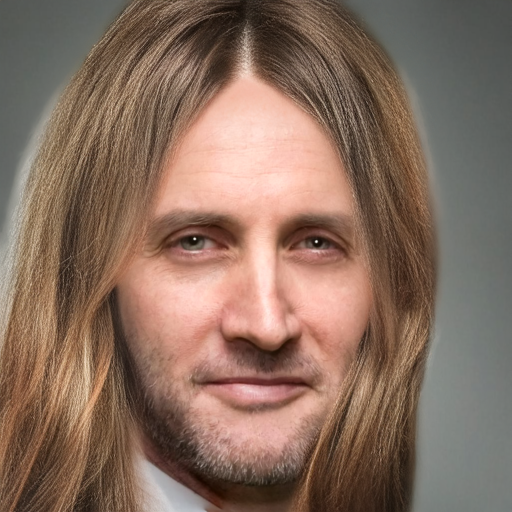 |

### 1.2 seed 2
오히려 mcs2보다 자연스러운 머릿결
| | CM_1007 | CM_1027 | CM_1033 | CM_1067 | CM_1068 | CM_1082 | CM_1172 |
|---|---|---|---|---|---|---|---|
| 스케치 |  |  |  |  |  |  |  |
| mcs2 | 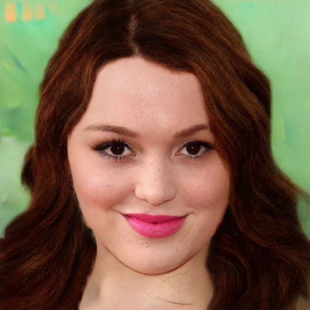 | 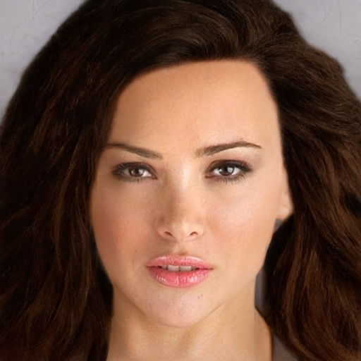 | 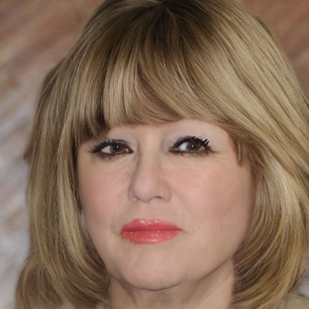 |  |  | 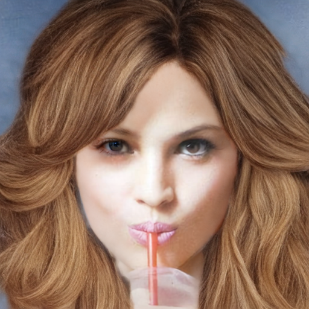 | 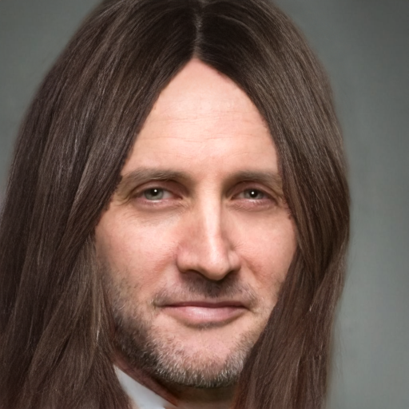 |
| run5_1 | 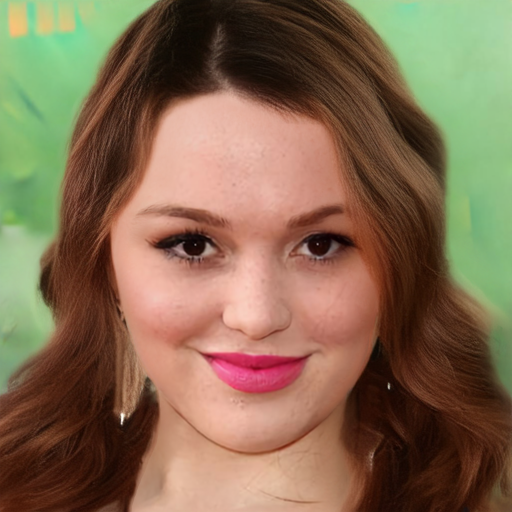 |  |  | 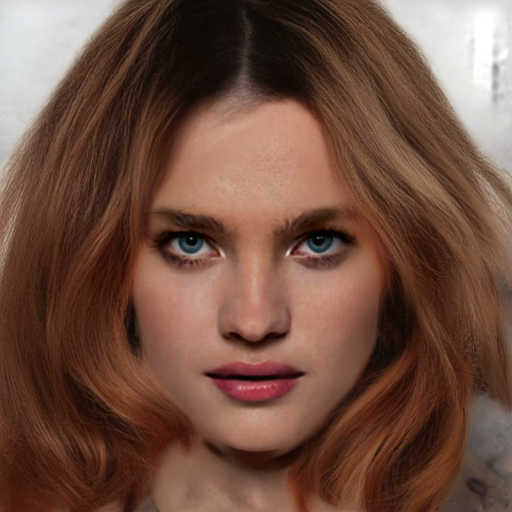 |  |  | 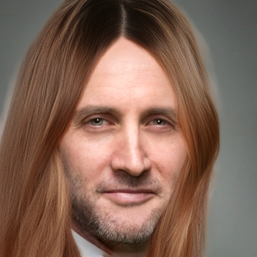 |

### 1.3 seed 3

| | CM_1007 | CM_1027 | CM_1033 | CM_1067 | CM_1068 | CM_1082 | CM_1172 |
|---|---|---|---|---|---|---|---|
| 스케치 |  |  |  |  |  |  |  |
| mcs2 | 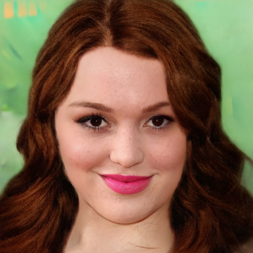 | 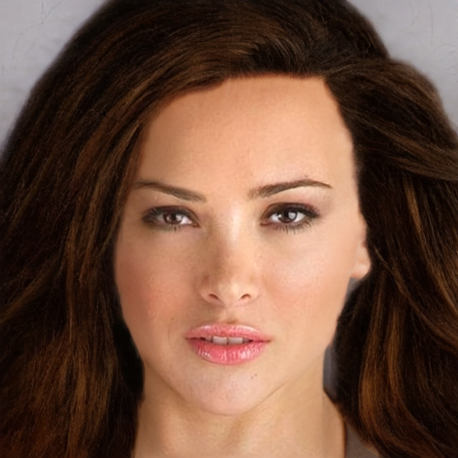 | 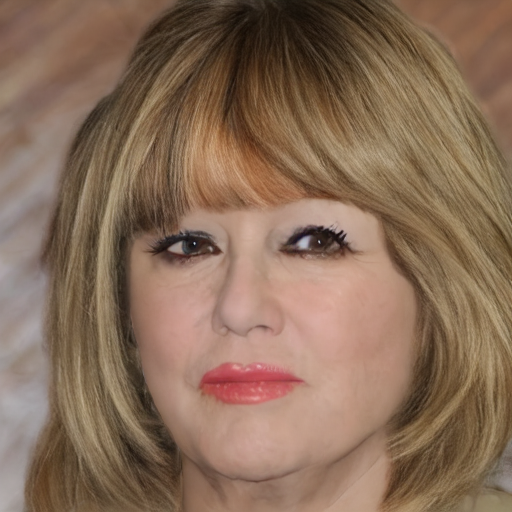 |  |  | 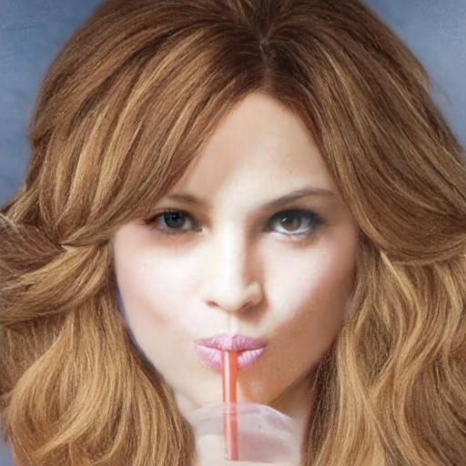 |  |
| run5_1 | 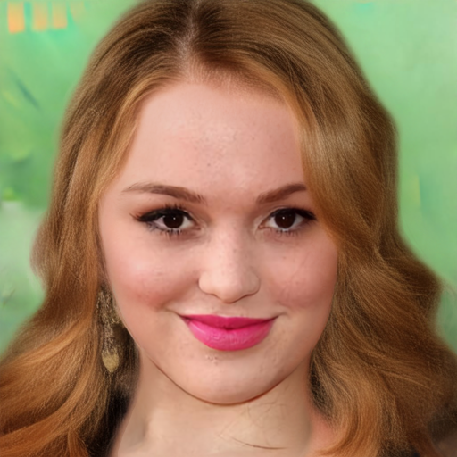 |  |  | 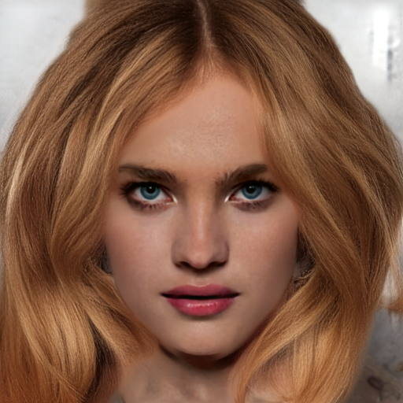 |  |  | 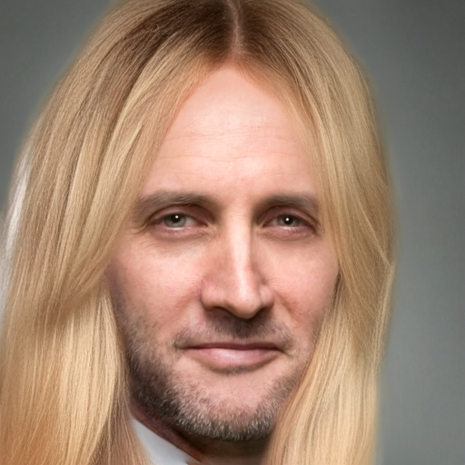 |

### 1.4 seed 42
CM_1027, CM_1067 하단 푸석거림 + 방향 노이즈 발생
| | CM_1007 | CM_1027 | CM_1033 | CM_1067 | CM_1068 | CM_1082 | CM_1172 |
|---|---|---|---|---|---|---|---|
| 스케치 |  |  |  |  |  |  |  |
| mcs2 | 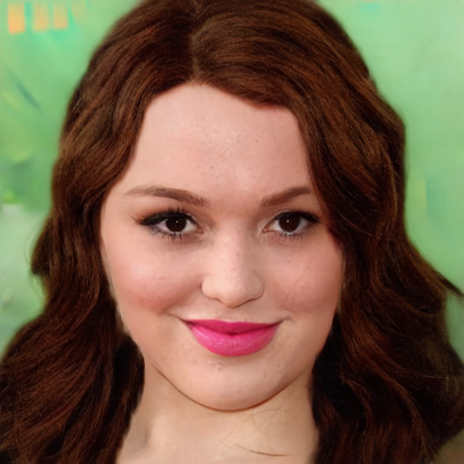 | 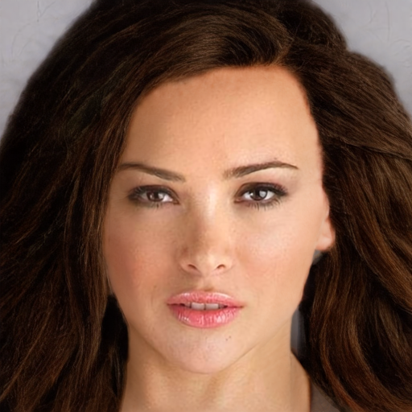 | 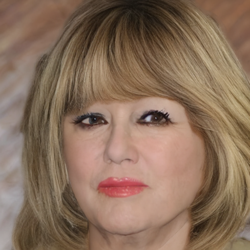 |  |  | 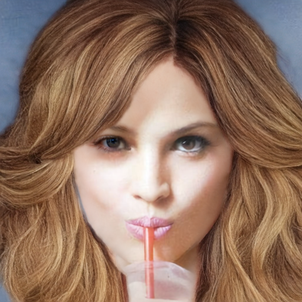 | 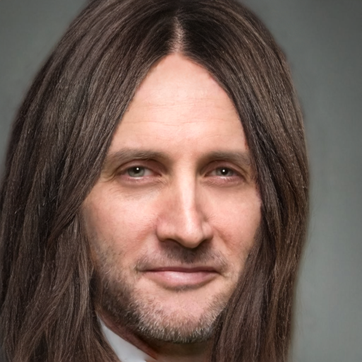 |
| run5_1 | 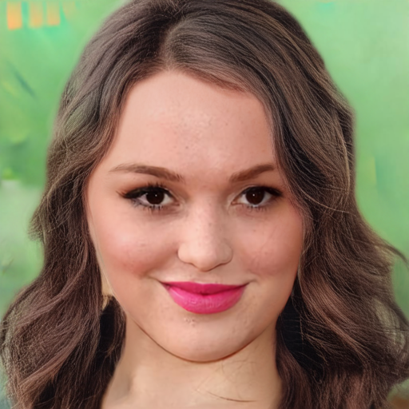 |  |  |  |  |  |  |

## 2. epoch 진행에 따른 푸석거림 / 방향 노이즈 양상

교수님 지시("30 epoch까지 추가 진행")의 전제는 푸석거림이 학습 부족 탓일 수 있다는 것임. §2.1은
run5_1(8장, epoch5→15), §2.2는 run2/run3/run4(CM_1067 한 장, seed42, 더 넓은 epoch 범위)로
같은 질문을 봄.

### 2.1 run5_1 (8장, seed 42, epoch5→15)

run5_1의 epoch5/10/15 산출물을 나란히 놓음(8장, seed 42 고정).

| image | epoch5 | epoch10 | epoch15 |
|---|---|---|---|
| CM_1007 |  |  |  |
| CM_1027 |  |  |  |
| CM_1033 |  |  |  |
| CM_1067 |  |  |  |
| CM_1068 |  |  |  |
| CM_1082 |  |  |  |
| CM_1084 |  |  |  |
| CM_1172 |  |  |  |

**정량 대비.** `[DIGLAB][0806][장서현]run5_test_result.md` §2-1의 8장 macro 평균 기준 GT 방향
오차는 epoch5 19.47° → epoch10 19.37° → epoch15 18.10°로 단조 감소함. 그러나 위 표를 육안으로 보면 문제가 있는 머릿결 노이즈 부분은 나아지지않음(CM_1067 하단 노이즈)

### 2.2 run2 / run3 / run4 (CM_1067, seed 42)

run5_1 이전 run들도 같은 질문(epoch가 늘면 방향 노이즈가 줄어드는가)을 볼 수 있는 기존 렌더가
있어 가져옴. 세 run은 학습 단계 구성이 서로 달라 같은 epoch 축으로 이어 붙이지 않고 run별로
따로 봄

**run4** phase1

| epoch5 | epoch10 | epoch15 | epoch20 | epoch25 | epoch30 | epoch35 | epoch40 |
|---|---|---|---|---|---|---|---|
|  |  |  |  |  |  |  |  |

**run3** phase1

| epoch10 | epoch20 | epoch30 | epoch40 |
|---|---|---|---|
|  |  |  |  |

**run2** phase1, phase2

| stage | epoch5 | epoch10 | epoch15 | epoch20 | epoch30 |
|---|---|---|---|---|---|
| phase1 | — |  | — | — |  |
| phase2 |  |  |  |  | — |

`[DIGLAB][0730][장서현]run4_results.md` §2가 이미 지적한 대로, run2/run3/run4 세 run 모두
CM_1067에서 헤어 하단 방향 노이즈가 남아있고 epoch가 늘어난다고 뚜렷이 사라지지 않음 —
run5_1(§2.1)에서 관찰한 것과 같은 양상이 최소 세 세대 앞선 run에서도 반복됨. `w_lpips`를
낮춰 frizz(고주파 곱슬거림, run3→run4 변경점)는 해결됐지만 방향 노이즈 자체는 run2 phase2
때부터 별도 원인으로 남아 있었다는 뜻이고, 이 양상이 run5_1까지 이어진다는 것이 **"30 epoch
추가 학습으로 해결될지 의문"**(요약, 판단 필요)의 근거임.

## 3. 정량평가 50장

### 3.0 test set 및 방법론

- 추론: `scripts/infer_custom.py --recolor_from_gt`(GT 색으로 stroke 재채색, §0 `run5_1`
 정의와 동일 조건) + 각 checkpoint(`checkpoints/{run5_1_noisegate,run6_1_lpips_mid,run6_2_lpips_high}/epoch_15_infer.pth`),
 epoch15 고정, seed `{1,2,3,42}`, 20 step. 배경 합성 없이 hair 영역만 생성(학습 GT의
 `img×matte` 포맷과 동일). 로컬 RTX 4070(12GB)에서 12개 조합(3 run × 4 seed) 순차 실행,
 조합당 약 2분 40초 → 총 600장 생성.
- 방향 지표: `scripts/eval/orientation_metric.py`(structure tensor, `sigma_i=3`,
 `erode_px=6`, `[DIGLAB][0803][장서현]seed_test.md` §5와 동일) 그대로 재사용. GT는
 `dataset/img`(512×512, 이미 hair 원본).
- 색/구조 지표: `scripts/eval_metrics.py`의 `compute_delta_e_hue`/`hair_masked_lpips` —
 `trainer.py._perceptual_validate`가 학습 중 로깅하는 `dE_unbraid`/`lpips_unbraid`와
 **동일 함수**. GT는 `dataset/img × dataset/matte`(soft composite). 단, 학습 쪽 원 정의는
 고정 seed 1개로 32장(unbraid 16 + braid 16)을 생성해 재는 반면, 여기서는 **seed
 4개(1/2/3/42) × 50장 평균**으로 확장함 — 그만큼 표본이 늘어 분산은 줄지만, 학습 로그
 수치와 절대값을 직접 비교하지 않음(정의 확장, §3.4 한계).
- `lpips_braid`/`edge_iou_braid`는 계산 못함 — `braid_test`(땋은 머리) 이미지가 로컬
 pool(`dataset/`, unbraid만 466장)에 없음.
- 재현: `python scripts/eval/quant50_run5_1_run6.py` (결과 CSV:
 `eval_results/eval50_run5_1_run6_summary.csv`).

### 3.1 방향 오차 / 시드 불일치 (n=50, epoch15)

| run | GT 오차 평균 [deg] | coherence | seed 불일치 [deg] |
|---|---:|---:|---:|
| **run5_1** | **15.29** | 0.779 | **13.15±4.58** |
| run6_1 | 16.69 | 0.744 | 15.52±4.91 |
| run6_2 | 15.68 | **0.783** | 13.91±5.03 |

순위는 8장 평가(`[DIGLAB][0809][장서현]run6_results.md` §2-1: run5_1 18.10 < run6_2 18.59 <
run6_1 19.56)와 **동일한 순서**(run5_1 < run6_2 < run6_1)로 재현됨 — GT 오차·seed 불일치
모두 run5_1이 최선, run6_1이 최악. coherence만 run6_2(0.783)가 run5_1(0.779)을 근소하게
앞섬(8장 평가에서는 run5_1 0.770 > run6_2 0.758로 반대 순서였음 — 차이가 0.004로 작아 이
역전을 실질적 신호로 보지는 않음).

### 3.2 색/구조 지표 (n=50, epoch15)

| run | dE_unbraid | lpips_unbraid |
|---|---:|---:|
| run5_1 | 5.2417 | 0.2497 |
| run6_1 | 5.1313 | 0.2444 |
| **run6_2** | **5.1035** | **0.2304** |

### 3.3 방향 지표와 색/구조 지표가 서로 반대 방향을 가리킴

§3.1(방향)과 §3.2(색/구조)를 나란히 보면 **최선 run이 지표군마다 다름**.

| 지표 | 최선 | 최악 |
|---|---|---|
| GT 방향 오차 | run5_1 (15.29°) | run6_1 (16.69°) |
| seed 불일치 | run5_1 (13.15°) | run6_1 (15.52°) |
| dE_unbraid | run6_2 (5.10) | run5_1 (5.24) |
| lpips_unbraid | run6_2 (0.2304) | run5_1 (0.2497) |

`run5_1`은 방향 지표 두 개 모두 최선이지만 색/구조 지표 두 개 모두 최악이고, `run6_2`(LPIPS
세기가 run5_1의 약 11배, §0)는 그 반대임. 이는 `[DIGLAB][0809][장서현]run6_results.md`
§3.2/§4의 결론 — "8장 평가에서 `w_lpips`를 올린 두 조건(run6_1/run6_2) 모두 방향·색·구조
지표가 전부 악화되어, `w_lpips`는 run5_1 수준을 유지"— 중 **색/구조 지표 악화** 부분과
정반대임. 그 리포트의 §3.3 색/구조 표(8장, epoch15)는 dE_unbraid 기준 run5_1(10.62) <
run6_2(10.94) < run6_1(10.99)로 run5_1이 최선이었음.

가능한 설명(미확인, 판단 필요 🔴):
- **표본 크기**: 8장은 색/구조 지표 하나가 이상치 한두 장에 흔들리기 쉬운 크기이고, 50장은
 그보다 안정적임 — 8장 결론이 표본 노이즈였을 가능성.
- **정의 확장**: §3.0에서 밝힌 대로 이번 dE_unbraid/lpips_unbraid는 4-seed 평균(원 정의는
 고정 seed 1개) — seed 평균이 LPIPS 노출이 큰 run6_2 쪽에 유리하게 작용했을 가능성.
- 가설 모두 이 리포트만으로 구분되지 않음. **`w_lpips` 상향을 재검토할지는 이 상충을
 어떻게 해석하느냐에 달려 있어 별도 판단 필요.**

## 4. 한계 / 다음
- 특정 시드의 특정 이미지에서만 발생하는 노이즈 + 푸석거림 문제를 어떻게 정의하고 해결할 것인지.
- §3.2/§3.3의 dE_unbraid/lpips_unbraid는 4-seed 평균으로 정의를 확장해 계산함 — 학습
 로그의 단일-seed 정의 수치와 절대값 비교 불가, run 간 상대 비교로만 사용
- §3.3 방향-vs-색 지표 상충은 원인(표본 크기/정의 확장 중 무엇인지) 미확정 —
 `w_lpips` 최종 채택 여부를 좌우하는 지점이라 **판단 필요** 🔴
- §1의 mcs2 vs run5_1 비교는 세대가 다른 아키텍처 간 비교라(§0) 단일 변수 ablation으로 해석하지
 않음 — "현재 모델이 구세대 baseline보다 어느 지점에서 나아졌는가"를 보는 정성 자료로만 사용
- §2.1은 run5_1 1개 run·seed 42·epoch5~15(3점)뿐인 정성 관찰이라 그 자체로 30 epoch 연장의
 효과를 미리 부정하는 근거는 아님
- 다만 §2.2에서 run2(phase2 epoch5~20)·run3(epoch10~40)·run4(epoch5~40) 세 개의 **독립된
 이전 run**이 이미 최대 epoch40까지 학습했는데도 같은 CM_1067 하단 방향 노이즈가 사라지지
 않음 — run5_1이 같은 손실 구성·같은 노이즈 축을 공유하는 이상, "epoch를 15→30으로 늘리면
 해결된다"는 가설은 최소 세 개의 선행 사례와 어긋남. **30 epoch 추가 학습은 실효가 낮을
 가능성이 높음 
