학습 전, 학습 조건 정리 및 확인 사항 검토

## 결정해야할 사항 - Condition Dropout 적용 여부
stable diffusion3.5에서는 CFG를 위해 학습 시 condition Dropout을 사용함.
우리 조건에서도 이와 유사한 Condition Residual Guidence를 사용 예정이며, 그래서 CRG에도 condition dropout이 필요할지, 아니면 기존 그대로 학습하고, CRG를 1.5~2.0으로 유지하는 방향으로 갈지 결정 필요.

확인 결과: SD3.5는 텍스트만 dropout하고 이미지/residual 조건은 안 함. 근거 두 갈래 —  
(1) diffusers 공식 코드: SD3 ControlNet 자체 예제 명령어는 텍스트 dropout 값을 아예 안 정해서(=0) 씀 — SDXL/Flux-control 등 이웃 모델 예제에서만 0.2를 씀.  
(2) SD3 논문(Esser et al., arXiv 2403.03206) §5.3.3 "Flexible Text Encoders": 텍스트 인코더 3개(CLIP-L, CLIP-G, T5-XXL) 각각을 **개별 46.3% 확률로 학습 중 생략** — 캡션을 통째로 비우는 것과는 다른 메커니즘(인코더 조합에 유연하게 대응 목적, T5 없이도 추론 가능하게). 이것도 이미지/컨트롤 조건은 전혀 안 건드림.  
두 값(0.2, 46.3%) 모두 텍스트 축이라 우리 축(residual)에 그대로 못 옮김. 이미지 조건 dropout의 실측 선례는 diffusers 전체에서 **InstructPix2Pix**(이미지+텍스트 지시문으로 이미지를 편집하는 SD 기반 모델, 예: "이 사진을 수채화로 바꿔줘". 조건이 텍스트·이미지 둘이라 각각 독립적으로 dropout해 학습함, 0.05)가 유일함.  
    
적용한다면 설계안 두 가지. **비율/방식 공통**: 매 학습 샘플마다 독립적으로 `rand() < p`를 뽑아(배치 전체 일괄이 아니라 샘플 단위 베르누이), 걸린 샘플만 아래처럼 0으로 마스킹. p=0.05~0.1(IP2P 권장 0.05) 권장 — 너무 크면 정작 배워야 할 조건부 생성 학습량이 줄어듦.  
- **안 A(residual 전체 dropout)**: 걸린 샘플은 `block_samples` 전체를 0으로. 구현 단순, 현재 CRG(residual 전체 on/off)와 축이 정확히 일치.  
- **안 B(sketch만 dropout, matte는 유지)**: 걸린 샘플은 ControlNet 입력 중 sketch만 0(matte는 그대로) → `v_cond−v_uncond`가 방향·색 정보만 담고 matte 위치정보는 안 섞임 — 이론적으로 더 정합적일 것이라는 추론. uncond 분기도 ControlNet을 돌려야 해 추론 비용이 현재(~1.5배)에서 ~2배로 늘어남    
아래 일단 추론부터 하고 결정

### dropout 없이 진행했을 때 A안과 B안 비교

방법: run5_1(`checkpoints/run5_1_noisegate/epoch_15_infer.pth`, epoch15) × CRG 2.0, 8장, seed 42, 20-step, 안 A/안 B 모두 학습 시 dropout은 없음(현재 체크포인트 그대로) — uncond 분기 구성만 추론 시점에서 다르게 흉내낸 것

| | CM_1007 | CM_1027 | CM_1033 | CM_1067 | CM_1068 | CM_1082 | CM_1084 | CM_1172 |
|---|---|---|---|---|---|---|---|---|
| GT | 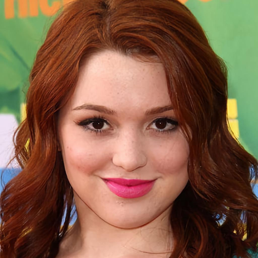 |  | 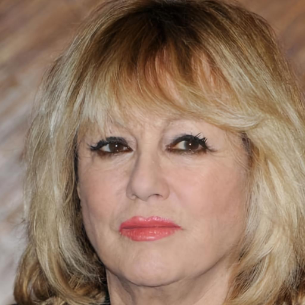 |  |  |  | 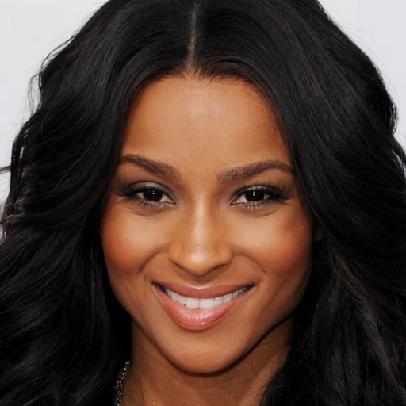 |  |
| 안 A (residual_off) |  |  |  | 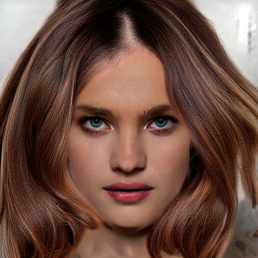 |  |  |  |  |
| 안 B (sketch_zero) | 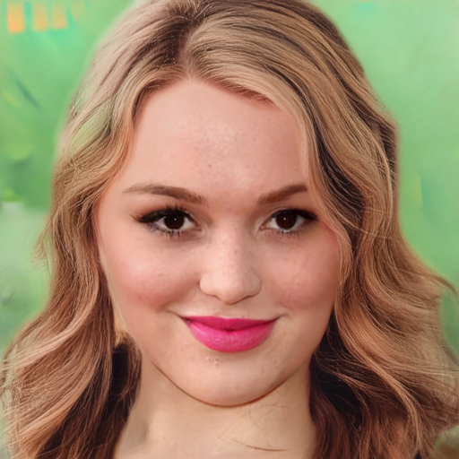 | 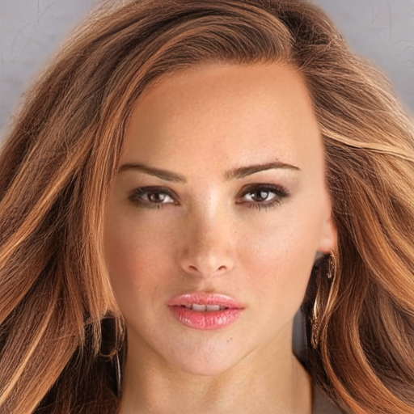 |  | 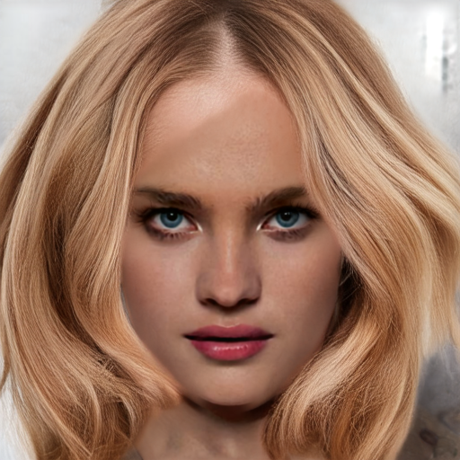 |  | 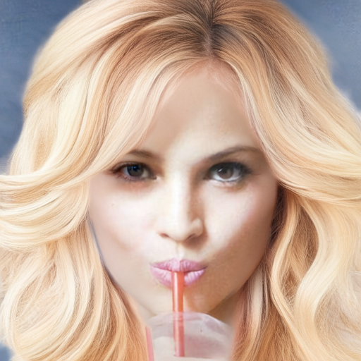 | 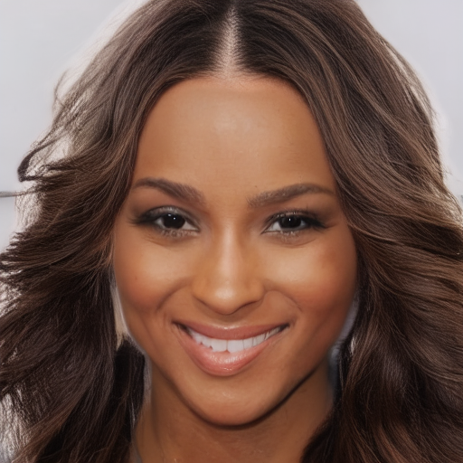 | 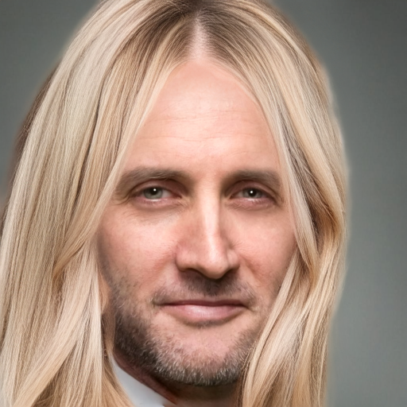 |

run4(40epoch) × colorful sketch(원본 색 스케치, GT 재채색 없음) 비교. 방법은 위와 동일

| | CM_1007 | CM_1027 | CM_1033 | CM_1067 | CM_1068 | CM_1082 | CM_1084 | CM_1172 |
|---|---|---|---|---|---|---|---|---|
| color 스케치 |  |  |  |  |  |  |  |  |
| 안 A (residual_off) |  | 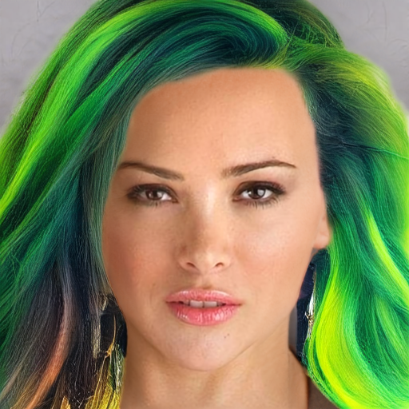 | 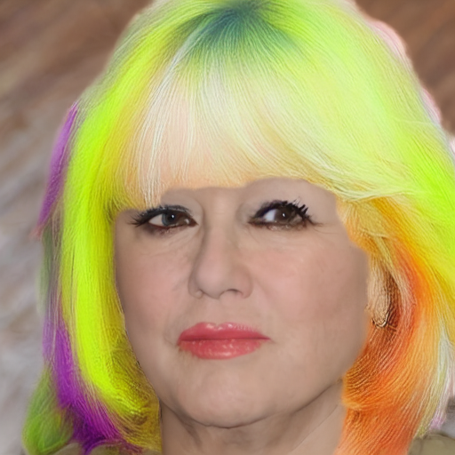 |  |  | 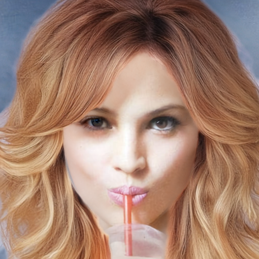 |  |  |
| 안 B (sketch_zero) |  | 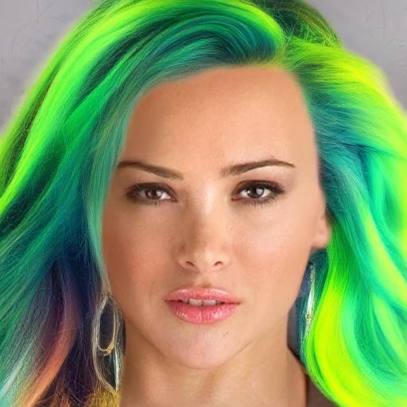 |  |  |  | 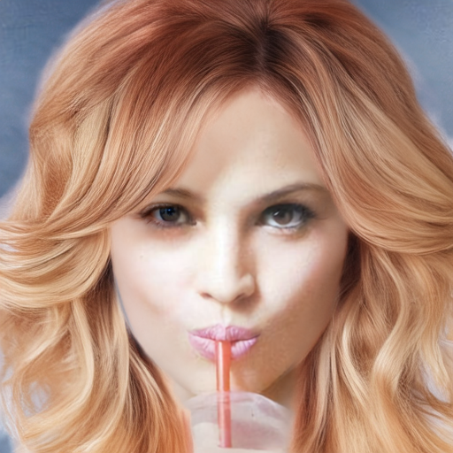 |  |  |

정성 판단: 안 A(residual_off)가 안 B(sketch_zero)보다 육안상 더 낫다고 판단 — run4(40epoch)에서 머릿결 자연스러움을 포함해 전반적으로 안 A가 우세.

리스크:
- 우리 null 임베딩은 cond/uncond에 동일하게 쓰임. SD3.5 CFG는 cond 분기(프롬프트 임베딩)와 uncond 분기(빈 프롬프트를 텍스트 인코더에 통과시킨 실제 임베딩)의 텍스트 입력이 서로 다른 값인데, 우리는 이 두 분기(v_cond/v_uncond)에 같은 null 임베딩 하나를 씀 — dropout을 넣으면 이 파라미터가 "residual과 협업"·"residual 없이 단독" 두 역할을 동시에 만족해야 해 조건부 생성 품질이 오히려 깎일 수 있음
- run4~run6 계열이 전부 "dropout 없음"을 공유 — 이번에만 넣으면 40epoch 결과 귀속(확인 사항 4)이 흐려짐
- `_perceptual_validate`는 CRG 미사용 기준으로 찍힘 — dropout으로 CRG 사용을 전제하면 체크포인트 사후 선정(확인 사항 5) 기준과 어긋남
- CRG는 dropout 없이도 이미 효과가 어느정도 실측됐고(`[DIGLAB][0810]` §3-3, CRG 2.0에서 GT오차 16.67→14.32°/16.64→14.66°), 얻는 게 불확실한 반면 비용(재학습, 계보 단절)은 확정적임. 
- 만약 dropout 진행한다면 A안으로 진행

## 확인 사항
1. loss 적용
lpips를 step말고 timestep 기준으로, 노이즈 단계 30% 이후부터 적용(noise-gate)  
phase2에서도 동일 적용으로, timestep 기준, 노이즈 30% 이후부터 적용, edge loss는 그대로 적용  
두 phase 공통:  
    L_flow = Σ(m̃⊙(v_pred-v_target)²) / (‖m̃‖₁+ε)   — matte(헤어 면적) L1으로 정규화, phase 1, 2에 동일 정의
    s = clamp(numel(v_pred)/‖matte_latent‖₁, 20, 120)  (scale-sync, flow 항을 lpips/edge와 gradient 스케일 맞춤용, phase 무관 동일 적용)
    σ 샘플링: logit-normal + shift=3.0 (SD3.5 사전학습 관례 상속, phase 무관 동일)  

phase1 : L_total = w_flow·(L_flow/s) + w_lpips·1[σ≤0.7]·L_LPIPS  
    = 1.0·(L_flow/s) + 0.002·1[σ≤0.7]·L_LPIPS   (w_edge=0, edge 없음)  
  
phase2 : L_total = w_flow·(L_flow/s) + w_lpips·1[σ≤0.7]·L_LPIPS + w_edge·L_edge  
    = 1.0·(L_flow/s) + 0.002·1[σ≤0.7]·L_LPIPS + 0.05·L_edge  

2. curriculum + replay 적용  
phase2에서 reports/[0721]loss_design_rationale.md ## 커리큘럼 러닝 방식 선택 (Rehearsal / Replay) 에 나왔던 설정 그대로 진행(phase2에서 braid:unbraid=8:8로 샘플링하여 학습)  
학습률 phase1 - 1e-4, phase2 - 5e-6로 설정  
phase1 40epoch + phase2 40epoch  

3. densify augmentation 적용 안함

4. phase1→phase2로 넘길 체크포인트는 perceptual val 로그 보고 사후 결정  
 무조건 epoch40이 아니라, epoch별 dE_unbraid/lpips_unbraid perceptual val 로그, 정성 지표를 보고 phase2 시작점을 사후에 고름

5. Condition Dropout 적용 안 할 시 run5_1 epoch15 체크포인트의 resume 사용
