# run7_phase2 결과

## 최상단 요약 (10줄 이내)

**이전 결정 사항** — 지시 ②③④ (아래 "학습 조건" 표 각주)
- resume_from은 weights-only(raw)로 phase1→phase2 이관 (②)
- LR은 5e-6 아닌 2e-5 유지 (③)
- 채택 기준은 방향 지표(GT 오차·seed 불일치) 필수, 색 지표는 참고용 (④)

**합의 사항 → 상태**
- [완료] resume_from weights-only + LR 2e-5로 epoch 40까지 재학습
- [부분] braid 정성·정량 괴리 — 현상만 확인(§분석 2), 원인 미확인
- [미착수] 채택 epoch 최종 확정

**이번 결과 / 막힌 것 / 다음**
- 결과: GT 오차 unbraid 14.85°→14.48°, braid 22.80°→20.04° (n=50, epoch5→40). mcs2 대비 run7_phase2는 sketch에 없는 색을 만들어 내는 경향이 약해짐(§분석 3)
- 막힌 것: `braid_2625`/`braid_2562_1` 등 일부 이미지·seed에서 정성적으로 epoch15 이후 품질 저하되는데 정량지표는 epoch25~35까지 계속 개선 — 원인 미확인 🔴
- 다음: 채택 epoch 확정(방향 지표 기준 epoch40)

## 학습 조건

`configs/run7_phase2.yaml` vs `configs/run7_phase1.yaml`

| 블록 | 키 | run7_phase1 | run7_phase2 | 상태 | 사유 |
|---|---|---|---|---|---|
| training | phase | pretrain | **finetune** | 변경 | edge loss 활성화 |
| training | dataset | unbraid | **replay** | 변경 | unbraid 3000 + braid 1000, 8:8 stratified |
| training | epochs | 40 | 40 | 동일 | |
| training | batch_size | 16 | 16 | 동일 | batch_sampler(8+8)가 실질 결정 |
| training | learning_rate | 1.0e-4 | **2.0e-5** | 변경 | mcs2 parity(2e-5) |
| training | resume | `run5_1_noisegate/epoch_15.pth` | null | 변경 | phase 이관은 resume_from 사용 |
| training | resume_from | — | `run7_phase1/epoch_40.pth` | 신규 | **weights-only (raw)**.|
| loss_weights | flow | 1.0 | 1.0 | 동일 | |
| loss_weights | lpips | 0.002 | 0.002 | 동일 | |
| loss_weights | edge | 0.0 | **0.05** | 변경 | mcs2 parity 유지 |
| loss_weights | scale_sync / s_min / s_max | true / 20 / 120 | true / 20 / 120 | 동일 | |
| checkpointing | save_every | 5 | 5 | 동일 | epoch 5/10/…/40 + final |
| checkpointing | perceptual_every | 1 | 1 | 동일 | |

> **LR 5e-6 vs 2e-5 ( 지시 ③)**: 2e-5로 실행

> **resume 형태 ( 지시 ②)**: phase1→phase2 이관은 `resume_from` = **weights-only**(controlnet
> 가중치만, optimizer/lr_scheduler 미복원)이다. full checkpoint(`resume:`)를 쓰면 phase1의
> lr_scheduler state(T_max=6980/last_epoch=6980, 코사인 끝점)가 복원되는데, CosineAnnealingLR은
> 주기 특성상 그 지점부터 LR이 다시 **1e-6 → 8.2e-5로 상승**한다(시뮬레이션 실측). LR 총합 기준
> full resume은 2e-5 런보다도 3.2배 커서 이관에는 부적합하다. 단, **동일 run 중단 후 재개**에는
> full resume이 올바른 경로이다.

## 정량지표

> 방법론은 `[DIGLAB][0810][장서현]run5_1_quant_eval.md` §3.0과 동일 — run7_phase1 정량지표와 같은 조건(50장 pool, face 합성·BLD·pixel_blend·cfg 미사용, `--recolor_from_gt`)으로 측정해 직접 비교 가능하다.

phase2는 replay(unbraid+braid 8:8) 학습이므로 **unbraid 유지력**과 **braid 습득**을 따로 측정한다.
unbraid만 보면 "안 까먹었나"만 알 뿐 phase2의 목적인 braid 품질은 알 수 없다.

### unbraid — 유지력 (n=50, seed 4개)

pool `outputs/0812/quant50/_pool50` (run7_phase1과 동일), GT `dataset/unbraid/{img,matte}/test`

| epoch | GT 오차 평균 [deg] | coherence | seed 불일치 [deg] | dE_unbraid | lpips_unbraid |
|---:|---:|---:|---:|---:|---:|
| 5 | 14.85 | 0.765 | 11.76±4.13 | 2.4244 | 0.2192 |
| 10 | 14.85 | 0.757 | 11.47±3.98 | 2.1107 | 0.2176 |
| 15 | 14.73 | 0.750 | 11.19±3.97 | 1.9928 | 0.2195 |
| 20 | 14.63 | 0.750 | 10.91±3.82 | 2.1739 | 0.2148 |
| 25 | 14.58 | 0.751 | 10.56±3.69 | 1.8789 | 0.2166 |
| 30 | 14.56 | 0.751 | 10.48±3.67 | 1.9746 | **0.2133** |
| 35 | 14.52 | 0.749 | 10.36±3.65 | **1.8096** | 0.2143 |
| 40 | **14.48** | 0.749 | **10.27±3.64** | 1.8797 | 0.2149 |

**phase1 epoch40(= phase2 시작점) 대비**

| 지표 | phase1 ep40 | phase2 최저 | 최저 epoch |
|---|---:|---:|---:|
| GT 오차 [deg] | 14.74 | 14.48 | 40 |
| seed 불일치 [deg] | 11.48±4.11 | 10.27 | 40 |
| dE_unbraid | 2.2868 | 1.8096 | 35 |
| lpips_unbraid | 0.2199 | 0.2133 | 30 |

**관측**(수치에서 직접 계산한 사실):

- 방향 지표 최적: GT 오차 epoch40, seed 불일치 epoch40
- 색/구조 지표 최적: dE_unbraid epoch35, lpips_unbraid epoch30
- GT 오차 단조 감소 여부: 예 / seed 불일치 단조 감소 여부: 예
- coherence 범위: 0.749 ~ 0.765

### braid — 습득 (n=50, seed 4개)

pool `outputs/0813/quant50/_pool50_braid` (braid test 107장 중 고정 시드 50장),
GT `dataset/braid/{img,matte}/test`. inference 조건은 unbraid와 완전히 동일.

지표 정의는 트레이너 `_perceptual_validate`의 braid 항목과 같다 —
`lpips_braid`는 GT 대비 질감 충실도(↓), **`edge_iou_braid`는 입력 스케치 대비 구조 충실도(↑)로
braid 형태를 따라갔는지를 보는 phase2의 핵심 지표**다.

| epoch | GT 오차 평균 [deg] | coherence | seed 불일치 [deg] | lpips_braid ↓ | edge_iou_braid ↑ |
|---:|---:|---:|---:|---:|---:|
| 5 | 22.80 | 0.688 | 20.42±4.41 | 0.1544 | 0.0932 |
| 10 | 21.77 | 0.696 | 18.66±4.27 | 0.1499 | 0.0937 |
| 15 | 21.24 | 0.688 | 17.70±4.12 | 0.1434 | 0.0945 |
| 20 | 20.98 | 0.682 | 16.84±3.93 | 0.1425 | 0.0946 |
| 25 | 20.46 | 0.688 | 15.68±3.80 | **0.1420** | 0.0953 |
| 30 | 20.18 | 0.685 | 14.94±3.66 | 0.1430 | 0.0955 |
| 35 | 20.10 | 0.682 | 14.66±3.59 | 0.1445 | **0.0963** |
| 40 | **20.04** | 0.681 | **14.57±3.58** | 0.1450 | 0.0961 |

**관측**(수치에서 직접 계산한 사실):

- 방향 지표 최적: GT 오차 epoch40, seed 불일치 epoch40 (둘 다 단조 감소)
- seed 불일치 20.42° → 14.57°로 **29% 감소** — braid 구조 학습이 실제로 진행돼 생성이 안정화됨
- edge_iou_braid는 epoch5→35 단조 증가(0.0932→0.0963), epoch40에서 0.0961로 -0.0002
- lpips_braid는 비단조(최저 epoch25, 범위 0.1420~0.1544)
- coherence 범위: 0.681 ~ 0.696

### 두 축 종합

| 축 | 지표 | 최적 epoch |
|---|---|---:|
| braid 습득 | GT 오차 / seed 불일치 | **40 / 40** |
| | edge_iou_braid / lpips_braid | 35 / 25 |
| unbraid 유지 | GT 오차 / seed 불일치 | **40 / 40** |
| | dE_unbraid / lpips_unbraid | 35 / 30 |

**두 축이 상충하지 않는다.** braid를 습득하면서 unbraid도 품질 저하되지 않았고(phase1 epoch40 대비
전 지표 개선), 방향 지표는 양쪽 모두 epoch40이 최적이다. 

`lpips`/`dE` 계열이 25-35에서 최저를 찍지만 변동폭이 좁아(braid lpips 0.1420~0.1450) 노이즈
범위로 보이며, 지시 ④가 색 지표는 참고용으로 한정했으므로 선정 근거로 쓰지 않는다.

## 정성지표 — 결과 사진

> seed42 기준, 모든 run7 정성평가 지표에 CRG = 2 적용

### gt sketch

| 파일명 | img | sketch | epoch5 | epoch10 | epoch15 | epoch20 | epoch25 | epoch30 | epoch35 | epoch40 |
|---|---|---|---|---|---|---|---|---|---|---|
| CM_1007 |  |  | 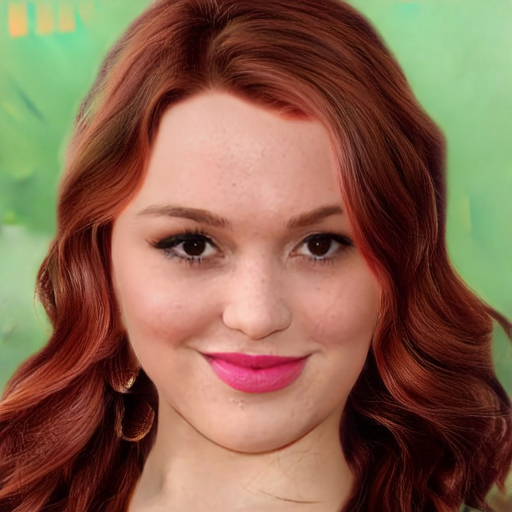 | 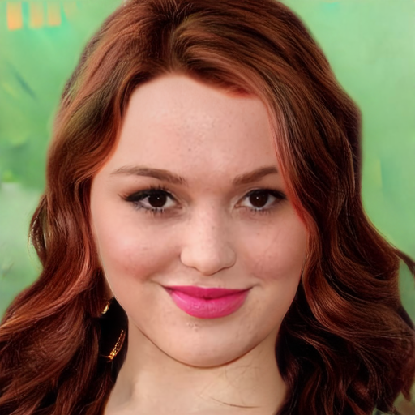 | 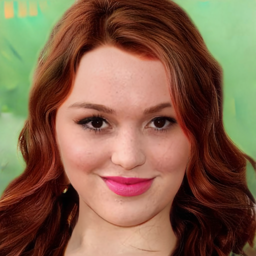 | 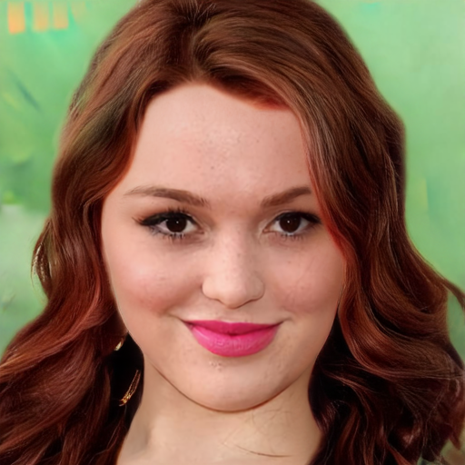 | 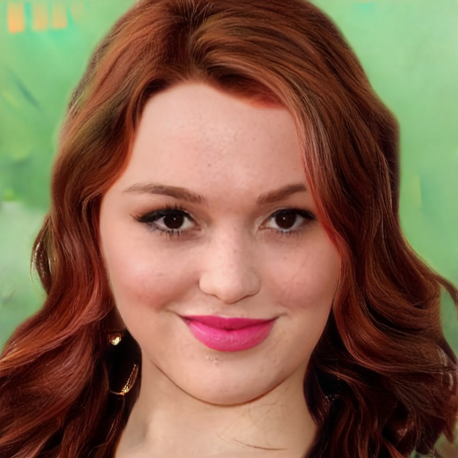 | 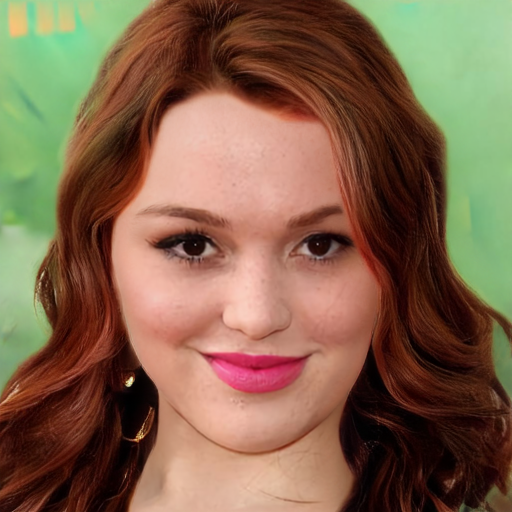 |  |  |
| CM_1027 |  | 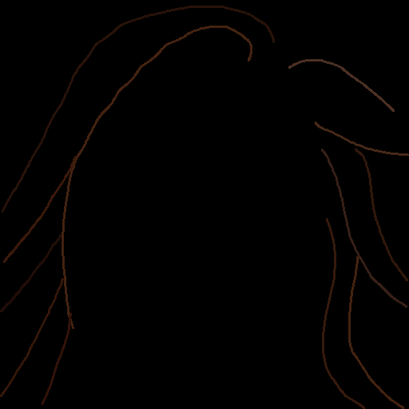 | 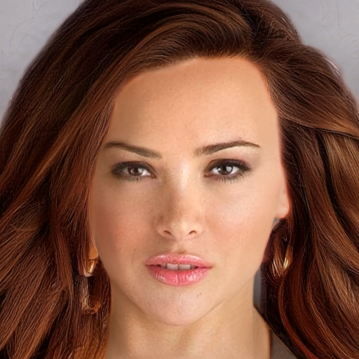 | 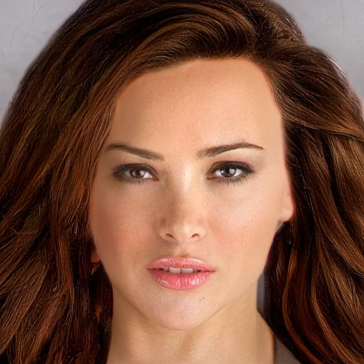 | 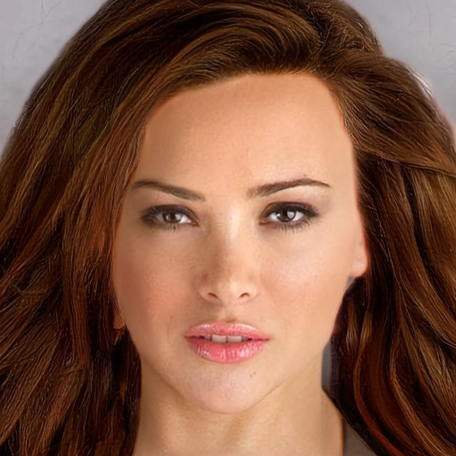 | 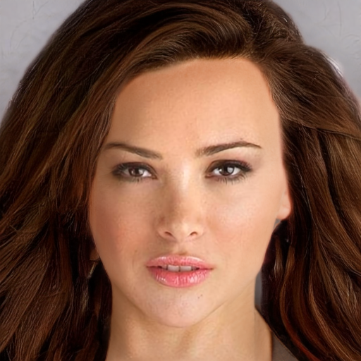 | 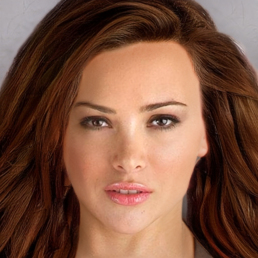 | 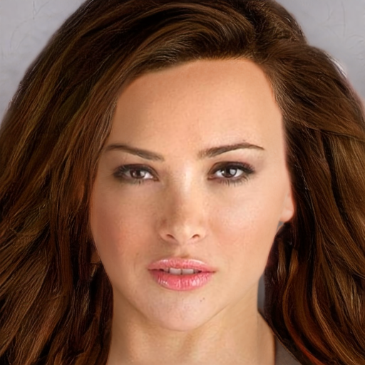 |  | 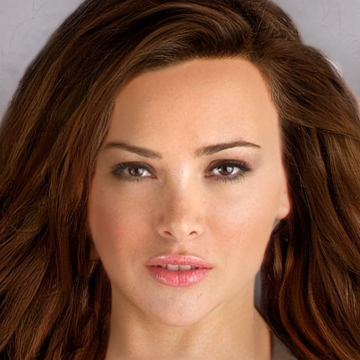 |
| CM_1033 |  |  | 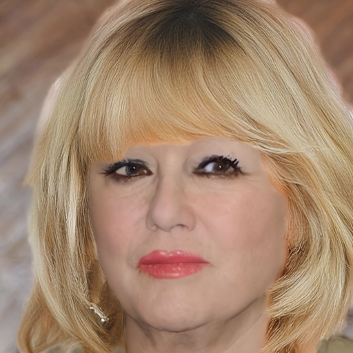 | 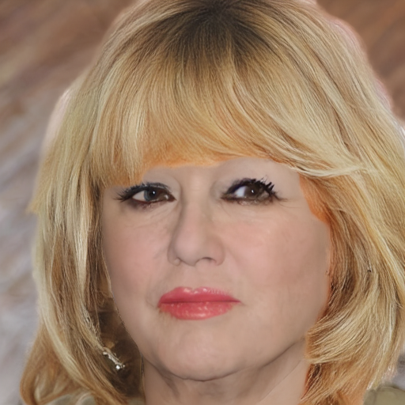 | 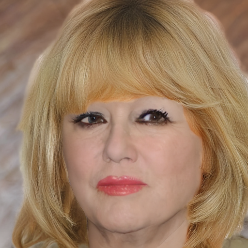 |  | 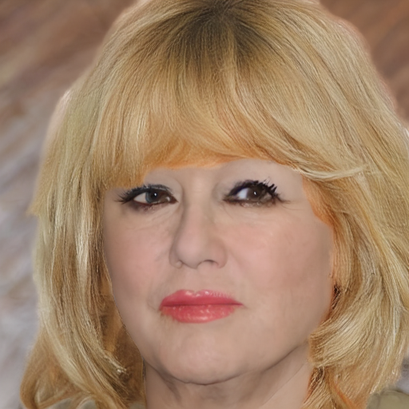 |  | 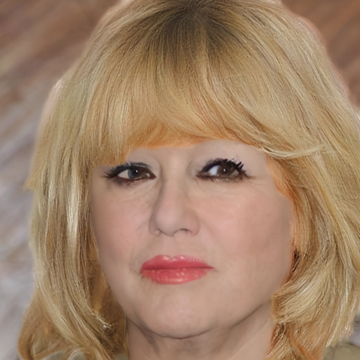 |  |
| CM_1067 |  |  | 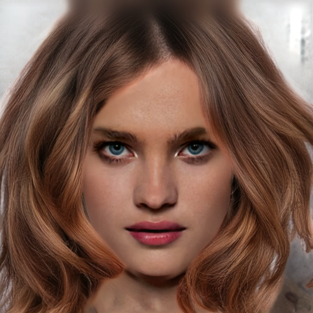 | 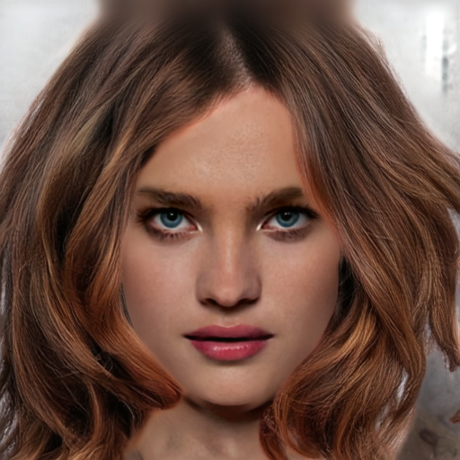 |  | 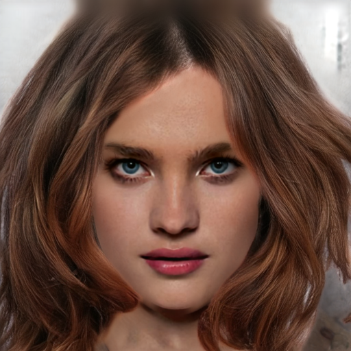 |  | 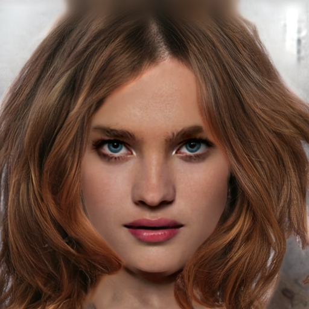 | 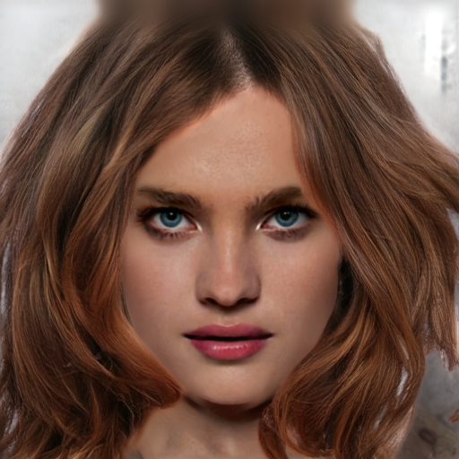 |  |
| CM_1068 |  |  |  |  |  |  |  |  |  |  |
| CM_1084 |  |  | 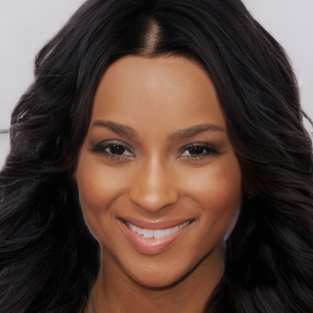 | 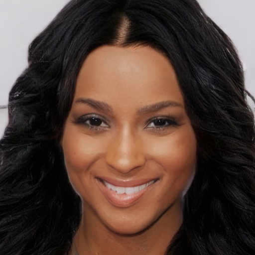 | 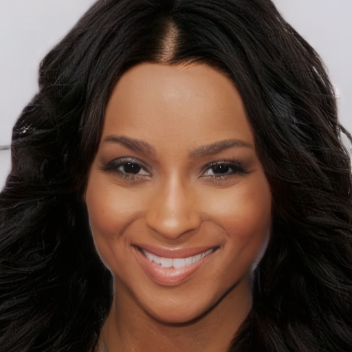 | 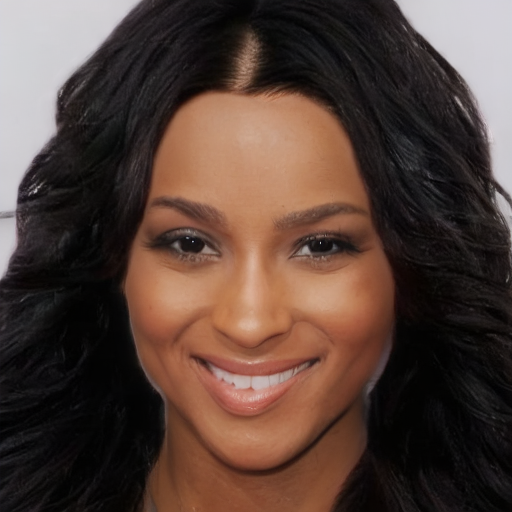 | 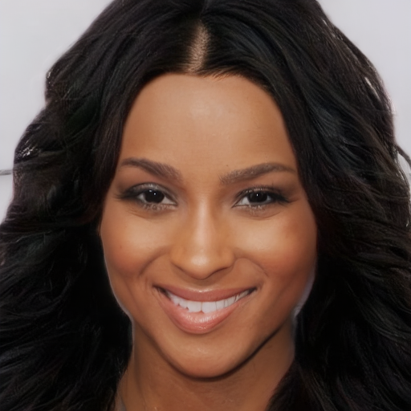 | 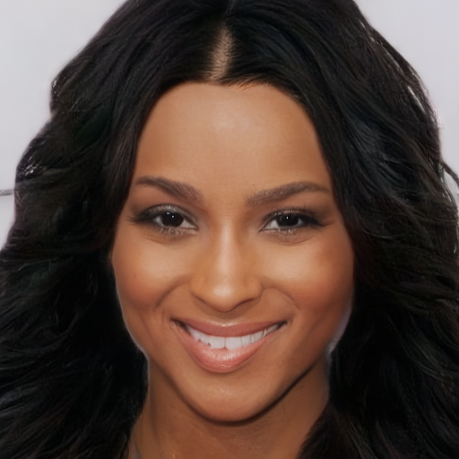 |  | 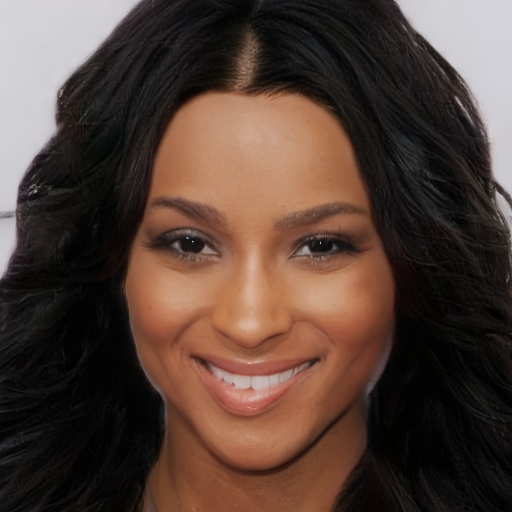 |
| CM_1172 |  |  |  |  |  |  |  |  |  |  |
| braid_2548 |  |  |  |  |  |  |  |  |  |  |
| braid_2562_1 |  | 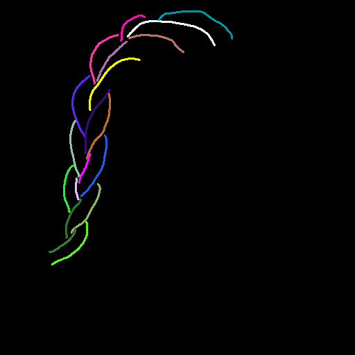 |  |  |  |  |  |  |  |  |
| braid_2625 |  |  |  |  |  |  |  |  |  |  |
| braid_4156 |  | 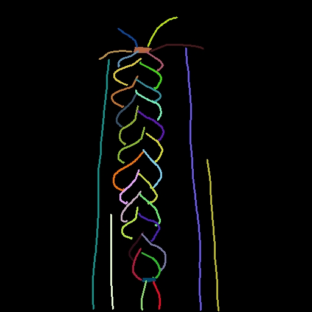 |  |  |  |  |  |  |  |  |

### Colorful sketch

| 파일명 | img | sketch | epoch5 | epoch10 | epoch15 | epoch20 | epoch25 | epoch30 | epoch35 | epoch40 |
|---|---|---|---|---|---|---|---|---|---|---|
| CM_1007 |  |  |  |  |  |  |  |  |  |  |
| CM_1027 |  |  |  |  |  |  |  |  |  |  |
| CM_1033 |  | 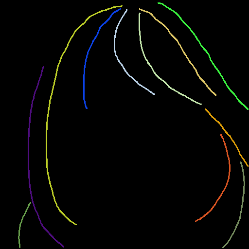 |  |  |  |  |  |  |  |  |
| CM_1067 |  |  |  |  |  |  |  |  |  |  |
| CM_1068 |  |  |  |  |  |  |  |  |  |  |
| CM_1084 |  |  |  |  |  |  |  |  |  |  |
| CM_1172 |  |  |  |  |  |  |  |  |  |  |
| braid_2548 |  |  |  |  |  |  |  |  |  |  |
| braid_2562_1 |  |  |  |  |  |  |  |  |  |  |
| braid_2625 |  |  |  |  |  |  |  |  |  |  |
| braid_4156 |  |  |  |  |  |  |  |  |  |  |

## 분석

### 1. phase1 epoch40 vs phase2 epoch 5 비교

**gt sketch (braid, `--recolor_from_gt`)**
phase1에 없던 braid hair 대한 능력 학습

| 파일명 | img | sketch | phase1 epoch40 | phase2 epoch5 |
|---|---|---|---|---|
| braid_2548 |  |  |  |  |
| braid_2562_1 |  |  |  |  |
| braid_4156 |  |  |  |  |

**Colorful sketch(unbraid)**
색 반영 능력 미세하게 향상되거나(CM_1007), 유지

| 파일명 | img | sketch | phase1 epoch40 | phase2 epoch5 |
|---|---|---|---|---|
| CM_1007 |  |  |  |  |
| CM_1067 |  |  |  |  |
| CM_1068 |  |  |  |  |

### 2. unbraid은 유지, braid는 정성·정량 괴리 (정성: ~15epoch 이후 정체·저하 / 정량: ~30epoch까지 개선)

**unbraid**: 능력 거의 그대로 유지 — 정량지표도 감소 없이 소폭 개선(GT 오차 14.85→14.48,
dE_unbraid 2.42→1.81, 위 "unbraid — 유지력" 표 참고).

**braid — 정성 관찰(일부 seed·이미지)**: 정량지표와 별개로, 육안으로는 15epoch 전후부터
오히려 품질 저하되는 사례가 보인다.

- `braid_2625`(Colorful sketch, seed 1/2/42 ): epoch가 올라갈수록 색이 노이즈처럼 깨짐
- `braid_2562_1`(gt sketch, seed 42): epoch가 올라갈수록 땋은 머리 경계가 옅어짐

**braid_2625 (Colorful sketch) — seed 1 / 2 / 42**

| seed | epoch5 | epoch10 | epoch15 | epoch20 | epoch25 | epoch30 | epoch35 | epoch40 |
|---|---|---|---|---|---|---|---|---|
| 1 |  |  |  |  |  |  |  |  |
| 2 |  |  |  |  |  |  |  |  |
| 42 |  |  |  |  |  |  |  |  |

**braid_2562_1 (gt sketch) — seed 42**

| seed | epoch5 | epoch10 | epoch15 | epoch20 | epoch25 | epoch30 | epoch35 | epoch40 |
|---|---|---|---|---|---|---|---|---|
| 42 |  |  |  |  |  |  |  |  |

**정량지표와의 괴리**: 반면 braid 정량지표(edge_iou_braid, lpips_braid)는 epoch25~35까지 계속
개선된다(위 "braid — 습득" 표 참고 — edge_iou_braid 최고 epoch35, lpips_braid 최저 epoch25).
n=50 평균에서는 개선되는데 위 두 stem처럼 개별 이미지·seed 단위에서는 일부이미지에서 품질 저하가 보임. 
정량지표(평균)가 이런 개별 사례의 품질 저하를 못 잡아내고 있을 가능성이 있다 — 원인·재현 범위는 미확인.

### 3. 색 반영

**unbraid: mcs2는 sketch에 없는 색까지 만들어내는 경향이 있었는데 run7_phase2는 sketch에 없는 색을 만들어 내는 경향이 약해짐**

>seed 42

| 파일명 | sketch | run7_phase2 epoch40 (color) | mcs2 (color) |
|---|---|---|---|
| CM_1084 |  |  |  |
| CM_1067 |  |  |  |

**braid: 색 반영이 약함 — mcs2에서도 있던 문제가 이번에도 재현** — unbraid는 sketch 색을 거의
그대로 따라가지만, braid는 두 모델 다 색 반영이 약하다.

| 파일명 | sketch | run7_phase2 epoch40 (color) | mcs2 (color) |
|---|---|---|---|
| braid_4156 |  |  |  |
| braid_2548 |  |  |  |
