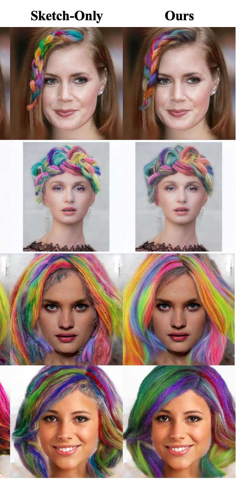

## 학습 조건
기존 mcs1, mcs3, mcs5, mcs6을 새로운 방식으로 재구성하여 진행

기존 방식:
| 논문 명칭 | Matte-CNN | Raw Matte | Gate | 내부 명칭 |
|---|:---:|:---:|:---:|:---:|
| Ours | ✓ | ✓ | ✗ | mcs1 |
| Ours + Gate | ✓ | ✓ | ✓ | mcs2 |
| Sketch-only | ✗ | ✗ | ✗ | mcs3 |
| Sketch-only + Gate | ✗ | ✗ | ✓ | mcs4 |
| Raw-only | ✗ | ✓ | ✗ (새로운 방식에서는 ✓로 변경) | mcs5 |
| Matte-CNN-only | ✓ | ✗ | ✗ (새로운 방식에서는 ✓로 변경) | mcs6 |

기존 방식의 mcs2를 run7의 기준 설정으로 둔다.    
새로운 mcs 방식은 run7_mcs1, run7_mcs2, run7_mcs3과 같이 명명한다.
따라서 현재 학습된 run7은 run7_mcs2라 칭한다.

모든 방식은 run7_mcs2의 설정을 따른다.
- run7_mcs1은 run7_mcs2에서 gate만 끈 설정이다. phase1 resume 여부를 제외한 다른 설정은 변경하지 않는다. (run7_mcs2는 run5_1와 구조가 완전히 똑같아 run5_1와 phase1 epoch15 에서 resume하여 이어 진행했음, 이번 실험은 모든 모델 다 처음부터 학습진행)
- run7_mcs3은 matte가 없으므로 gate 없이 진행하며, run7_mcs2에서 입력으로 sketch만 사용한다.
- run7_mcs5와 run7_mcs6은 기존 방식과 달리 gate on(hard gate)으로 진행한다.

## 정량지표
Unbraid: 466장, Braid: 107장, 총 573장 사용  
CRG 1.5 + BLD full (step 20) + Pixel Matte-Blend + Feathering OFF (0), epoch20 기준  
mcs2(Ours)는 기존 run7 phase2 rawstart epoch20 결과와 동일하게 비교

### braid (n=107)

#### 구조·색상·화질·리얼리즘 (matte 내부에서만 진행)

| Run | 설정 | Sketch LPIPS ↓ | Sketch ΔE2000 ↓ | Edge IoU ↑ | LPIPS(GT) ↓ | ΔE2000(GT) ↓ | PSNR ↑ | Hair FID ↓ | KID_hair ↓ |
|---|---|---:|---:|---:|---:|---:|---:|---:|---:|
| mcs1 | Gate OFF | 0.4843 | 13.8734 | **0.0961** | 0.1319 | 3.1991 | 16.3227 | 78.2520 | 0.0019±0.0005 |
| mcs2 | Ours | 0.4668 | **12.8527** | 0.0952 | 0.1141 | 2.0913 | 16.6502 | **69.7901** | 0.0002±0.0004 |
| mcs3 | Sketch-only | 0.4908 | 13.0287 | 0.0956 | 0.1208 | **1.7154** | 16.1589 | 75.1511 | 0.0015±0.0005 |
| mcs5 | RawMatte + Gate | 0.4777 | 13.5523 | 0.0953 | **0.1139** | 2.0726 | **16.7095** | 71.8576 | 0.0013±0.0004 |
| mcs6 | MatteCNN + Gate | **0.4562** | 13.3729 | 0.0944 | 0.1140 | 3.4606 | 16.5351 | 72.1001 | 0.0012±0.0004 |

#### 경계밴드 B

| Run | 설정 | Boundary LPIPS ↓(legacy) | Bnd LPIPS k=8 ↓ | Bnd LPIPS k=16 ↓ | Boundary FID ↓ | Region IoU ↑ | Boundary IoU ↑ |
|---|---|---:|---:|---:|---:|---:|---:|
| mcs1 | Gate OFF | 0.0063 | 0.0084 | 0.0273 | 4.2583 | **0.1629** | **0.1159** |
| mcs2 | Ours | 0.0057 | 0.0076 | 0.0245 | 3.8197 | 0.1433 | 0.1011 |
| mcs3 | Sketch-only | **0.0052** | **0.0070** | 0.0248 | **3.3632** | 0.1602 | 0.1019 |
| mcs5 | RawMatte + Gate | 0.0056 | 0.0072 | **0.0242** | 3.8364 | 0.1413 | 0.0955 |
| mcs6 | MatteCNN + Gate | 0.0063 | 0.0082 | 0.0256 | 4.2229 | 0.1538 | 0.1137 |

#### 배경 보존 · identity · 방향 안정성(matte 내부에서만 진행)

| Run | 설정 | PSNR_bg ↑ | LPIPS_bg ↓ | ArcFace cos ↑ | Full-portrait FID ↓ | GT 방향오차 ↓ | Seed 불일치 ↓ |
|---|---|---:|---:|---:|---:|---:|---:|
| mcs1 | Gate OFF | 47.4563 | 0.0004 | **0.9572** | 45.1613 | **19.53±4.55** | **12.92±3.07** |
| mcs2 | Ours | 47.8856 | **0.0003** | 0.9194 | **40.6367** | 21.19±4.71 | 14.96±3.15 |
| mcs3 | Sketch-only | **48.0490** | **0.0003** | 0.8997 | 41.1005 | 19.90±4.70 | 16.15±3.92 |
| mcs5 | RawMatte + Gate | 47.9759 | **0.0003** | 0.9248 | 41.0968 | 19.56±4.65 | 14.33±3.45 |
| mcs6 | MatteCNN + Gate | 47.5576 | 0.0004 | 0.9022 | 41.9973 | 19.56±4.61 | 13.15±3.22 |

### unbraid (n=466)

#### 구조·색상·화질·리얼리즘 (matte 내부에서만 진행)

| Run | 설정 | Sketch LPIPS ↓ | Sketch ΔE2000 ↓ | Edge IoU ↑ | LPIPS(GT) ↓ | ΔE2000(GT) ↓ | PSNR ↑ | Hair FID ↓ | KID_hair ↓ |
|---|---|---:|---:|---:|---:|---:|---:|---:|---:|
| mcs1 | Gate OFF | 0.7000 | 13.1133 | 0.0485 | 0.1852 | 2.4115 | 16.7622 | 38.5344 | 0.0083±0.0028 |
| mcs2 | Ours | 0.6755 | **12.3779** | 0.0468 | 0.1726 | 1.5365 | 17.2934 | **34.2327** | 0.0051±0.0023 |
| mcs3 | Sketch-only | 0.7051 | 12.4818 | **0.0495** | 0.1895 | **1.3229** | 16.7114 | 35.0597 | 0.0066±0.0024 |
| mcs5 | RawMatte + Gate | 0.7040 | 12.7311 | 0.0494 | 0.1805 | 1.3797 | 17.1794 | 36.6846 | 0.0080±0.0026 |
| mcs6 | MatteCNN + Gate | **0.6694** | 13.0178 | 0.0466 | **0.1718** | 1.8958 | **17.4436** | 37.2540 | 0.0078±0.0026 |

#### 경계밴드 B

| Run | 설정 | Boundary LPIPS ↓(legacy) | Bnd LPIPS k=8 ↓ | Bnd LPIPS k=16 ↓ | Boundary FID ↓ | Region IoU ↑ | Boundary IoU ↑ |
|---|---|---:|---:|---:|---:|---:|---:|
| mcs1 | Gate OFF | 0.0074 | 0.0033 | 0.0212 | 2.8750 | **0.1402** | **0.0978** |
| mcs2 | Ours | 0.0066 | **0.0029** | **0.0190** | 2.5609 | 0.1199 | 0.0815 |
| mcs3 | Sketch-only | **0.0064** | **0.0029** | 0.0198 | **2.3532** | 0.1398 | 0.0908 |
| mcs5 | RawMatte + Gate | 0.0066 | **0.0029** | 0.0192 | 2.6530 | 0.1253 | 0.0826 |
| mcs6 | MatteCNN + Gate | 0.0069 | 0.0031 | 0.0194 | 2.7804 | 0.1200 | 0.0852 |

#### 배경 보존 · identity · 방향 안정성 (matte 내부에서만 진행)

| Run | 설정 | PSNR_bg ↑ | LPIPS_bg ↓ | ArcFace cos ↑ | Full-portrait FID ↓ | GT 방향오차 ↓ | Seed 불일치 ↓ |
|---|---|---:|---:|---:|---:|---:|---:|
| mcs1 | Gate OFF | 41.8648 | 0.0015 | 0.9698 | 16.1854 | **12.90±3.91** | 7.88±2.56 |
| mcs2 | Ours | 42.3961 | 0.0015 | 0.9718 | **13.5973** | 13.28±3.89 | 8.66±2.51 |
| mcs3 | Sketch-only | **42.4717** | **0.0014** | **0.9738** | 15.5801 | 13.42±4.08 | 10.36±3.37 |
| mcs5 | RawMatte + Gate | 42.4202 | 0.0015 | 0.9723 | 13.9529 | 13.21±3.94 | 9.25±2.90 |
| mcs6 | MatteCNN + Gate | 42.3103 | 0.0015 | 0.9713 | 14.4443 | **12.90±3.89** | **7.76±2.57** |

## Cross-Identity 
정량지표에 cross-identity 추가.
기존 논문 방식 사용([0620][서현택]color_sketch_3seed.md과 완전히 동일한 방법론   
단, CRG 1.5 + BLD full (step 20) + Pixel Blend/Feathering OFF (0) 적용), 헤어 마스크 부분(matte)에 대해서만 평가 적용  

####  Braid (n=107)
| 모델 | Sketch LPIPS ↓ | Sketch ΔE2000 ↓ | Edge IoU ↑ | PSNR (hair) ↑ |
|---|:---:|:---:|:---:|:---:|
| **mcs1** (Gate OFF) | 0.4746±0.0037 | 11.55±0.04 | **0.0930±0.0002** | **10.55±0.11** |
| **mcs2** (Ours) | 0.4430±0.0066 | 11.02±0.43 | 0.0894±0.0002 | 10.01±0.11 |
| **mcs3** (Sketch-only) | 0.4575±0.0029 | **10.85±0.39** | 0.0871±0.0002 | 9.46±0.02 |
| **mcs5** (RawMatte + Gate) | 0.4418±0.0080 | 12.81±0.89 | 0.0886±0.0004 | 9.84±0.11 |
| **mcs6** (MatteCNN + Gate) | **0.4249±0.0067** | 11.69±0.56 | 0.0905±0.0004 | 9.71±0.10 |

#### Unbraid (n=466)
| 모델 | Sketch LPIPS ↓ | Sketch ΔE2000 ↓ | Edge IoU ↑ | PSNR (hair) ↑ |
|---|:---:|:---:|:---:|:---:|
| **mcs1** (Gate OFF) | 0.6790±0.0059 | **11.71±0.32** | **0.0492±0.0005** | 10.03±0.13 |
| **mcs2** (Ours) | 0.6639±0.0038 | 11.86±0.22 | 0.0480±0.0004 | 9.96±0.19 |
| **mcs3** (Sketch-only) | 0.6602±0.0152 | 12.08±0.19 | 0.0481±0.0012 | 9.33±0.12 |
| **mcs5** (RawMatte + Gate) | 0.6678±0.0105 | 12.39±0.39 | 0.0489±0.0008 | **10.04±0.17** |
| **mcs6** (MatteCNN + Gate) | **0.6383±0.0052** | 12.00±0.08 | 0.0460±0.0005 | 9.70±0.13 |

#### Macro-avg = (braid + unbraid) / 2
| 모델 | Sketch LPIPS ↓ | Sketch ΔE2000 ↓ | Edge IoU ↑ | PSNR (hair) ↑ |
|---|:---:|:---:|:---:|:---:|
| **mcs1** (Gate OFF) | 0.5768±0.0017 | 11.63±0.17 | **0.0711±0.0002** | **10.29±0.12** |
| **mcs2** (Ours) | 0.5535±0.0014 | **11.44±0.27** | 0.0687±0.0002 | 9.98±0.15 |
| **mcs3** (Sketch-only) | 0.5588±0.0063 | 11.46±0.15 | 0.0676±0.0006 | 9.39±0.07 |
| **mcs5** (RawMatte + Gate) | 0.5548±0.0013 | 12.60±0.51 | 0.0687±0.0002 | 9.94±0.14 |
| **mcs6** (MatteCNN + Gate) | **0.5315±0.0009** | 11.84±0.29 | 0.0682±0.0005 | 9.70±0.12 |

#### Hair FID (통합 573, unpaired)
| 모델 | Hair FID ↓ |
|---|:---:|
| **mcs1** (Gate OFF) | **129.68±0.78** |
| **mcs2** (Ours) | 138.23±1.12 |
| **mcs3** (Sketch-only) | 152.96±0.39 |
| **mcs5** (RawMatte + Gate) | 147.55±0.24 |
| **mcs6** (MatteCNN + Gate) | 142.18±0.31 |

- Hair FID는 **mcs1(Gate OFF)이 최선**(129.68), gate를 켠 mcs2(Ours)가 오히려 138.23으로 더 나쁨 — [0620]에서는
  반대로 gate 켠 쪽(Ours, mcs1 표기)이 140.11로 최선·Ours+Gate가 152.28로 최악이었던 것과 **순위가 뒤집힘**.
  다만 [0620]은 CRG/BLD/blend 없이 돌린 값이라 추론조건 차이 때문일 가능성이 있음 — 직접적인 1:1 비교는 주의.
- 나머지 4지표(Sketch LPIPS·ΔE2000·Edge IoU·PSNR)는 braid/unbraid 공통으로 mcs1·mcs6이 상위권, mcs3(Sketch-only)이
  PSNR에서 가장 낮음(braid 9.46, unbraid 9.33) — 색·구조 지표가 좋아도 화질(PSNR)은 손해 보는 경향.

### 논문 결과: ranking inversion (§4.6, Table 1, Fig.3)
| Configuration | Cross-identity Hair FID ↓ (leakage-free) |
|---|---:|
| Sketch-only | **159.95** (최악) |
| RawMatte-concat only | 148.73 |
| MatteCNN-bias only | 148.10 |
| Ours (둘 다) | **140.11 ± 3.10**(3 seed, 최선) |

## 정성지표
### gt sketch
| sketch | mcs1 (Gate OFF) | mcs2(Ours) | mcs3(Sketch-Only) |  mcs5(RawMatte) | mcs6(MatteCNN) |
|---|---|---|---|---|---|
|  |  |  |  |  |  |
|  |  |  |  |  |  |
|  |  |  |  |  |  |
|  |  |  |  |  |  |
|  |  |  |  |  |  |
|  |  |  |  |  |  |
|  |  |  |  |  |  |
|  |  |  |  |  |  |
|  |  |  |  |  |  |
|  |  |  |  |  |  |
|  |  |  |  |  |  |
|  |  |  |  |  |  |
|  |  |  |  |  |  |

### color sketch
| sketch | mcs1 (Gate OFF) | mcs2(Ours) | mcs3(Sketch-Only) |  mcs5(RawMatte) | mcs6(MatteCNN) |
|---|---|---|---|---|---|
|  |  |  |  |  |  |
|  |  |  |  |  |  |
|  |  |  |  |  |  |
|  |  |  |  |  |  |
|  |  |  |  |  |  |
|  |  |  |  |  |  |
|  |  |  |  |  |  |
|  |  |  |  |  |  |
|  |  |  |  |  |  |
|  |  |  |  |  |  |
|  |  |  |  |  |  |
|  |  |  |  |  |  |
|  |  |  |  |  |  |

## 논문에 표시된 각 실험에 따른 효과 vs 실제 효과
논문 §4.2는 MatteCNN bias × RawMatte anchor의 2×2 factorial만 정식 ablation으로 두고, gate는 직교하는 별도 축(§4.8)으로 분리함.
수치는 Cross-identity Hair FID(§4.6, Table 1, leakage-free, 3 seed) / GT-bg(§4.7, Table 2) 기준.

1. gate on/off

- 논문(정성지표) : ON이면 unbraid가 더 매끄럽고 스케치 색에 충실, OFF면 잔차가 강해 braid의 strand-crossing·knot boundary 표현이 좋음    
- 실제(정성지표) : ON이면 unbraid가 스케치 색에 충실(논문만큼 매끄러움이 차이나진 않음), OFF면 strand-crossing·knot boundary 표현이 좋음 

| | CM_1082(GT) | CM_1172(color) | braid_2548(GT) | braid_2562_1(color) | CM_1067(color) | CM_1027(color) |
|---|---|---|---|---|---|---|
| mcs1 |  |  |  |  |  |  |
| mcs2 |  |  |  |  |  |  |

- 논문(정량지표) : gate on/off 큰 차이 없음    
- 실제(정량지표) : 논문과 달리 차이가 작지 않음. braid·unbraid 양쪽 모두에서 gate ON(mcs2)이 realism/분포 지표를 개선: Hair FID(braid mcs1 78.2520→mcs2 **69.7901**, unbraid 38.5344→**34.2327**), KID_hair(braid 0.0019→**0.0002**, unbraid 0.0083→**0.0051**), Full-portrait FID(braid 45.1613→**40.6367**, unbraid 16.1854→**13.5973**). 반대로 구조 지표는 gate OFF(mcs1)가 두 그룹 모두에서 5개 중 최고: Region IoU(braid **0.1629**/unbraid **0.1402**)·Boundary IoU(braid **0.1159**/unbraid **0.0978**) — mcs2는 각각 0.1433·0.1199 / 0.1011·0.0815로 더 낮아 gate ON이 구조 충실도를 깎는다는 게 수치로도 확인됨. identity(ArcFace cos)는 그룹별로 갈림 — braid에서는 mcs1이 **0.9572**로 5개 중 최고이지만, unbraid에서는 오히려 mcs1(0.9698)이 5개 중 **최저**이고 mcs3(0.9738)이 최고: gate OFF가 identity를 더 잘 보존하는 효과는 braid에서만 나타남. GT 방향오차는 두 그룹 모두 mcs1이 최고(braid **19.53**/unbraid **12.90**, unbraid는 mcs6과 공동 최고). 즉 "큰 차이 없음"이 아니라 **realism vs 구조 충실도의 트레이드오프가 뚜렷**하며, identity는 braid에서만 gate OFF가 우세함 — 위 정성지표(실제)의 "gate off가 boundary 표현이 더 좋음" 관찰과도 방향이 일치함  

2. Sketch-only (mcs3)

- 논문(정성지표) : 텍스처가 거칠고 strand flow가 덜 일관됨(§4.5, Fig.2). 스트로크 색을 가장 문자 그대로 따라감(색 fidelity ↔ realism 트레이드오프, §5)    
- 실제(정성지표) : 논문에서 제시된 것에 비해 텍스처가 거칠지 않고, GT image에서는 다른지표와 거의 구분할 수 없음, 색 학습이 가장 잘 되어보이고, 특히 형광색 stroke에 대해 잘 표현함. 

| | braid_2562_1(color) | CM_1067(color) | CM_1068(color) | braid_4156(color) | CM_1084(color) |
|---|---|---|---|---|---|
| mcs2 |  |  |  |  |  |
| mcs3 |  |  |  |  |  |

- 논문(정량지표) : matte 신호가 전혀 없는 baseline. Hair FID **159.95로 최악**. ΔE2000은 2.1550으로 최고. GT-bg 프로토콜에서는 배경 누수 덕에 **오히려 최고로 보이는 ranking inversion**이 발생(§4.6, Fig.3) → 논문 contribution 3번의 근거  
- 실제(정량지표) : Hair FID는 그룹별로 갈림 — unbraid에서는 **35.0597**로 5개 중 2위(1위 mcs2 34.2327)로 mcs1(38.5344)보다 낮아 논문의 "최악" 서술과 반대이지만, braid에서는 **75.1511**로 5개 중 4위(2위 mcs5 71.8576, 3위 mcs6 72.1001)로 mcs1(78.2520) 다음으로 나빠 논문의 "최악" 서술에 오히려 가까움. Sketch ΔE2000은 braid 13.0287·unbraid 12.4818로 두 그룹 모두 5개 중 2위(1위는 mcs2, braid 12.8527/unbraid 12.3779)이며 "최고"는 아님. 반면 ΔE2000(GT)는 braid **1.7154**·unbraid **1.3229**로 두 그룹 모두 5개 중 최고 — 색 fidelity(GT 대비) 우위는 재현됨. Edge IoU는 unbraid에서 **0.0495**로 근소하게 최고(2위 mcs5 0.0494)이지만 braid에서는 0.0956으로 2위(1위는 mcs1 0.0961)라 "최고"는 unbraid에서만 성립. PSNR_bg는 braid **48.0490**·unbraid **42.4717**로 두 그룹 모두 5개 중 최고 — 배경 쪽에서 가장 유리하게 나오는 경향은 paper의 ranking inversion과 방향이 일치(단, 평가 프로토콜 자체는 paper의 GT-bg와 다르므로 동일 메커니즘이라 단정은 어려움)   

3. RawMatte (mcs5)

- 논문(정량지표) : sketch latent + raw matte anchor 단독. Hair FID 159.95 → **148.73**. pixel unshuffle + 1×1 conv로 편집 영역의 명시적 기하 정보를 줌(§3.3.2)   
- 실제(정량지표) : Hair FID는 braid **71.8576**으로 5개 중 2위(mcs3 75.1511보다도 좋음), unbraid는 **36.6846**으로 5개 중 3위(mcs3 35.0597보다 나쁨) — 그룹에 따라 mcs3(sketch-only) 대비 우열이 갈려, "raw matte 추가가 sketch-only보다 낫다"는 논문 서열이 braid에서는 오히려 재현되고 unbraid에서는 반대로 나타남. 단, 실제는 gate ON이 같이 걸려 있어 논문과 세팅이 다름  

4. MatteCNN (mcs6)

- 논문(정량지표) : sketch latent + zero-init 학습형 region-aware bias 단독. Hair FID 159.95 → **148.10**. RawMatte·MatteCNN 어느 한쪽만 넣어도 ~11점 개선, 둘 다 넣으면(Ours, mcs1) **140.11±3.10**으로 최고 → 두 신호는 역할 분담이 아니라 같은 목표로 latent를 미는 **additive** 관계(§5). GT-bg에서도 Ours가 PSNR 14.2263·Edge IoU 0.0728로 최고  
- 실제(정량지표) : mcs6 Hair FID는 braid **72.1001**로 5개 중 3위, unbraid는 **37.2540**으로 5개 중 4위. 논문에서 "최고"라던 mcs1(=RawMatte+MatteCNN 둘 다, gate off)은 braid **78.2520**·unbraid **38.5344** 모두 5개 중 최하위 — 논문의 additive 최적 조합 서열이 재현되지 않음  
  
단, 논문에 나온 방식은 mcs1이 ours라고 정의. 현재는 mcs2가 ours라고 정의하며, mcs5, 6도 gate on으로 설정 되어있음.
