## 통계 방법

- **비교 모델(5개)**: Sketch-only(mcs3) / SHS(SketchHairSalon) / HairCLIPv2 / VividHair(VividHairStyler) / **Ours**(gated, mcs2)
- **문항(세트당 3개)**: Hair Realism / Structure Fidelity / Color Fidelity
    - 입력 스케치를 참고했을 때, 머리카락이 가장 자연스럽고 실제처럼 보이는 결과를 선택해 주세요.
    - 입력 스케치와 비교했을 때, 머리 모양과 머릿결의 방향을 가장 잘 따라간 결과를 선택해 주세요.
    - 입력 스케치와 비교했을 때, 머리카락 색을 가장 잘 따라간 결과를 선택해 주세요.
- **세트**: 총 20세트 = GT 10세트(braid 4 / unbraid 6) + COLOR 10세트(braid 4 / unbraid 6)
- **응답자**: 33명
- **공정성 확보**: 세트마다 5개 모델을 A~E로 랜덤 셔플해 제시. → 집계는 실제 모델명을 복원한 뒤 집계함.
- **% 계산**: 그룹별 각 문항의 모델별 득표수 ÷ (그룹 세트 수 × 33명). 예) braid(GT)는 4세트 × 33명 = 132표가 분모.

## 전체 결과
(20세트 × 33명 = 660표/문항)

| Method      | Hair Realism ↑ | Structure Fidelity ↑ | Color Fidelity ↑ |
| ----------- | -------------: | -------------------: | ---------------: |
| Sketch-only |           27.3% |                 36.7% |             44.8% |
| SHS         |            7.3% |                 10.6% |             13.8% |
| HairCLIPv2  |           11.4% |                  5.2% |              4.2% |
| VividHair   |           15.2% |                  8.5% |              8.6% |
| Ours        |       **38.9%** |             **39.1%** |         **28.5%** |

Hair Realism, Structure Fidelity는 Ours(mcs2)가 1위  
Color Fidelity는 Sketch-only(mcs3)가 1위

## 개별 결과

### braid(GT)
(4세트 × 33명 = 132표/문항)

| Method      | Hair Realism ↑ | Structure Fidelity ↑ | Color Fidelity ↑ |
| ----------- | -------------: | -------------------: | ---------------: |
| Sketch-only |           49.2% |                 55.3% |             60.6% |
| SHS         |           10.6% |                 13.6% |             10.6% |
| HairCLIPv2  |            2.3% |                  2.3% |              1.5% |
| VividHair   |            9.1% |                  0.0% |              1.5% |
| Ours        |       **28.8%** |             **28.8%** |         **25.8%** |

### braid(COLOR)
(4세트 × 33명 = 132표/문항)

| Method      | Hair Realism ↑ | Structure Fidelity ↑ | Color Fidelity ↑ |
| ----------- | -------------: | -------------------: | ---------------: |
| Sketch-only |           17.4% |                 25.0% |             43.9% |
| SHS         |            6.8% |                 12.9% |             17.4% |
| HairCLIPv2  |            6.8% |                  1.5% |              1.5% |
| VividHair   |            5.3% |                  2.3% |              0.8% |
| Ours        |       **63.6%** |             **58.3%** |         **36.4%** |

### unbraid(GT)
(6세트 × 33명 = 198표/문항)

| Method      | Hair Realism ↑ | Structure Fidelity ↑ | Color Fidelity ↑ |
| ----------- | -------------: | -------------------: | ---------------: |
| Sketch-only |           28.8% |                 34.8% |             34.3% |
| SHS         |            6.6% |                 10.1% |             12.1% |
| HairCLIPv2  |           15.2% |                  9.6% |             10.1% |
| VividHair   |           33.3% |                 20.2% |             21.7% |
| Ours        |       **16.2%** |             **25.3%** |         **21.7%** |

### unbraid(COLOR)
(6세트 × 33명 = 198표/문항)

| Method      | Hair Realism ↑ | Structure Fidelity ↑ | Color Fidelity ↑ |
| ----------- | -------------: | -------------------: | ---------------: |
| Sketch-only |           17.7% |                 33.8% |             45.5% |
| SHS         |            6.1% |                  7.6% |             15.2% |
| HairCLIPv2  |           16.7% |                  5.1% |              2.0% |
| VividHair   |            7.6% |                  6.6% |              5.6% |
| Ours        |       **52.0%** |             **47.0%** |         **31.8%** |

## 요약
- **전체**적으로는 Ours가 Hair Realism·Structure Fidelity 1위(각 38.9%/39.1%), Color Fidelity는 Sketch-only가 1위(44.8%, Ours 28.5%로 2위) — Sketch-only/SHS/HairCLIPv2/VividHair 대비 Ours가 대체로 우세하지만 색상 재현만큼은 gating 없는 Sketch-only가 근소하게 더 좋은 평가를 받음.
- **COLOR 세트(braid/unbraid 모두**)에서는 Ours가 Hair Realism·Structure Fidelity에서 압도적 1위(braid 63.6%/58.3%, unbraid 52.0%/47.0%) — 색상 스케치가 입력으로 주어질 때 Ours의 이득이 가장 크게 나타남.
- **braid(GT)**에서도 Ours가 전 문항 2위권으로 준수하나, Sketch-only가 3문항 모두 1위(49.2~60.6%)로 가장 강세.
- **unbraid(GT)는 4개 조합 중 Ours가 상대적으로 가장 약한 조합** — Hair Realism은 VividHair(33.3%) > Sketch-only(28.8%) > **Ours(16.2%)** > HairCLIPv2(15.2%) > SHS(6.6%) 순으로 Ours가 3위에 그침. Structure Fidelity는 Sketch-only(34.8%) > **Ours(25.3%)**로 2위, Color Fidelity는 Sketch-only(34.3%) 다음으로 **Ours**와 VividHair가 21.7%(43/198표)로 동률 2위.
- 종합하면 SHS·HairCLIPv2는 전 조합에서 하위권(대부분 5~15%)에 머무르고, VividHair는 unbraid(GT)에서만 예외적으로 두드러진 강세(Hair Realism 1위)를 보임.

### 사용한 이미지 그리드 모음

각 세트는 위쪽 sketch(입력) + 아래 A-E 5분할 결과 그리드로 구성. A-E와 실제 모델 매핑은 세트마다 랜덤이며, 아래 "정답 키"에 표시.

#### 1. GT · unbraid · CM_1121
- 정답 키: A=Ours, B=Sketch-only, C=VividHair, D=HairCLIPv2, E=SHS
- 집계 (33명):

| Method | Hair Realism | Structure Fidelity | Color Fidelity |
|---|---|---|---|
| Sketch-only | 8/33 | 12/33 | 6/33 |
| SHS | 0/33 | 1/33 | 0/33 |
| HairCLIPv2 | 2/33 | 0/33 | 3/33 |
| VividHair | 20/33 | 15/33 | 19/33 |
| Ours | **3/33** | **5/33** | **5/33** |

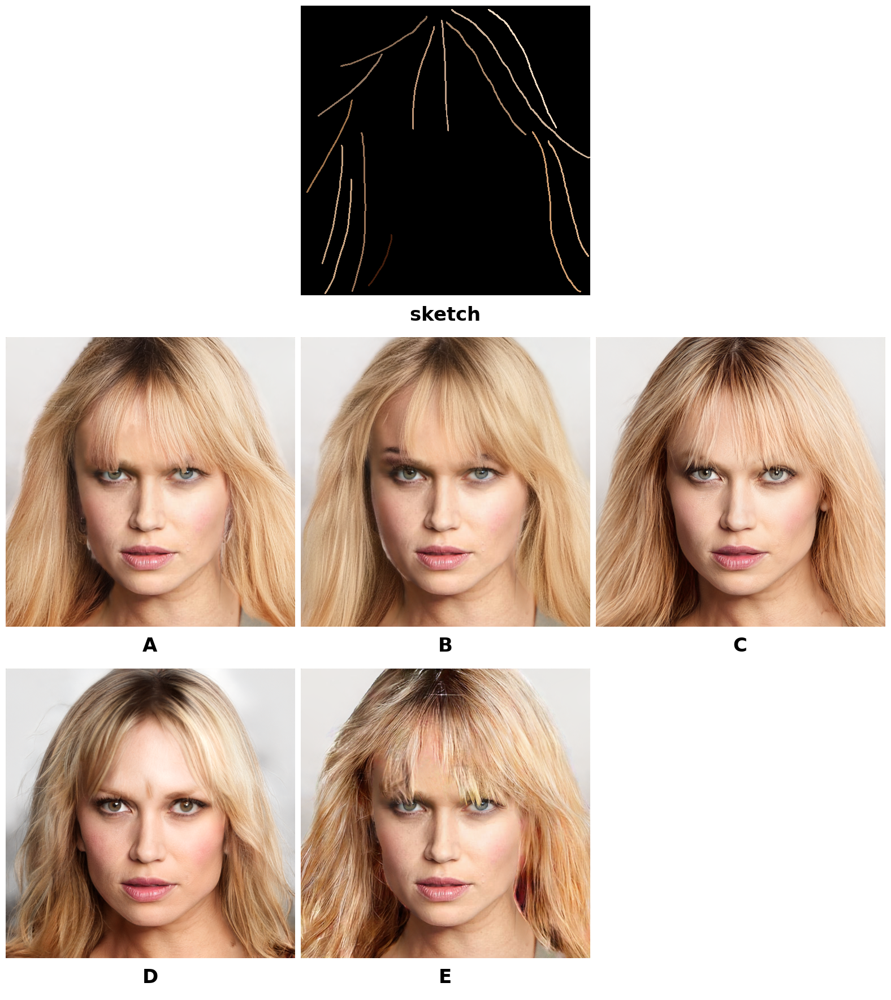

#### 2. COLOR · unbraid · CM_1028
- 정답 키: A=Sketch-only, B=Ours, C=VividHair, D=SHS, E=HairCLIPv2
- 집계 (33명):

| Method | Hair Realism | Structure Fidelity | Color Fidelity |
|---|---|---|---|
| Sketch-only | 3/33 | 7/33 | 11/33 |
| SHS | 1/33 | 4/33 | 6/33 |
| HairCLIPv2 | 6/33 | 4/33 | 1/33 |
| VividHair | 5/33 | 2/33 | 4/33 |
| Ours | **18/33** | **16/33** | **11/33** |

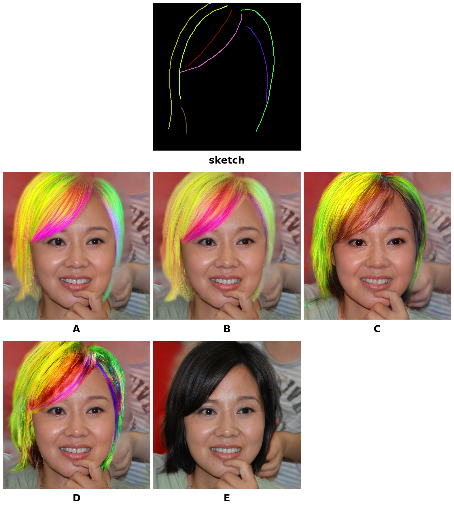

#### 3. GT · braid · braid_2548
- 정답 키: A=HairCLIPv2, B=SHS, C=Ours, D=VividHair, E=Sketch-only
- 집계 (33명):

| Method | Hair Realism | Structure Fidelity | Color Fidelity |
|---|---|---|---|
| Sketch-only | 1/33 | 4/33 | 10/33 |
| SHS | 10/33 | 11/33 | 9/33 |
| HairCLIPv2 | 0/33 | 0/33 | 0/33 |
| VividHair | 4/33 | 0/33 | 0/33 |
| Ours | **18/33** | **18/33** | **14/33** |

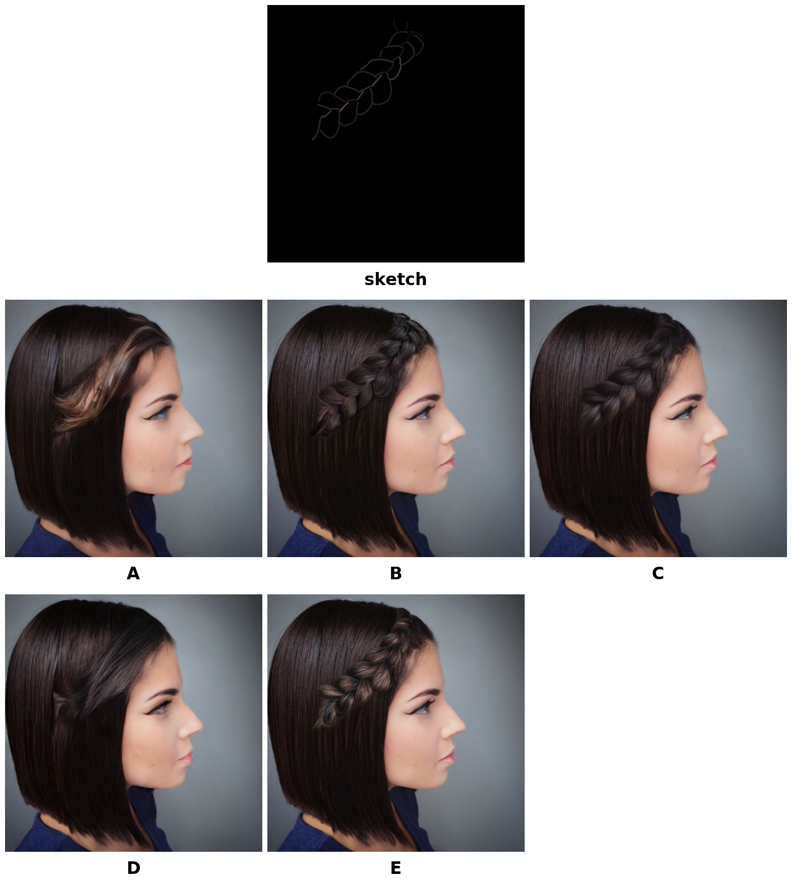

#### 4. COLOR · unbraid · CM_1055
- 정답 키: A=Sketch-only, B=SHS, C=HairCLIPv2, D=VividHair, E=Ours
- 집계 (33명):

| Method | Hair Realism | Structure Fidelity | Color Fidelity |
|---|---|---|---|
| Sketch-only | 3/33 | 12/33 | 8/33 |
| SHS | 7/33 | 4/33 | 15/33 |
| HairCLIPv2 | 10/33 | 4/33 | 2/33 |
| VividHair | 1/33 | 0/33 | 0/33 |
| Ours | **12/33** | **13/33** | **8/33** |

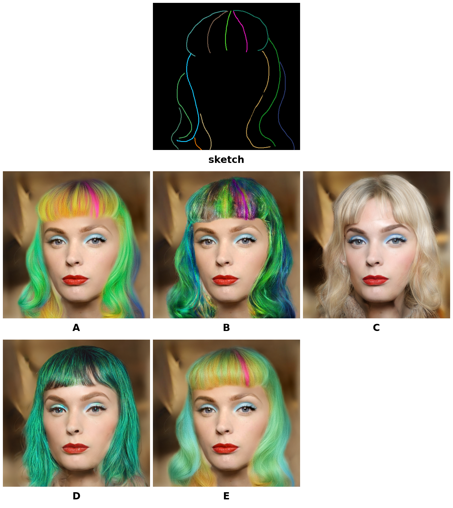

#### 5. COLOR · braid · braid_2562_1_2
- 정답 키: A=Sketch-only, B=HairCLIPv2, C=VividHair, D=SHS, E=Ours
- 집계 (33명):

| Method | Hair Realism | Structure Fidelity | Color Fidelity |
|---|---|---|---|
| Sketch-only | 3/33 | 4/33 | 9/33 |
| SHS | 3/33 | 6/33 | 7/33 |
| HairCLIPv2 | 7/33 | 1/33 | 2/33 |
| VividHair | 4/33 | 2/33 | 0/33 |
| Ours | **16/33** | **20/33** | **15/33** |

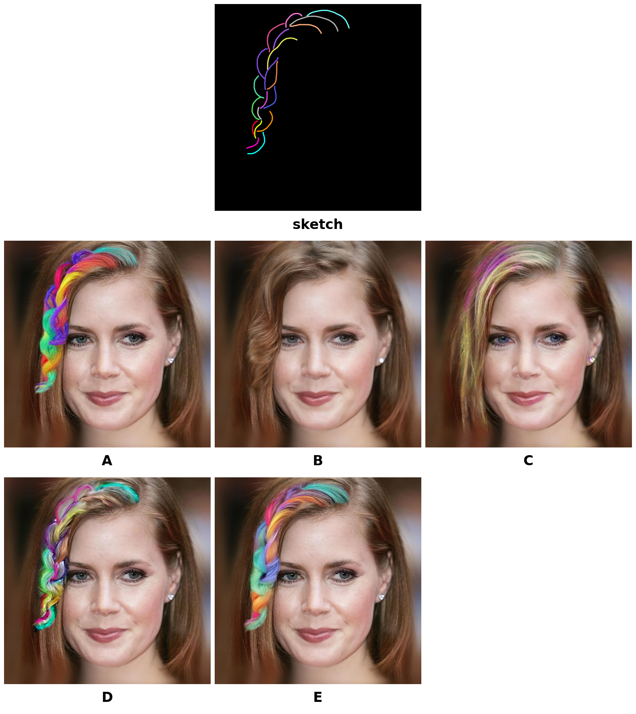

#### 6. GT · braid · braid_3276
- 정답 키: A=Sketch-only, B=HairCLIPv2, C=VividHair, D=SHS, E=Ours
- 집계 (33명):

| Method | Hair Realism | Structure Fidelity | Color Fidelity |
|---|---|---|---|
| Sketch-only | 14/33 | 18/33 | 20/33 |
| SHS | 4/33 | 7/33 | 5/33 |
| HairCLIPv2 | 0/33 | 0/33 | 1/33 |
| VividHair | 3/33 | 0/33 | 1/33 |
| Ours | **12/33** | **8/33** | **6/33** |

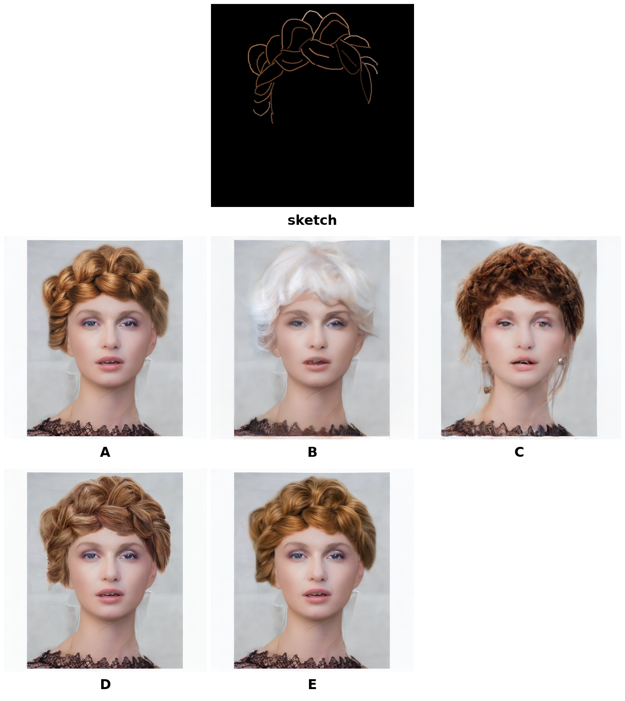

#### 7. COLOR · unbraid · CM_1133
- 정답 키: A=SHS, B=VividHair, C=Sketch-only, D=Ours, E=HairCLIPv2
- 집계 (33명):

| Method | Hair Realism | Structure Fidelity | Color Fidelity |
|---|---|---|---|
| Sketch-only | 8/33 | 12/33 | 17/33 |
| SHS | 2/33 | 2/33 | 3/33 |
| HairCLIPv2 | 2/33 | 0/33 | 0/33 |
| VividHair | 4/33 | 3/33 | 3/33 |
| Ours | **17/33** | **16/33** | **10/33** |

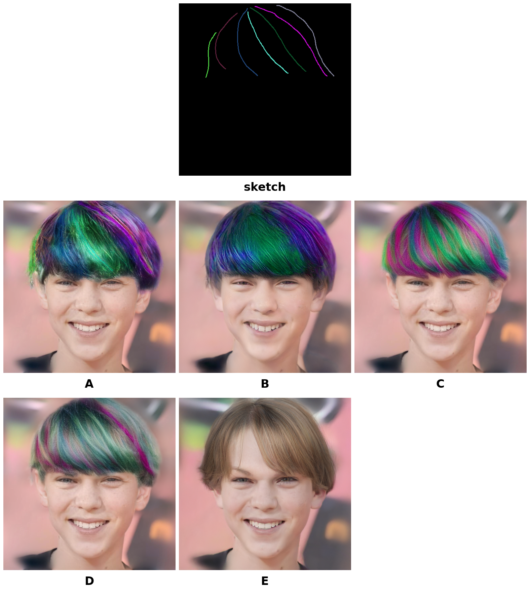

#### 8. GT · unbraid · CM_1067_12
- 정답 키: A=Ours, B=HairCLIPv2, C=SHS, D=VividHair, E=Sketch-only
- 집계 (33명):

| Method | Hair Realism | Structure Fidelity | Color Fidelity |
|---|---|---|---|
| Sketch-only | 13/33 | 12/33 | 12/33 |
| SHS | 2/33 | 4/33 | 7/33 |
| HairCLIPv2 | 6/33 | 3/33 | 2/33 |
| VividHair | 3/33 | 0/33 | 2/33 |
| Ours | **9/33** | **14/33** | **10/33** |

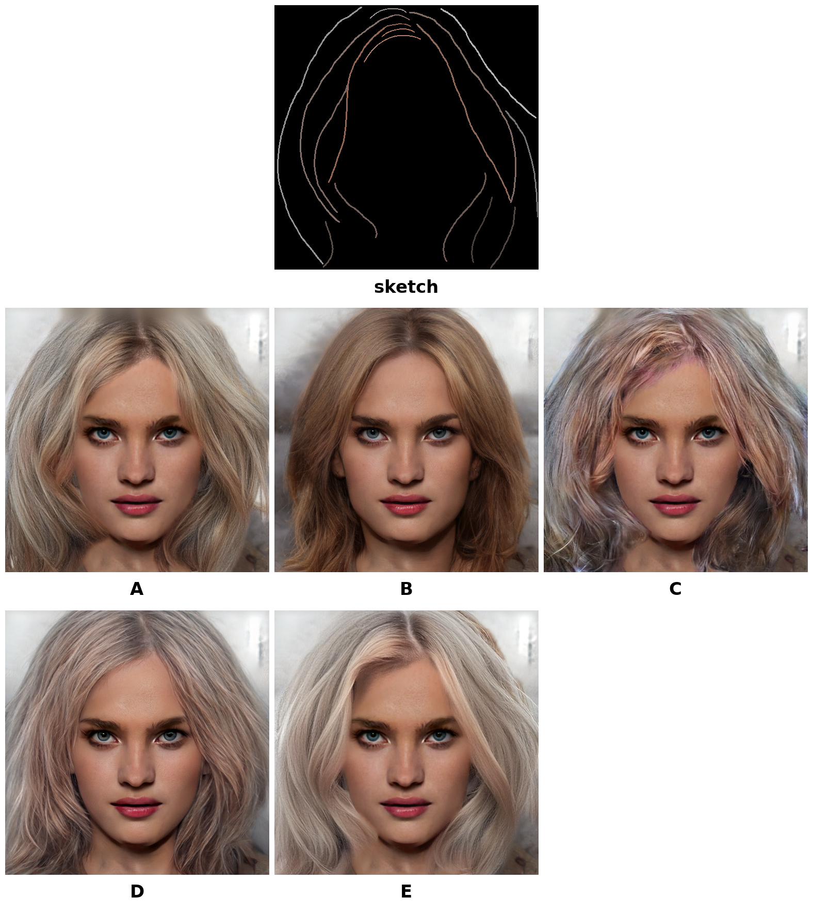

#### 9. COLOR · braid · braid_4276
- 정답 키: A=VividHair, B=HairCLIPv2, C=Ours, D=SHS, E=Sketch-only
- 집계 (33명):

| Method | Hair Realism | Structure Fidelity | Color Fidelity |
|---|---|---|---|
| Sketch-only | 1/33 | 3/33 | 11/33 |
| SHS | 4/33 | 5/33 | 5/33 |
| HairCLIPv2 | 1/33 | 0/33 | 0/33 |
| VividHair | 3/33 | 0/33 | 0/33 |
| Ours | **24/33** | **25/33** | **17/33** |

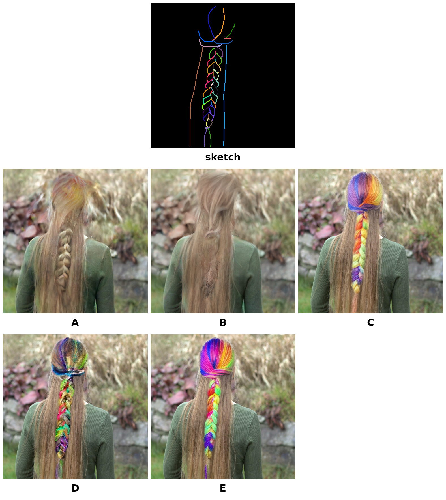

#### 10. COLOR · braid · braid_4212
- 정답 키: A=VividHair, B=HairCLIPv2, C=Sketch-only, D=SHS, E=Ours
- 집계 (33명):

| Method | Hair Realism | Structure Fidelity | Color Fidelity |
|---|---|---|---|
| Sketch-only | 9/33 | 10/33 | 21/33 |
| SHS | 0/33 | 2/33 | 6/33 |
| HairCLIPv2 | 1/33 | 1/33 | 0/33 |
| VividHair | 0/33 | 0/33 | 0/33 |
| Ours | **23/33** | **20/33** | **6/33** |

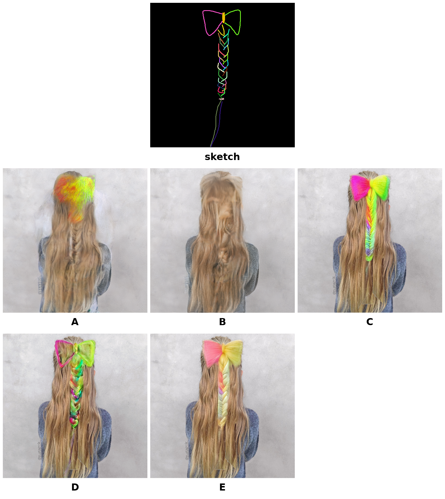

#### 11. COLOR · unbraid · CM_1215
- 정답 키: A=SHS, B=HairCLIPv2, C=VividHair, D=Sketch-only, E=Ours
- 집계 (33명):

| Method | Hair Realism | Structure Fidelity | Color Fidelity |
|---|---|---|---|
| Sketch-only | 7/33 | 10/33 | 18/33 |
| SHS | 1/33 | 1/33 | 1/33 |
| HairCLIPv2 | 3/33 | 0/33 | 0/33 |
| VividHair | 2/33 | 6/33 | 2/33 |
| Ours | **20/33** | **16/33** | **12/33** |

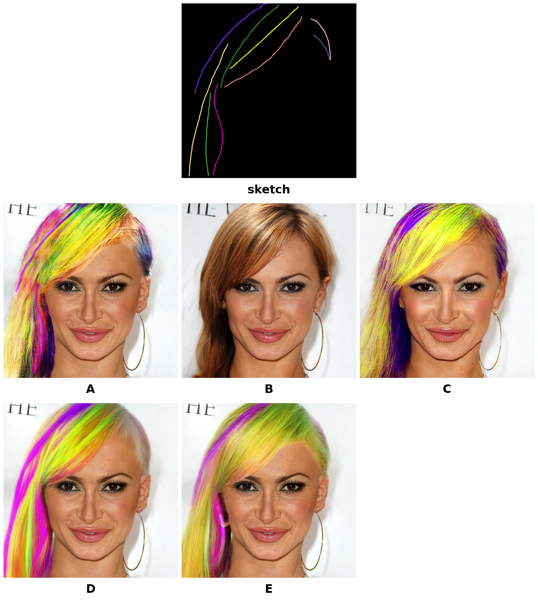

#### 12. GT · unbraid · CM_1027
- 정답 키: A=HairCLIPv2, B=VividHair, C=Ours, D=Sketch-only, E=SHS
- 집계 (33명):

| Method | Hair Realism | Structure Fidelity | Color Fidelity |
|---|---|---|---|
| Sketch-only | 12/33 | 15/33 | 16/33 |
| SHS | 0/33 | 0/33 | 1/33 |
| HairCLIPv2 | 7/33 | 2/33 | 2/33 |
| VividHair | 6/33 | 9/33 | 8/33 |
| Ours | **8/33** | **7/33** | **6/33** |

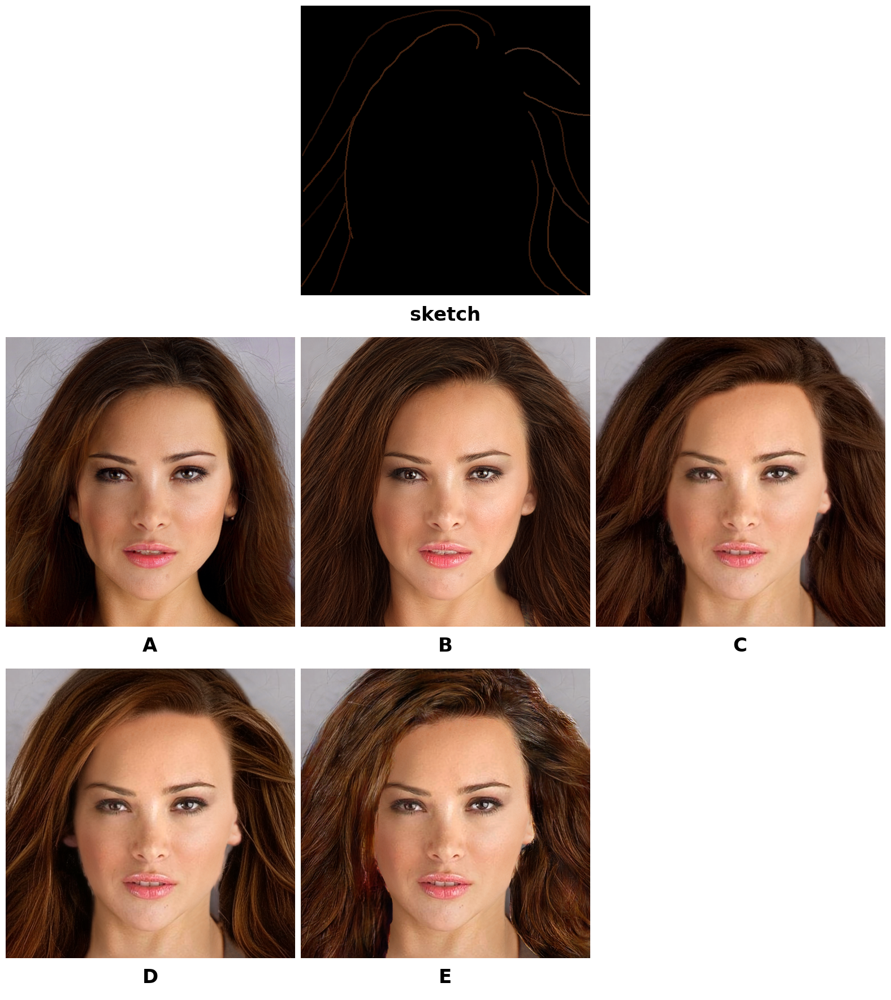

#### 13. GT · unbraid · CM_1151
- 정답 키: A=Ours, B=HairCLIPv2, C=SHS, D=VividHair, E=Sketch-only
- 집계 (33명):

| Method | Hair Realism | Structure Fidelity | Color Fidelity |
|---|---|---|---|
| Sketch-only | 3/33 | 2/33 | 3/33 |
| SHS | 6/33 | 8/33 | 12/33 |
| HairCLIPv2 | 8/33 | 8/33 | 8/33 |
| VividHair | 15/33 | 8/33 | 5/33 |
| Ours | **1/33** | **7/33** | **5/33** |

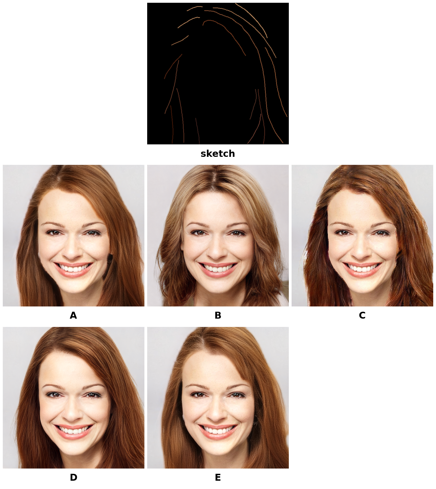

#### 14. COLOR · unbraid · CM_1139
- 정답 키: A=VividHair, B=Ours, C=Sketch-only, D=HairCLIPv2, E=SHS
- 집계 (33명):

| Method | Hair Realism | Structure Fidelity | Color Fidelity |
|---|---|---|---|
| Sketch-only | 12/33 | 20/33 | 26/33 |
| SHS | 0/33 | 1/33 | 2/33 |
| HairCLIPv2 | 6/33 | 2/33 | 1/33 |
| VividHair | 1/33 | 1/33 | 0/33 |
| Ours | **14/33** | **9/33** | **4/33** |

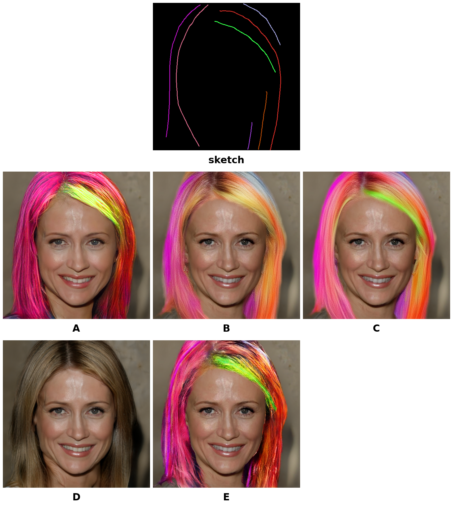

#### 15. GT · braid · wavy_753
- 정답 키: A=Sketch-only, B=HairCLIPv2, C=Ours, D=SHS, E=VividHair
- 집계 (33명):

| Method | Hair Realism | Structure Fidelity | Color Fidelity |
|---|---|---|---|
| Sketch-only | 27/33 | 27/33 | 26/33 |
| SHS | 0/33 | 0/33 | 0/33 |
| HairCLIPv2 | 0/33 | 2/33 | 0/33 |
| VividHair | 3/33 | 0/33 | 0/33 |
| Ours | **3/33** | **4/33** | **7/33** |

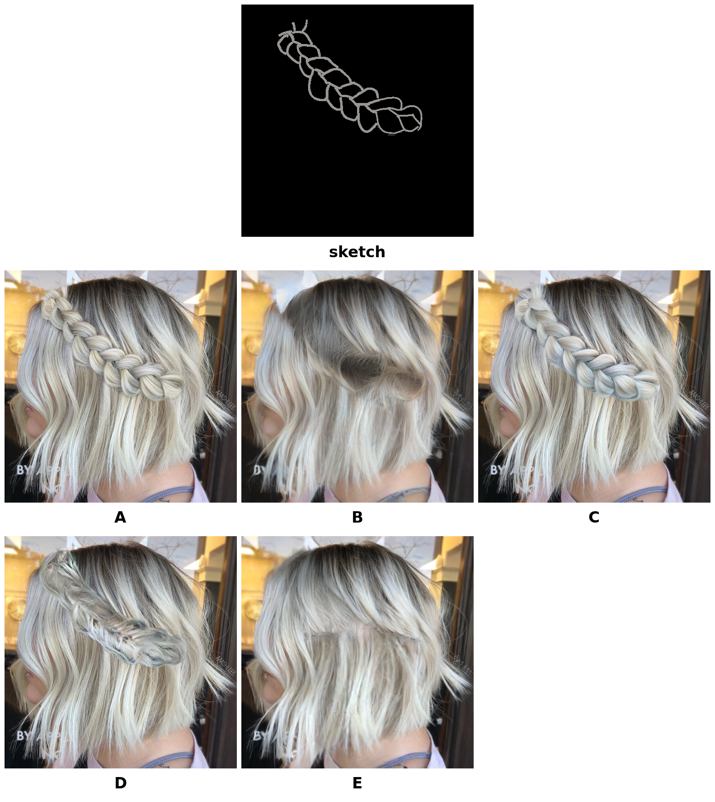

#### 16. GT · unbraid · CM1033
- 정답 키: A=VividHair, B=HairCLIPv2, C=SHS, D=Ours, E=Sketch-only
- 집계 (33명):

| Method | Hair Realism | Structure Fidelity | Color Fidelity |
|---|---|---|---|
| Sketch-only | 10/33 | 19/33 | 20/33 |
| SHS | 4/33 | 2/33 | 3/33 |
| HairCLIPv2 | 3/33 | 3/33 | 2/33 |
| VividHair | 11/33 | 4/33 | 3/33 |
| Ours | **5/33** | **5/33** | **5/33** |

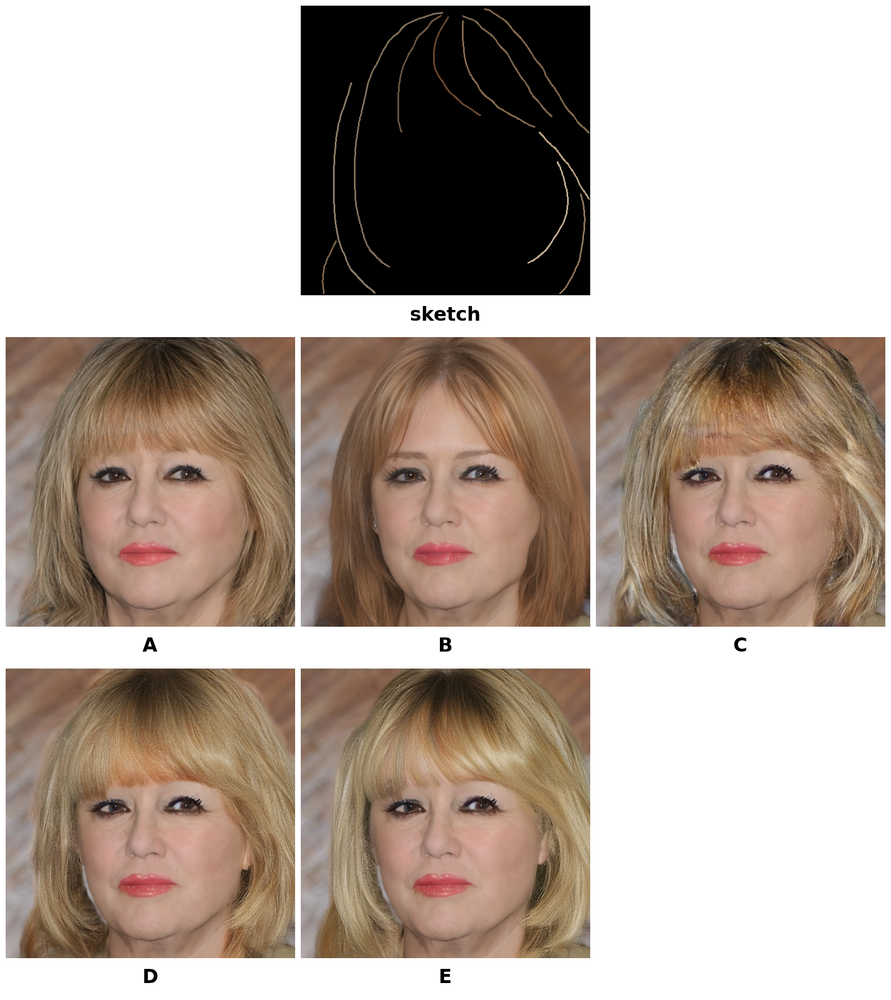

#### 17. COLOR · braid · braid_4156
- 정답 키: A=Ours, B=Sketch-only, C=VividHair, D=SHS, E=HairCLIPv2
- 집계 (33명):

| Method | Hair Realism | Structure Fidelity | Color Fidelity |
|---|---|---|---|
| Sketch-only | 10/33 | 16/33 | 17/33 |
| SHS | 2/33 | 4/33 | 5/33 |
| HairCLIPv2 | 0/33 | 0/33 | 0/33 |
| VividHair | 0/33 | 1/33 | 1/33 |
| Ours | **21/33** | **12/33** | **10/33** |

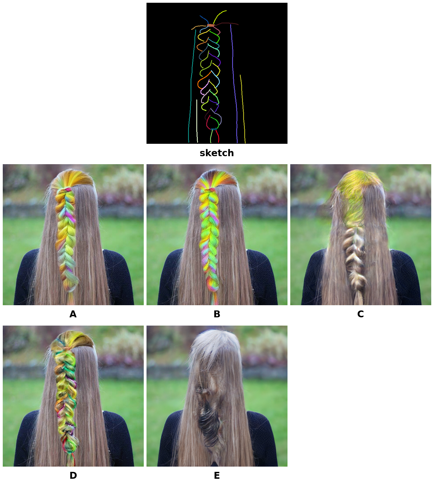

#### 18. GT · unbraid · CM_1009
- 정답 키: A=Ours, B=HairCLIPv2, C=VividHair, D=SHS, E=Sketch-only
- 집계 (33명):

| Method | Hair Realism | Structure Fidelity | Color Fidelity |
|---|---|---|---|
| Sketch-only | 11/33 | 9/33 | 11/33 |
| SHS | 1/33 | 5/33 | 1/33 |
| HairCLIPv2 | 4/33 | 3/33 | 3/33 |
| VividHair | 11/33 | 4/33 | 6/33 |
| Ours | **6/33** | **12/33** | **12/33** |

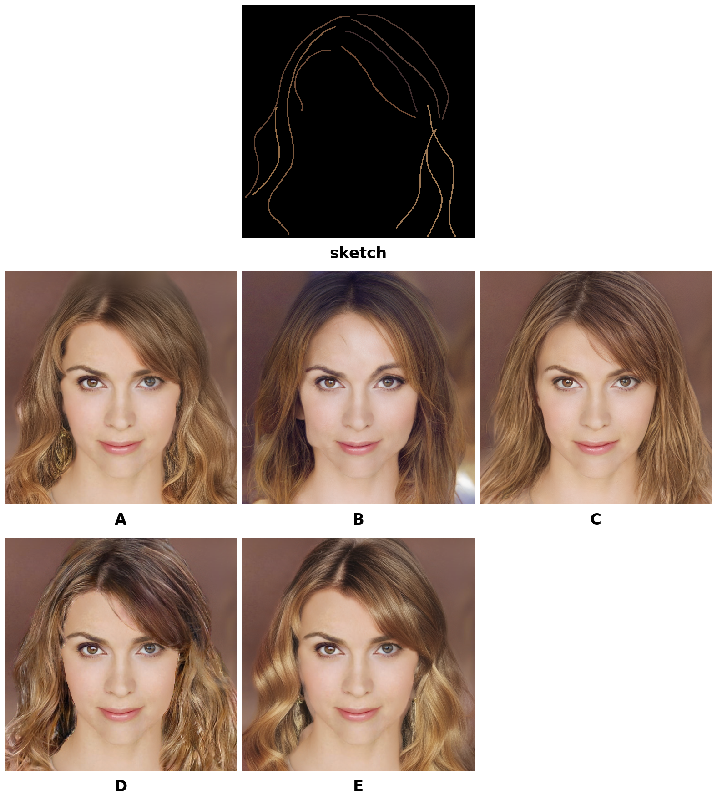

#### 19. COLOR · unbraid · CM_1007
- 정답 키: A=Ours, B=VividHair, C=SHS, D=Sketch-only, E=HairCLIPv2
- 집계 (33명):

| Method | Hair Realism | Structure Fidelity | Color Fidelity |
|---|---|---|---|
| Sketch-only | 2/33 | 6/33 | 10/33 |
| SHS | 1/33 | 3/33 | 3/33 |
| HairCLIPv2 | 6/33 | 0/33 | 0/33 |
| VividHair | 2/33 | 1/33 | 2/33 |
| Ours | **22/33** | **23/33** | **18/33** |

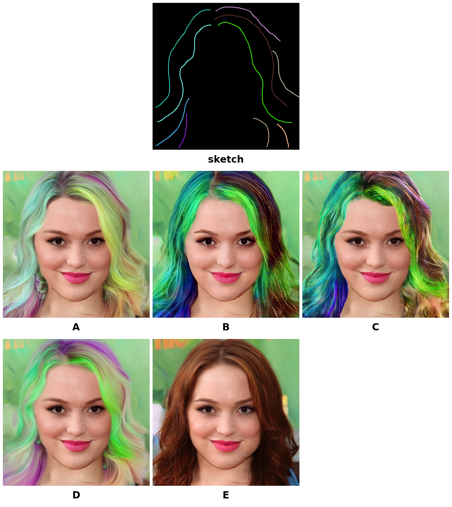

#### 20. GT · braid · wavy_749
- 정답 키: A=Ours, B=HairCLIPv2, C=Sketch-only, D=VividHair, E=SHS
- 집계 (33명):

| Method | Hair Realism | Structure Fidelity | Color Fidelity |
|---|---|---|---|
| Sketch-only | 23/33 | 24/33 | 24/33 |
| SHS | 0/33 | 0/33 | 0/33 |
| HairCLIPv2 | 3/33 | 1/33 | 1/33 |
| VividHair | 2/33 | 0/33 | 1/33 |
| Ours | **5/33** | **8/33** | **7/33** |

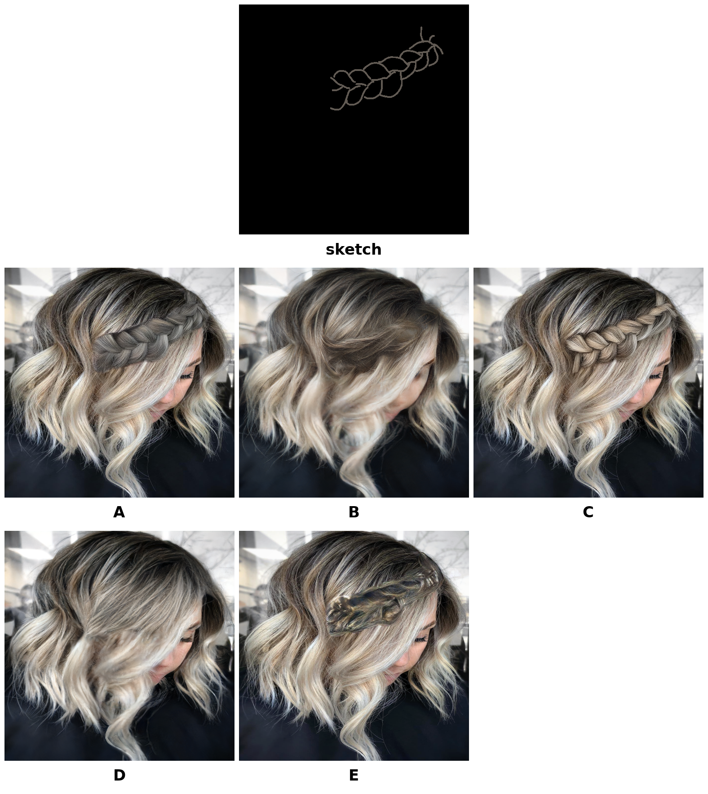

## 쌍별 연관성 검정 (Pairwise Association) · 3항목 동시 일치도 (Multi-way Consistency)

33명 × 20세트 = 660개 응답 단위(각 단위 = Hair Realism/Structure Fidelity/Color Fidelity 3개 선택의 묶음) 전체를 대상으로 계산. "3문항이 서로 독립적으로 다른 것을 측정하는지, 아니면 응답자가 그냥 하나의 전반적 선호로 3문항을 동일하게 찍는 경향(halo effect)이 있는지"를 확인하기 위함.

### 쌍별 연관성 검정 (Pairwise Association)

문항 쌍마다 (선택 모델 A) × (선택 모델 B) 5×5 교차표를 만들어 카이제곱 독립성 검정 + Cramér's V(효과크기) 계산.

| 문항 쌍 | χ² | df | p | Cramér's V |
|---|---:|---:|---:|---:|
| Hair Realism × Structure Fidelity | 394.06 | 16 | < .001 | 0.386 |
| Hair Realism × Color Fidelity | 407.03 | 16 | < .001 | 0.393 |
| Structure Fidelity × Color Fidelity | 639.73 | 16 | < .001 | 0.492 |

- 세 쌍 모두 p < .001로 통계적으로 유의한 연관성이 있음 — 3문항의 모델 선택은 서로 독립이 아님.
- Cramér's V는 0.39~0.49(중간~중간강) 수준. 특히 **Structure Fidelity × Color Fidelity**가 가장 강하게 연관(0.492)됨 — 구조를 잘 따라간 모델을 색상도 잘 따라갔다고 평가하는 경향이 가장 뚜렷. Hair Realism은 나머지 두 문항과의 연관성이 상대적으로 약간 낮음(0.386/0.393) — Realism 판단에는 구조·색상 일치 여부 외에 "그냥 자연스러워 보이는가"라는 별도 기준이 어느 정도 작용하는 것으로 보임.

**⚠️ 방법론 caveat (검증 완료)**: 카이제곱 검정은 관측치가 서로 독립일 것을 가정하는데, 여기서는 응답자 33명이 각각 20세트를 반복 응답한 구조라 660개 관측치가 완전히 독립은 아님(응답자별 성향이 반복 반영됨). 또한 5×5=25개 셀 중 12~24%가 기대빈도 5 미만(Cochran 권장 기준 위반 가능성, 다만 최솟값도 1.44로 1 미만은 아님) — 즉 위 표의 p-value(1e-74~1e-126 수준)를 문자 그대로 정확한 값으로 믿기는 어려움. 이를 확인하기 위해 **응답자별 순열검정(respondent-cluster permutation test)**을 추가로 수행함 — 각 응답자 본인의 20개 응답 내에서만 Q_i↔Q_j 짝을 무작위로 섞어(응답자 개인의 성향·세트 난이도는 그대로 유지) 귀무분포를 만들고, 관측된 χ²이 그 안에서 얼마나 극단적인지 확인(2,000회 순열):

| 문항 쌍 | 관측 χ² | 순열 귀무분포 평균(sd) | 순열 p |
|---|---:|---:|---:|
| Realism × Structure | 394.1 | 24.3 (8.1) | 0.0005 |
| Realism × Color | 407.0 | 21.1 (7.2) | 0.0005 |
| Structure × Color | 639.7 | 25.4 (9.0) | 0.0005 |

→ 응답자 반복측정 구조를 정확히 반영해도(2,000회 순열 중 관측값보다 큰 경우가 없어 p=0.0005, 즉 1/2001로 검출 가능한 최솟값) 여전히 압도적으로 유의함 — **결론(3문항 간 유의한 연관) 자체는 강건하게 성립**하지만, 표에 적힌 카이제곱 raw p-value의 정확한 크기(예: "1e-74")는 문자 그대로 신뢰하지 말고 "< .001(순열검정으로도 재확인됨)" 정도로만 읽을 것.

### 응답자 간 일치도 (Inter-rater Reliability — 표준 Fleiss' kappa 용법)

Fleiss' kappa의 원래(교과서적) 정의대로: 문항마다 **20개 세트(대상, N=20) × 33명 응답자(rater, n=33) × 5개 모델(범주, k=5)** 구조에서 "33명이 서로 얼마나 일치해서 모델을 골랐는지"를 계산.

| 문항 | Fleiss' κ | 해석(Landis & Koch) |
|---|---:|---|
| Hair Realism | 0.151 | slight agreement |
| Structure Fidelity | 0.121 | slight agreement |
| Color Fidelity | 0.102 | slight agreement |

- 세 문항 모두 **"slight agreement"(0.00~0.20)** 수준 — 33명의 개별 응답자가 서로 강하게 일치하며 모델을 고른 건 아님. 5지선다 중 여러 모델이 시각적으로 근접해 사람마다 선호가 꽤 갈렸다는 뜻.
- 단, "개별 응답자 간 일치도가 낮다"는 것과 "집계된 득표율 차이가 무의미하다"는 건 별개임 — 위 표들의 득표율 차이(예: 전체 결과 Ours 38.9% vs Sketch-only 27.3%)는 그 자체로 유효한 집계 신호이고, 이 kappa는 그와 별도로 "개인별 판단이 얼마나 일관됐는가"만 보는 지표.
- (참고) 그룹별로는 braid(GT)에서 상대적으로 kappa가 조금 더 높고(Realism 0.191 / Structure 0.173 / Color 0.076), COLOR·unbraid 조합들은 대체로 더 낮음(0.02~0.09) — braid(GT)가 그나마 응답자 간 판단이 더 일관됐던 조합.

### 3항목 동시 일치도 (Multi-way Consistency, 응답 내부 일관성)

- **완전 일치율**: 660개 응답 단위 중 3문항 모두 같은 모델을 고른 경우는 **289개(43.8%)**.
  - 그중 Sketch-only로 3문항 모두 일치: 121회, Ours로 3문항 모두 일치: 111회, SHS: 26회, VividHair: 19회, HairCLIPv2: 12회.
  - 즉 완전일치의 대부분(232/289 ≈ 80%)은 Sketch-only 아니면 Ours로 쏠림 — 베이스라인 3종은 3문항 전부 압도적이라고 느껴지는 경우가 드묾.
- **(참고, 비표준 용법) 문항 간 Fleiss' kappa**: 3문항을 3명의 "평가자"로 보고(각자 5개 모델 중 하나를 "판정"한다고 취급) 계산 시 **κ = 0.411** (P̄=0.579, Pₑ=0.285) — Landis & Koch 기준으로 "중간 수준의 일치(moderate agreement)".
  - **⚠️ 표준 용법과의 차이**: Fleiss' kappa는 원래 "같은 대상을 채점하는 여러 평가자" 간 일치도를 재는 지표라, "서로 다른 3개 문항"을 rater로 취급하는 건 교과서적 정의를 벗어난 응용(공식 자체는 문제없이 계산되지만, 원래 가정하는 "매번 바뀔 수 있는 평가자 집단"이 아니라 "항상 고정된 3개 rater" 상황). 위 **응답자 간 일치도(0.10~0.15)**가 표준 Fleiss' kappa 용법이고, 이 값(0.411)은 어디까지나 "같은 응답자가 3문항에 얼마나 일관되게 답했는가"를 보는 보조 지표로만 참고할 것.

**해석**: (1) 응답자 33명 사이의 순수 개별 일치도는 세 문항 모두 낮은 편(slight, 0.10~0.15)이지만, (2) 같은 응답자 안에서 3문항끼리는 완전 독립도 완전 동일도 아닌 중간 정도로 연관되어 있음(카이제곱·Cramér's V, 순열검정으로 재확인) — 특히 Structure/Color 두 문항은 상당 부분 같은 시각적 단서(스케치 라인 재현도)에 의존해 판단됐을 가능성이 있음.
