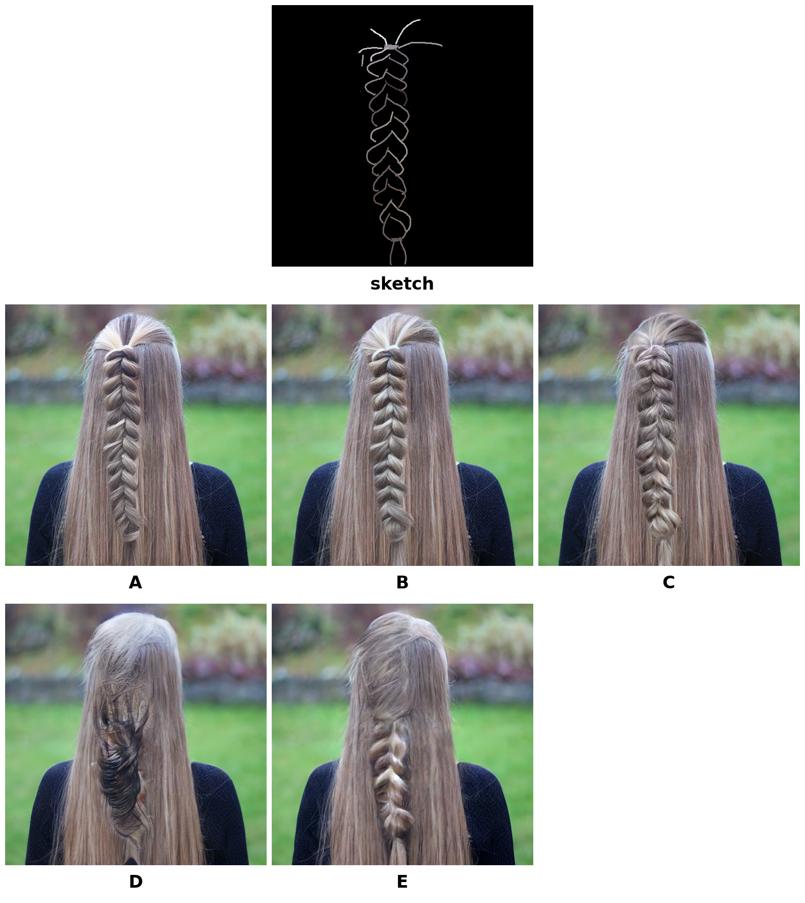
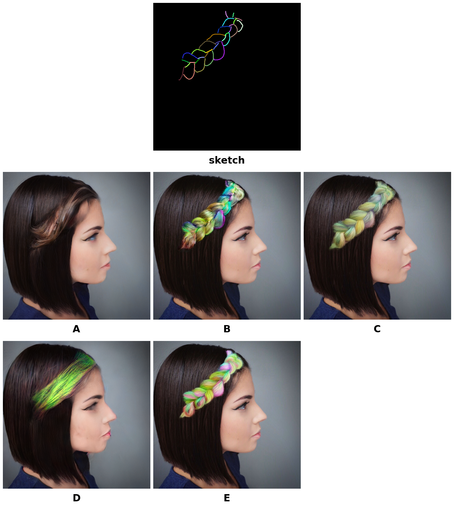
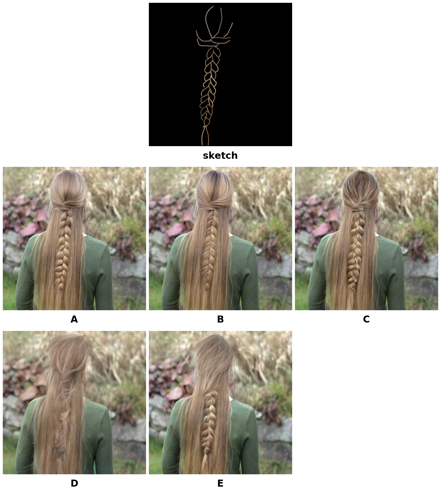

## 통계 방법

- **비교 모델(5개)**: Sketch-only(mcs3) / SHS(SketchHairSalon) / HairCLIPv2 / VividHair(VividHairStyler) / **Ours**(gated, mcs2)
- **문항(세트당 3개)**: Hair Realism / Structure Fidelity / Color Fidelity
    - 입력 스케치를 참고했을 때, 머리카락이 가장 자연스럽고 실제처럼 보이는 결과를 선택해 주세요.
    - 입력 스케치와 비교했을 때, 머리 모양과 머릿결의 방향을 가장 잘 따라간 결과를 선택해 주세요.
    - 입력 스케치와 비교했을 때, 머리카락 색을 가장 잘 따라간 결과를 선택해 주세요.
- **세트**: 총 20세트 = GT 10세트(braid 5 / unbraid 5) + COLOR 10세트(braid 5 / unbraid 5)
- **응답자**: 35명
- **공정성 확보**: 세트마다 5개 모델을 A~E로 랜덤 셔플해 제시. → 집계는 실제 모델명을 복원한 뒤 집계함.
- **% 계산**: 그룹별 각 문항의 모델별 득표수 ÷ (그룹 세트 수 × 35명). 4그룹(braid/unbraid × GT/COLOR) 모두 5세트 × 35명 = 175표가 분모.

## 전체 결과
(20세트 × 35명 = 700표/문항)

| Method      | Hair Realism ↑ | Structure Fidelity ↑ | Color Fidelity ↑ |
| ----------- | -------------: | -------------------: | ---------------: |
| Sketch-only |           24.7% |                 32.1% |             38.1% |
| SHS         |            7.0% |                 10.4% |             13.6% |
| HairCLIPv2  |           11.7% |                  5.4% |              4.6% |
| VividHair   |           12.1% |                  7.0% |              6.6% |
| Ours        |       **44.4%** |             **45.0%** |         **37.1%** |

Hair Realism, Structure Fidelity는 Ours(mcs2)가 1위  
Color Fidelity는 Sketch-only(mcs3)가 1위

## 개별 결과

### braid(GT)
(5세트 × 35명 = 175표/문항)

| Method      | Hair Realism ↑ | Structure Fidelity ↑ | Color Fidelity ↑ |
| ----------- | -------------: | -------------------: | ---------------: |
| Sketch-only |           34.3% |                 41.1% |             41.1% |
| SHS         |            8.6% |                 12.6% |              9.7% |
| HairCLIPv2  |            2.9% |                  1.7% |              2.9% |
| VividHair   |            8.6% |                  2.9% |              4.0% |
| Ours        |       **45.7%** |             **41.7%** |         **42.3%** |

### braid(COLOR)
(5세트 × 35명 = 175표/문항)

| Method      | Hair Realism ↑ | Structure Fidelity ↑ | Color Fidelity ↑ |
| ----------- | -------------: | -------------------: | ---------------: |
| Sketch-only |           20.6% |                 25.1% |             36.6% |
| SHS         |            5.1% |                 10.3% |             14.3% |
| HairCLIPv2  |            9.1% |                  2.3% |              1.7% |
| VividHair   |            4.6% |                  2.3% |              0.6% |
| Ours        |       **60.6%** |             **60.0%** |         **46.9%** |

### unbraid(GT)
(5세트 × 35명 = 175표/문항)

| Method      | Hair Realism ↑ | Structure Fidelity ↑ | Color Fidelity ↑ |
| ----------- | -------------: | -------------------: | ---------------: |
| Sketch-only |           29.1% |                 33.7% |             36.6% |
| SHS         |            7.4% |                 10.9% |             13.7% |
| HairCLIPv2  |           18.3% |                 13.1% |             12.0% |
| VividHair   |           26.9% |                 15.4% |             15.4% |
| Ours        |       **18.3%** |             **26.9%** |         **22.3%** |

### unbraid(COLOR)
(5세트 × 35명 = 175표/문항)

| Method      | Hair Realism ↑ | Structure Fidelity ↑ | Color Fidelity ↑ |
| ----------- | -------------: | -------------------: | ---------------: |
| Sketch-only |           14.9% |                 28.6% |             38.3% |
| SHS         |            6.9% |                  8.0% |             16.6% |
| HairCLIPv2  |           16.6% |                  4.6% |              1.7% |
| VividHair   |            8.6% |                  7.4% |              6.3% |
| Ours        |       **53.1%** |             **51.4%** |         **37.1%** |

## 요약
- **전체**적으로는 Ours가 Hair Realism·Structure Fidelity 1위(각 44.4%/45.0%), Color Fidelity는 Sketch-only가 1위(38.1%, Ours 37.1%로 2위) — 하지만 격차 1%p 차이
- **braid(GT)도 Ours가 3문항 모두 1위**(45.7%/41.7%/42.3% vs Sketch-only 34.3%/41.1%/41.1%) 
- **braid(COLOR)**에서는 Ours가 3문항 모두 압도적 1위(60.6%/60.0%/46.9%) — 색상 스케치가 입력으로 주어질 때 Ours의 이득이 가장 크게 나타남.
- **unbraid(GT)는 4개 조합 중 Ours가 유일하게 순위가 내려감** — Hair Realism은 Sketch-only(29.1%) > VividHair(26.9%) > **Ours·HairCLIPv2 동률(18.3%)** > SHS(7.4%), Structure Fidelity는 Sketch-only(33.7%) > **Ours(26.9%)**로 2위, Color Fidelity도 Sketch-only(36.6%) 다음으로 **Ours(22.3%)**가 2위.
- **unbraid(COLOR)**는 Ours가 Hair Realism·Structure Fidelity 1위(53.1%/51.4%), Color Fidelity만 Sketch-only가 근소하게 1위(38.3% vs 37.1%).

### 사용한 이미지 그리드 모음
각 세트는 위쪽 sketch(입력) + 아래 A-E 5분할 결과 그리드로 구성. A-E와 실제 모델 매핑은 세트마다 랜덤이며, 아래 "정답 키"에 표시.

#### 1. GT · braid · wavy_749
- 정답 키: A=Ours, B=Sketch-only, C=VividHair, D=HairCLIPv2, E=SHS
- 집계 (35명):

| Method | Hair Realism | Structure Fidelity | Color Fidelity |
|---|---|---|---|
| Sketch-only | 9/35 | 12/35 | 6/35 |
| SHS | 0/35 | 2/35 | 1/35 |
| HairCLIPv2 | 2/35 | 0/35 | 3/35 |
| VividHair | 3/35 | 5/35 | 5/35 |
| Ours | **21/35** | **16/35** | **20/35** |

#### 2. COLOR · unbraid · CM_1028
- 정답 키: A=Sketch-only, B=Ours, C=VividHair, D=SHS, E=HairCLIPv2
- 집계 (35명):

| Method | Hair Realism | Structure Fidelity | Color Fidelity |
|---|---|---|---|
| Sketch-only | 3/35 | 7/35 | 11/35 |
| SHS | 1/35 | 4/35 | 6/35 |
| HairCLIPv2 | 6/35 | 4/35 | 1/35 |
| VividHair | 6/35 | 3/35 | 4/35 |
| Ours | **19/35** | **17/35** | **13/35** |

#### 3. GT · braid · braid_2548
- 정답 키: A=HairCLIPv2, B=SHS, C=Ours, D=VividHair, E=Sketch-only
- 집계 (35명):

| Method | Hair Realism | Structure Fidelity | Color Fidelity |
|---|---|---|---|
| Sketch-only | 1/35 | 4/35 | 10/35 |
| SHS | 11/35 | 12/35 | 10/35 |
| HairCLIPv2 | 0/35 | 0/35 | 0/35 |
| VividHair | 4/35 | 0/35 | 0/35 |
| Ours | **19/35** | **19/35** | **15/35** |

#### 4. COLOR · unbraid · CM_1055
- 정답 키: A=Sketch-only, B=SHS, C=HairCLIPv2, D=VividHair, E=Ours
- 집계 (35명):

| Method | Hair Realism | Structure Fidelity | Color Fidelity |
|---|---|---|---|
| Sketch-only | 5/35 | 14/35 | 10/35 |
| SHS | 7/35 | 4/35 | 15/35 |
| HairCLIPv2 | 10/35 | 4/35 | 2/35 |
| VividHair | 1/35 | 0/35 | 0/35 |
| Ours | **12/35** | **13/35** | **8/35** |

#### 5. COLOR · braid · braid_2562_1_2
- 정답 키: A=Sketch-only, B=HairCLIPv2, C=VividHair, D=SHS, E=Ours
- 집계 (35명):

| Method | Hair Realism | Structure Fidelity | Color Fidelity |
|---|---|---|---|
| Sketch-only | 4/35 | 5/35 | 10/35 |
| SHS | 3/35 | 6/35 | 7/35 |
| HairCLIPv2 | 8/35 | 1/35 | 2/35 |
| VividHair | 4/35 | 2/35 | 0/35 |
| Ours | **16/35** | **21/35** | **16/35** |

#### 6. GT · braid · braid_3276
- 정답 키: A=Sketch-only, B=HairCLIPv2, C=VividHair, D=SHS, E=Ours
- 집계 (35명):

| Method | Hair Realism | Structure Fidelity | Color Fidelity |
|---|---|---|---|
| Sketch-only | 16/35 | 19/35 | 21/35 |
| SHS | 4/35 | 8/35 | 6/35 |
| HairCLIPv2 | 0/35 | 0/35 | 1/35 |
| VividHair | 3/35 | 0/35 | 1/35 |
| Ours | **12/35** | **8/35** | **6/35** |

#### 7. COLOR · unbraid · CM_1133
- 정답 키: A=SHS, B=VividHair, C=Sketch-only, D=Ours, E=HairCLIPv2
- 집계 (35명):

| Method | Hair Realism | Structure Fidelity | Color Fidelity |
|---|---|---|---|
| Sketch-only | 9/35 | 13/35 | 18/35 |
| SHS | 2/35 | 2/35 | 3/35 |
| HairCLIPv2 | 3/35 | 0/35 | 0/35 |
| VividHair | 4/35 | 3/35 | 3/35 |
| Ours | **17/35** | **17/35** | **11/35** |

#### 8. GT · unbraid · CM_1067_12
- 정답 키: A=Ours, B=HairCLIPv2, C=SHS, D=VividHair, E=Sketch-only
- 집계 (35명):

| Method | Hair Realism | Structure Fidelity | Color Fidelity |
|---|---|---|---|
| Sketch-only | 13/35 | 12/35 | 12/35 |
| SHS | 2/35 | 4/35 | 7/35 |
| HairCLIPv2 | 7/35 | 4/35 | 3/35 |
| VividHair | 3/35 | 0/35 | 3/35 |
| Ours | **10/35** | **15/35** | **10/35** |

#### 9. COLOR · braid · braid_4276
- 정답 키: A=VividHair, B=HairCLIPv2, C=Ours, D=SHS, E=Sketch-only
- 집계 (35명):

| Method | Hair Realism | Structure Fidelity | Color Fidelity |
|---|---|---|---|
| Sketch-only | 1/35 | 3/35 | 11/35 |
| SHS | 4/35 | 5/35 | 5/35 |
| HairCLIPv2 | 1/35 | 0/35 | 0/35 |
| VividHair | 3/35 | 0/35 | 0/35 |
| Ours | **26/35** | **27/35** | **19/35** |

#### 10. COLOR · braid · braid_4212
- 정답 키: A=VividHair, B=HairCLIPv2, C=Sketch-only, D=SHS, E=Ours
- 집계 (35명):

| Method | Hair Realism | Structure Fidelity | Color Fidelity |
|---|---|---|---|
| Sketch-only | 9/35 | 10/35 | 21/35 |
| SHS | 0/35 | 2/35 | 6/35 |
| HairCLIPv2 | 1/35 | 1/35 | 0/35 |
| VividHair | 0/35 | 0/35 | 0/35 |
| Ours | **25/35** | **22/35** | **8/35** |

#### 11. COLOR · unbraid · CM_1215
- 정답 키: A=SHS, B=HairCLIPv2, C=VividHair, D=Sketch-only, E=Ours
- 집계 (35명):

| Method | Hair Realism | Structure Fidelity | Color Fidelity |
|---|---|---|---|
| Sketch-only | 7/35 | 10/35 | 18/35 |
| SHS | 1/35 | 1/35 | 1/35 |
| HairCLIPv2 | 4/35 | 0/35 | 0/35 |
| VividHair | 2/35 | 6/35 | 2/35 |
| Ours | **21/35** | **18/35** | **14/35** |

#### 12. GT · unbraid · CM_1027
- 정답 키: A=HairCLIPv2, B=VividHair, C=Ours, D=Sketch-only, E=SHS
- 집계 (35명):

| Method | Hair Realism | Structure Fidelity | Color Fidelity |
|---|---|---|---|
| Sketch-only | 13/35 | 16/35 | 17/35 |
| SHS | 0/35 | 0/35 | 1/35 |
| HairCLIPv2 | 7/35 | 2/35 | 2/35 |
| VividHair | 7/35 | 10/35 | 9/35 |
| Ours | **8/35** | **7/35** | **6/35** |

#### 13. GT · unbraid · CM_1151
- 정답 키: A=Ours, B=HairCLIPv2, C=SHS, D=VividHair, E=Sketch-only
- 집계 (35명):

| Method | Hair Realism | Structure Fidelity | Color Fidelity |
|---|---|---|---|
| Sketch-only | 3/35 | 2/35 | 3/35 |
| SHS | 6/35 | 8/35 | 12/35 |
| HairCLIPv2 | 9/35 | 9/35 | 9/35 |
| VividHair | 15/35 | 9/35 | 6/35 |
| Ours | **2/35** | **7/35** | **5/35** |

#### 14. COLOR · braid · braid_2548
- 정답 키: A=VividHair, B=Ours, C=Sketch-only, D=HairCLIPv2, E=SHS
- 집계 (35명):

| Method | Hair Realism | Structure Fidelity | Color Fidelity |
|---|---|---|---|
| Sketch-only | 12/35 | 10/35 | 5/35 |
| SHS | 0/35 | 1/35 | 2/35 |
| HairCLIPv2 | 6/35 | 2/35 | 1/35 |
| VividHair | 1/35 | 1/35 | 0/35 |
| Ours | **16/35** | **21/35** | **27/35** |

#### 15. GT · unbraid · wavy_753
- 정답 키: A=Sketch-only, B=HairCLIPv2, C=Ours, D=SHS, E=VividHair
- 집계 (35명):

| Method | Hair Realism | Structure Fidelity | Color Fidelity |
|---|---|---|---|
| Sketch-only | 29/35 | 29/35 | 28/35 |
| SHS | 0/35 | 0/35 | 0/35 |
| HairCLIPv2 | 0/35 | 2/35 | 0/35 |
| VividHair | 3/35 | 0/35 | 0/35 |
| Ours | **3/35** | **4/35** | **7/35** |

#### 16. GT · unbraid · CM1033
- 정답 키: A=VividHair, B=HairCLIPv2, C=SHS, D=Ours, E=Sketch-only
- 집계 (35명):

| Method | Hair Realism | Structure Fidelity | Color Fidelity |
|---|---|---|---|
| Sketch-only | 11/35 | 20/35 | 21/35 |
| SHS | 4/35 | 2/35 | 3/35 |
| HairCLIPv2 | 4/35 | 4/35 | 3/35 |
| VividHair | 11/35 | 4/35 | 3/35 |
| Ours | **5/35** | **5/35** | **5/35** |

#### 17. COLOR · braid · braid_4156
- 정답 키: A=Ours, B=Sketch-only, C=VividHair, D=SHS, E=HairCLIPv2
- 집계 (35명):

| Method | Hair Realism | Structure Fidelity | Color Fidelity |
|---|---|---|---|
| Sketch-only | 10/35 | 16/35 | 17/35 |
| SHS | 2/35 | 4/35 | 5/35 |
| HairCLIPv2 | 0/35 | 0/35 | 0/35 |
| VividHair | 0/35 | 1/35 | 1/35 |
| Ours | **23/35** | **14/35** | **12/35** |

#### 18. GT · unbraid · CM_1009
- 정답 키: A=Ours, B=HairCLIPv2, C=VividHair, D=SHS, E=Sketch-only
- 집계 (35명):

| Method | Hair Realism | Structure Fidelity | Color Fidelity |
|---|---|---|---|
| Sketch-only | 11/35 | 9/35 | 11/35 |
| SHS | 1/35 | 5/35 | 1/35 |
| HairCLIPv2 | 5/35 | 4/35 | 4/35 |
| VividHair | 11/35 | 4/35 | 6/35 |
| Ours | **7/35** | **13/35** | **13/35** |

#### 19. COLOR · unbraid · CM_1007
- 정답 키: A=Ours, B=VividHair, C=SHS, D=Sketch-only, E=HairCLIPv2
- 집계 (35명):

| Method | Hair Realism | Structure Fidelity | Color Fidelity |
|---|---|---|---|
| Sketch-only | 2/35 | 6/35 | 10/35 |
| SHS | 1/35 | 3/35 | 4/35 |
| HairCLIPv2 | 6/35 | 0/35 | 0/35 |
| VividHair | 2/35 | 1/35 | 2/35 |
| Ours | **24/35** | **25/35** | **19/35** |

#### 20. GT · braid · braid_4276
- 정답 키: A=Ours, B=HairCLIPv2, C=Sketch-only, D=VividHair, E=SHS
- 집계 (35명):

| Method | Hair Realism | Structure Fidelity | Color Fidelity |
|---|---|---|---|
| Sketch-only | 5/35 | 8/35 | 7/35 |
| SHS | 0/35 | 0/35 | 0/35 |
| HairCLIPv2 | 3/35 | 1/35 | 1/35 |
| VividHair | 2/35 | 0/35 | 1/35 |
| Ours | **25/35** | **26/35** | **26/35** |

## 쌍별 연관성 검정 (Pairwise Association) · 3항목 동시 일치도 (Multi-way Consistency)

35명 × 20세트 = 700개 응답 단위(각 단위 = Hair Realism/Structure Fidelity/Color Fidelity 3개 선택의 묶음) 전체를 대상으로 계산. "3문항이 서로 독립적으로 다른 것을 측정하는지, 아니면 응답자가 그냥 하나의 전반적 선호로 3문항을 동일하게 찍는 경향(halo effect)이 있는지"를 확인하기 위함.

### 쌍별 연관성 검정 (Pairwise Association)

문항 쌍마다 (선택 모델 A) × (선택 모델 B) 5×5 교차표를 만들어 카이제곱 독립성 검정 + Cramér's V(효과크기) 계산.

| 문항 쌍 | χ² | df | p | Cramér's V |
|---|---:|---:|---:|---:|
| Hair Realism × Structure Fidelity | 414.37 | 16 | < .001 | 0.385 |
| Hair Realism × Color Fidelity | 411.46 | 16 | < .001 | 0.383 |
| Structure Fidelity × Color Fidelity | 713.42 | 16 | < .001 | 0.505 |

- 세 쌍 모두 p < .001로 통계적으로 유의한 연관성이 있음 — 3문항의 모델 선택은 서로 독립이 아님.
- Cramér's V는 0.38~0.51(중간~중간강) 수준. 특히 **Structure Fidelity × Color Fidelity**가 가장 강하게 연관(0.505)됨 — 구조를 잘 따라간 모델을 색상도 잘 따라갔다고 평가하는 경향이 가장 뚜렷. Hair Realism은 나머지 두 문항과의 연관성이 상대적으로 약간 낮음(0.385/0.383) — Realism 판단에는 구조·색상 일치 여부 외에 "그냥 자연스러워 보이는가"라는 별도 기준이 어느 정도 작용하는 것으로 보임.

### 3항목 동시 일치도 (Multi-way Consistency)

- **완전 일치율**: 700개 응답 단위 중 3문항 모두 같은 모델을 고른 경우는 **318개(45.4%)**.
  - 그중 Ours로 3문항 모두 일치: 151회, Sketch-only로 3문항 모두 일치: 110회, SHS: 27회, HairCLIPv2: 16회, VividHair: 14회.
  - 즉 완전일치의 대부분(261/318 ≈ 82%)은 Sketch-only 아니면 Ours로 쏠림 — 베이스라인 3종은 3문항 전부 압도적이라고 느껴지는 경우가 드묾.

**해석**: 3문항이 완전히 독립적이지도, 완전히 동일하지도 않은 관계. 응답자들이 순수하게 전반적 선호 하나로 3문항을 기계적으로 찍은 것은 아니지만(그랬다면 일치율 훨씬 높았을 것), 구조 판단과 색상 판단은 서로 꽤 강하게 얽혀 있어 완전히 독립적인 3개 지표로 보기는 어려움
