## 입력 이미지 색 필터에 따른 mcs1 / mcs2의 결과 변화

**공통 인퍼런스 조건**
- `--bld_mode full` — 매 denoising 스텝마다 matte 바깥을 배경의 noised latent로 블렌딩(latent 단계 배경 합성)
- `--crg_scale 1.5`
- `--pixel_blend` **미사용**(off) — decode 후 pixel-space 최종 matte blending은 적용 안 함, `vae.decode()` 결과를 그대로 저장

**입력 이미지 필터**
- 입력 이미지 전체에 단색 오버레이를 alpha blending
- blue: RGB(0, 0, 255) / red: RGB(255, 0, 0)
- 강도(alpha): 0.3, 0.4

### mcs1

강도 0.3

| 입력 | Seed 42 | Seed 1 | Seed 2 | Seed 3 |
|---|---|---|---|---|
| 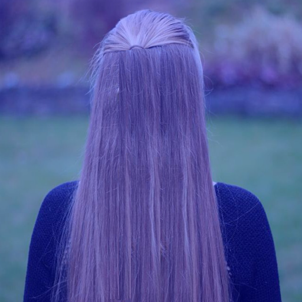 |  | 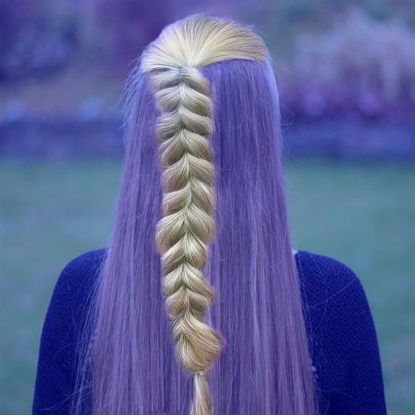 | 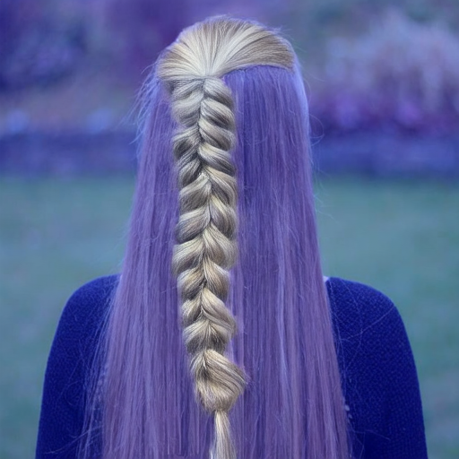 | 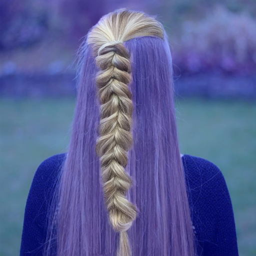 |
| 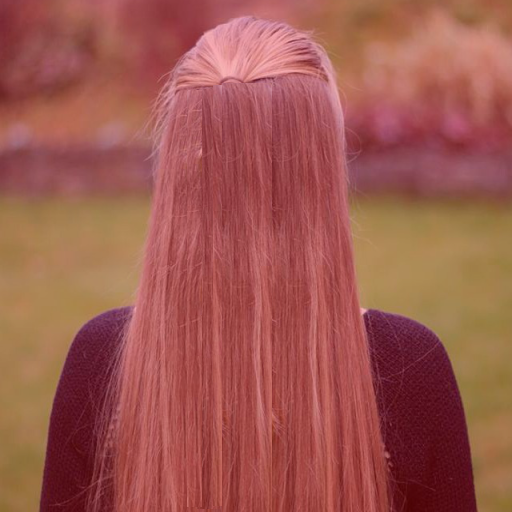 |  | 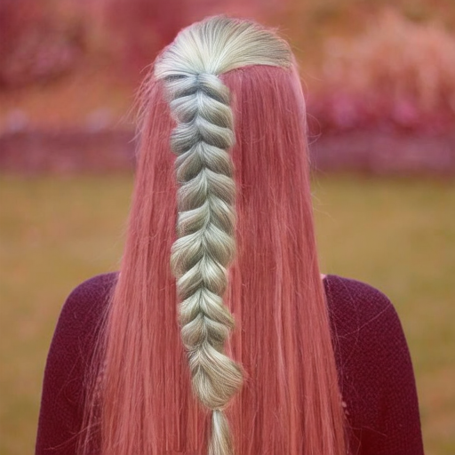 | 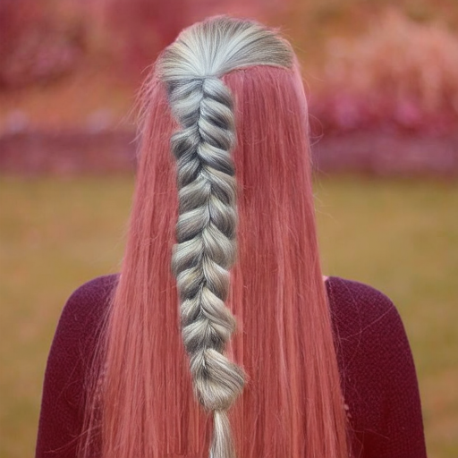 |  |

강도 0.4

| 입력 | Seed 42 | Seed 1 | Seed 2 | Seed 3 |
|---|---|---|---|---|
| 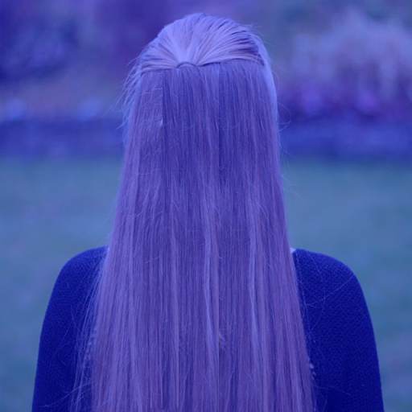 |  | 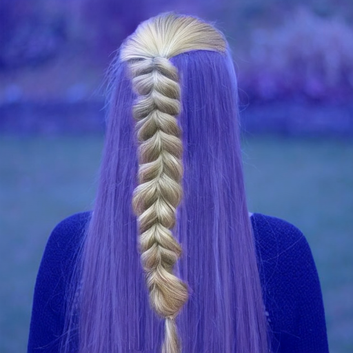 | 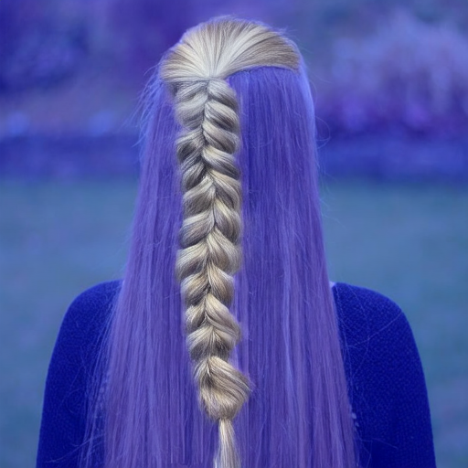 | 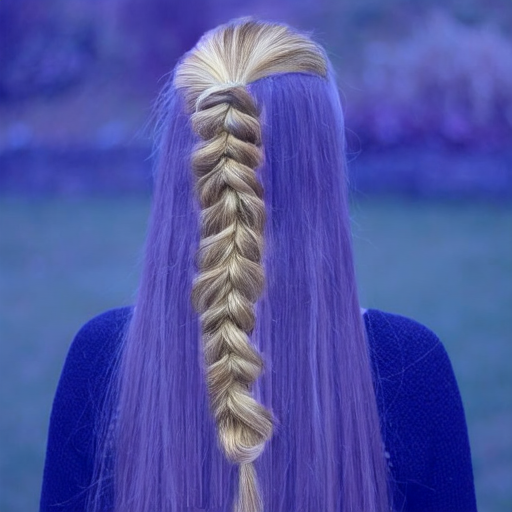 |
| 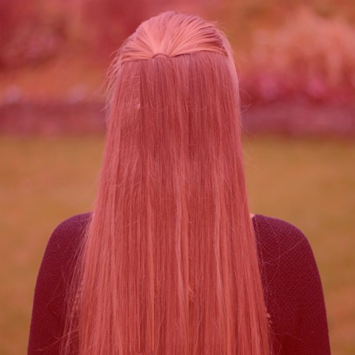 |  | 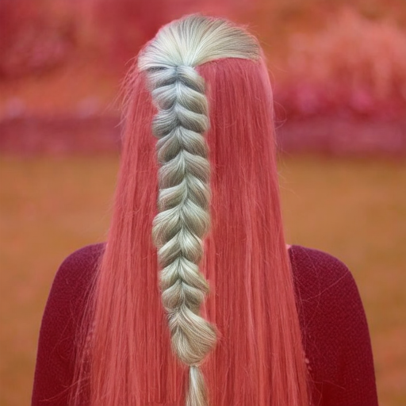 | 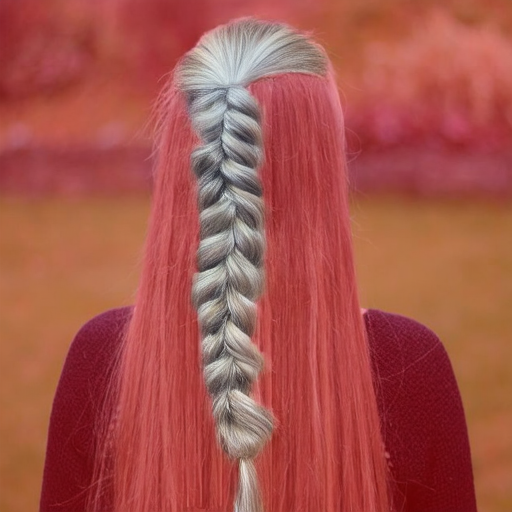 | 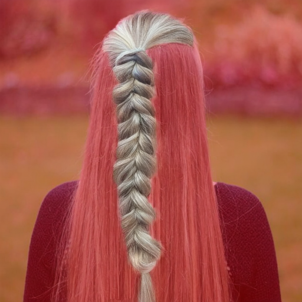 |

### mcs2

강도 0.3

| 입력 | Seed 42 | Seed 1 | Seed 2 | Seed 3 |
|---|---|---|---|---|
|  |  | 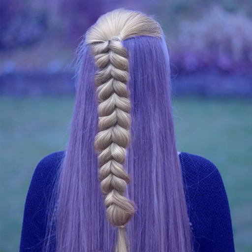 | 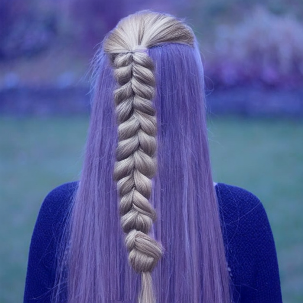 | 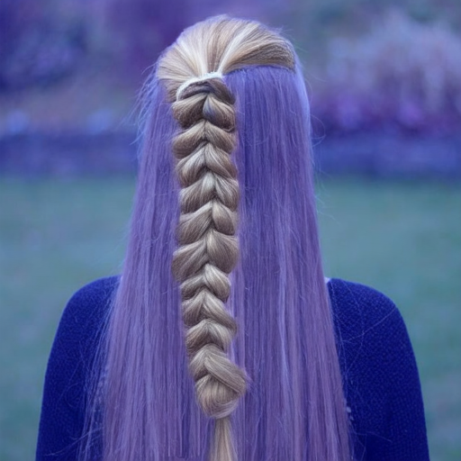 |
|  |  |  | 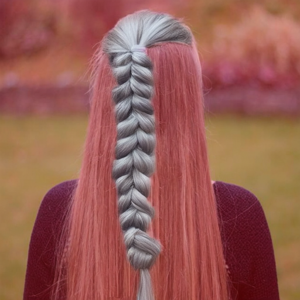 | 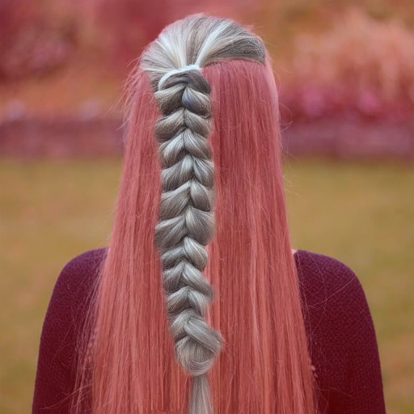 |

강도 0.4

| 입력 | Seed 42 | Seed 1 | Seed 2 | Seed 3 |
|---|---|---|---|---|
|  | 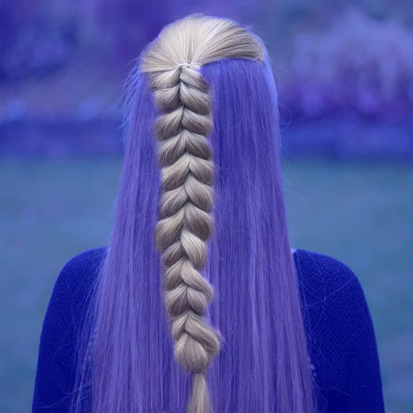 | 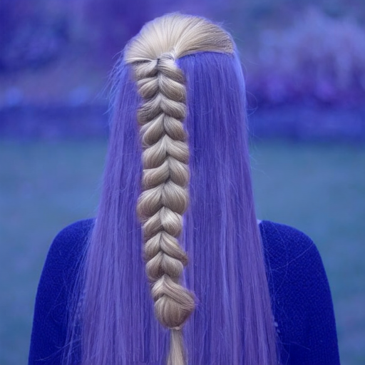 | 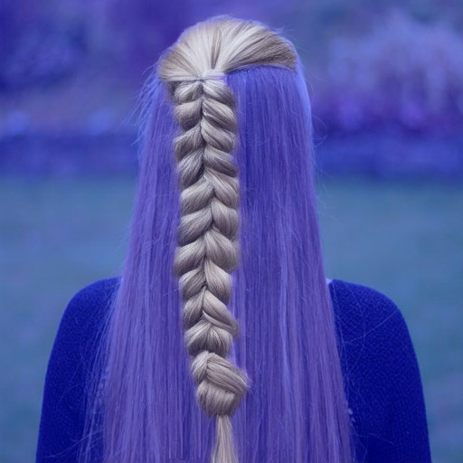 | 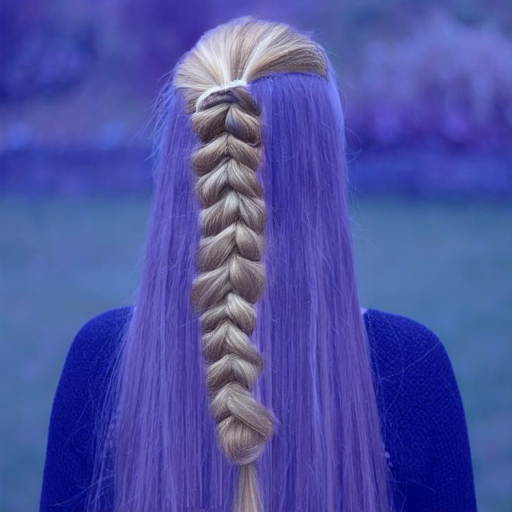 |
|  |  | 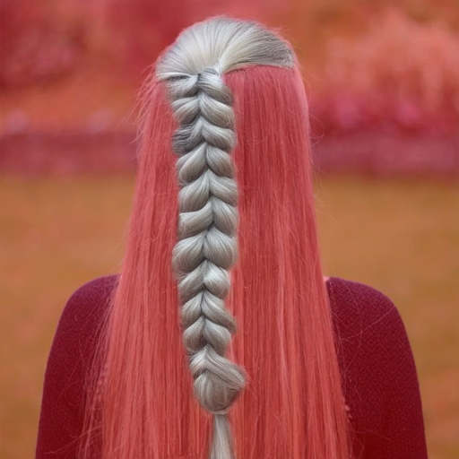 | 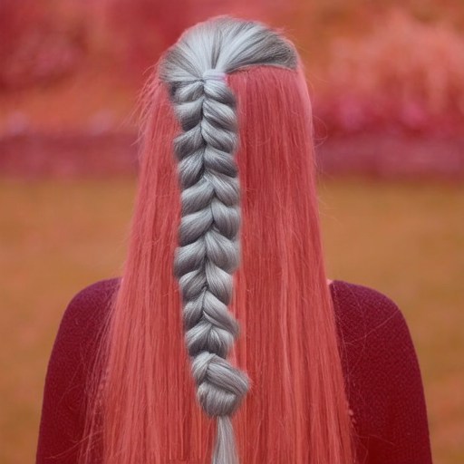 | 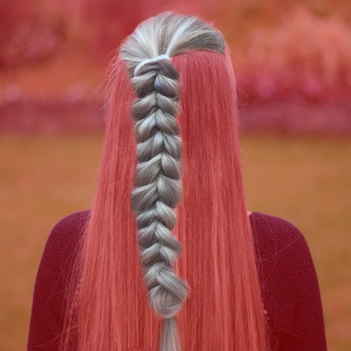 |
