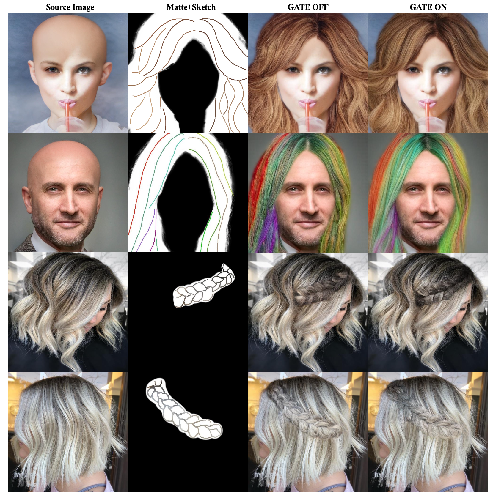

# mcs1 vs mcs2 정량평가 비교 (Gate OFF vs Gate ON)

기존 정량평가 리포트([DIGLAB][0825][장서현]quant_eval_summary.md 의 Cross-identity mcs1-6 표,
[DIGLAB][0815][장서현]run7_mcs_result.md 의 same-identity mcs1-6 표·해석) 중 **mcs1·mcs2 두 설정만** 뽑아 정리.

## 두 설정 정의

| 약칭 | Matte-CNN | Raw Matte | Gate | 비고 |
|---|:---:|:---:|:---:|---|
| **mcs1** | ✓ | ✓ | ✗ (Gate OFF) | 논문이 정의하는 Ours와 동일 설정 |
| **mcs2** | ✓ | ✓ | ✓ (Gate ON) | 현재 코드베이스 기준 Ours (run7 정식 결과, [0825] 5-모델 표에 채택된 값) |

두 설정 모두 run7 학습으로, gate on/off만 다르고 나머지 조건은 동일하다(phase1 resume 여부 제외).

---

## 1. Cross-identity (3-seed: seed 1, 2, 42)

방법론: 논문과 완전히 동일([0620][서현택]color_sketch_3seed.md), CRG 1.5 + BLD full(step 20) +
Pixel Blend/Feathering OFF(0), 헤어 마스크(matte) 내부에서만 평가.

### Braid (n=107)
| 모델 | Sketch LPIPS ↓ | Sketch ΔE2000 ↓ | Edge IoU ↑ | PSNR (hair) ↑ |
|---|:---:|:---:|:---:|:---:|
| **mcs1** (Gate OFF) | 0.4746±0.0037 | 11.55±0.04 | **0.0930±0.0002** | **10.55±0.11** |
| **mcs2** (Gate ON) | **0.4430±0.0066** | **11.02±0.43** | 0.0894±0.0002 | 10.01±0.11 |

### Unbraid (n=466)
| 모델 | Sketch LPIPS ↓ | Sketch ΔE2000 ↓ | Edge IoU ↑ | PSNR (hair) ↑ |
|---|:---:|:---:|:---:|:---:|
| **mcs1** (Gate OFF) | 0.6790±0.0059 | **11.71±0.32** | **0.0492±0.0005** | **10.03±0.13** |
| **mcs2** (Gate ON) | **0.6639±0.0038** | 11.86±0.22 | 0.0480±0.0004 | 9.96±0.19 |

### Macro-avg = (braid + unbraid) / 2
| 모델 | Sketch LPIPS ↓ | Sketch ΔE2000 ↓ | Edge IoU ↑ | PSNR (hair) ↑ |
|---|:---:|:---:|:---:|:---:|
| **mcs1** (Gate OFF) | 0.5768±0.0017 | 11.63±0.17 | **0.0711±0.0002** | **10.29±0.12** |
| **mcs2** (Gate ON) | **0.5535±0.0014** | **11.44±0.27** | 0.0687±0.0002 | 9.98±0.15 |

### Hair FID / KID_hair (통합 573장, unpaired)
| 모델 | Hair FID ↓ | KID_hair ↓ |
|---|:---:|:---:|
| **mcs1** (Gate OFF) | **129.68±0.78** | **0.0920±0.0012** |
| **mcs2** (Gate ON) | 138.23±1.12 | 0.1001±0.0012 |

→ Hair FID 기준 **mcs1(Gate OFF)이 더 좋음**. 논문이 "Ours"로 정의한 gate-off 설정(140.11±3.10, 3-seed)과
서열 방향이 일치한다.

---

## 2. Same-identity (single-seed, epoch20)

출처: [0815] run7_mcs_result.md, `CRG 1.5 + BLD full(step 20) + Pixel Matte-Blend + Feathering OFF(0), epoch20`.
**4-seed 평균이 아닌 단일 시드(epoch20) 값**이다 — [0825] 정식 5-모델 표에서는 mcs2만 4-seed로 재평가되어
(Sketch LPIPS 0.4684±0.0011 등) 아래 값과 근소하게 다르지만 seed 분산 범위 안이다. mcs1은 same-identity
4-seed 재평가가 없으므로 이 단일시드 값이 유일한 비교 자료다.

### braid (n=107)

#### 구조·색상·화질·리얼리즘
| 모델 | Sketch LPIPS ↓ | Sketch ΔE2000 ↓ | Edge IoU ↑ | LPIPS(GT) ↓ | ΔE2000(GT) ↓ | PSNR ↑ | Hair FID ↓ | KID_hair ↓ |
|---|---:|---:|---:|---:|---:|---:|---:|---:|
| **mcs1** (Gate OFF) | 0.4843 | 13.8734 | **0.0961** | 0.1319 | 3.1991 | 16.3227 | 78.2520 | 0.0019±0.0005 |
| **mcs2** (Gate ON) | **0.4668** | **12.8527** | 0.0952 | **0.1141** | **2.0913** | **16.6502** | **69.7901** | **0.0002±0.0004** |

#### 경계밴드 B
| 모델 | Boundary LPIPS ↓(legacy) | Bnd LPIPS k=8 ↓ | Bnd LPIPS k=16 ↓ | Boundary FID ↓ | Region IoU ↑ | Boundary IoU ↑ |
|---|---:|---:|---:|---:|---:|---:|
| **mcs1** (Gate OFF) | 0.0063 | 0.0084 | 0.0273 | 4.2583 | **0.1629** | **0.1159** |
| **mcs2** (Gate ON) | **0.0057** | **0.0076** | **0.0245** | **3.8197** | 0.1433 | 0.1011 |

#### 배경 보존 · identity · 방향 안정성
| 모델 | PSNR_bg ↑ | LPIPS_bg ↓ | ArcFace cos ↑ | Full-portrait FID ↓ | GT 방향오차 ↓ | Seed 불일치 ↓ |
|---|---:|---:|---:|---:|---:|---:|
| **mcs1** (Gate OFF) | 47.4563 | 0.0004 | **0.9572** | 45.1613 | **19.53±4.55** | **12.92±3.07** |
| **mcs2** (Gate ON) | **47.8856** | **0.0003** | 0.9194 | **40.6367** | 21.19±4.71 | 14.96±3.15 |

### unbraid (n=466)

#### 구조·색상·화질·리얼리즘
| 모델 | Sketch LPIPS ↓ | Sketch ΔE2000 ↓ | Edge IoU ↑ | LPIPS(GT) ↓ | ΔE2000(GT) ↓ | PSNR ↑ | Hair FID ↓ | KID_hair ↓ |
|---|---:|---:|---:|---:|---:|---:|---:|---:|
| **mcs1** (Gate OFF) | 0.7000 | 13.1133 | **0.0485** | 0.1852 | 2.4115 | 16.7622 | 38.5344 | 0.0083±0.0028 |
| **mcs2** (Gate ON) | **0.6755** | **12.3779** | 0.0468 | **0.1726** | **1.5365** | **17.2934** | **34.2327** | **0.0051±0.0023** |

#### 경계밴드 B
| 모델 | Boundary LPIPS ↓(legacy) | Bnd LPIPS k=8 ↓ | Bnd LPIPS k=16 ↓ | Boundary FID ↓ | Region IoU ↑ | Boundary IoU ↑ |
|---|---:|---:|---:|---:|---:|---:|
| **mcs1** (Gate OFF) | 0.0074 | 0.0033 | 0.0212 | 2.8750 | **0.1402** | **0.0978** |
| **mcs2** (Gate ON) | **0.0066** | **0.0029** | **0.0190** | **2.5609** | 0.1199 | 0.0815 |

#### 배경 보존 · identity · 방향 안정성
| 모델 | PSNR_bg ↑ | LPIPS_bg ↓ | ArcFace cos ↑ | Full-portrait FID ↓ | GT 방향오차 ↓ | Seed 불일치 ↓ |
|---|---:|---:|---:|---:|---:|---:|
| **mcs1** (Gate OFF) | 41.8648 | 0.0015 | 0.9698 | 16.1854 | **12.90±3.91** | **7.88±2.56** |
| **mcs2** (Gate ON) | **42.3961** | 0.0015 | **0.9718** | **13.5973** | 13.28±3.89 | 8.66±2.51 |

---

## 3. 해석 — 지표별로 갈리는 트레이드오프

("[0815] run7_mcs_result.md §1. gate on/off" 원문 정리)

- **Hair FID (cross-identity)**: mcs1 **129.68** < mcs2 138.23 → **gate OFF 우세**. 논문이 "Ours"로 정의한
  gate-off 설정과 서열 방향 일치.
- **KID_hair · Full-portrait FID (same-identity)**: **gate ON(mcs2) 우세** — KID braid 0.0019→**0.0002**,
  unbraid 0.0083→**0.0051**; Full-portrait FID braid 45.16→**40.64**, unbraid 16.19→**13.60**.
  Hair FID(cross)와 결론이 반대 방향이다.
- **Region IoU · Boundary IoU**: braid·unbraid 모두 **gate OFF(mcs1) 우세** — braid 0.1629/0.1159,
  unbraid 0.1402/0.0978 (mcs2는 각각 더 낮음).
- **ArcFace cos (identity)**: braid는 gate OFF가 최고(0.9572, 단 braid는 얼굴 검출 유효 표본이 적어 참고용),
  unbraid는 오히려 gate OFF가 더 낮음(0.9698 vs mcs2 0.9718) — 그룹별로 갈림.
- **GT 방향오차 · Seed 불일치**: braid·unbraid 모두 **gate OFF(mcs1) 우세**(19.53/12.90 vs 21.19/14.96,
  12.90/7.88 vs 13.28/8.66).

→ "차이 없음"이 아니라 **지표(프로토콜)별로 갈리는 트레이드오프**다: Hair FID·구조 정합(Region/Boundary IoU)·
방향 안정성은 **gate OFF(mcs1)** 우세, same-identity realism(KID·Full-portrait FID)은 **gate ON(mcs2)** 우세.
정성적으로도 "gate off가 strand-crossing·knot boundary 표현이 더 좋다"는 관찰과 방향이 일치한다.

## 4. 정성 비교 (gate on/off, GT/color 스케치)

| | CM_1007(GT) | braid_4156(GT) | CM_1033(color) | CM_1068(color) | CM_1084(color) | braid_4276(color) |
|---|---|---|---|---|---|---|
| mcs1(Gate OFF) |  |  |  |  |  |  |
| mcs2(Gate ON) |  |  |  |  |  |  |

논문 참고 figure: 

- 논문(정성): ON이면 unbraid가 더 매끄럽고 스케치 색에 충실, OFF면 잔차가 강해 braid의
  strand-crossing·knot boundary 표현이 좋음.
- 실제(정성): ON이면 unbraid가 스케치 색에 충실하되 논문만큼 매끄러움 차이는 크지 않음, OFF면
  strand-crossing·knot boundary 표현이 좋음 — 논문과 방향 일치.

---

## 결론 / 참고

- 논문이 정의하는 "Ours"는 **gate 없는 mcs1**이고, 현재 코드베이스·[0825] 정식 요약에서 "Ours"로 채택된
  값은 **gate 있는 mcs2**다 — 이름과 정의가 다르다는 점에 주의.
- gate on/off는 명확한 우열이 아니라 **cross-identity Hair FID·구조 정합·방향 안정성(gate OFF 우세)**
  vs **same-identity realism, 즉 KID·Full-portrait FID(gate ON 우세)**의 트레이드오프다.
- 출처: [DIGLAB][0825][장서현]quant_eval_summary.md (Cross-identity mcs1-6, 3-seed),
  [DIGLAB][0815][장서현]run7_mcs_result.md (same-identity mcs1-6 단일시드, gate on/off 해석·정성비교)
